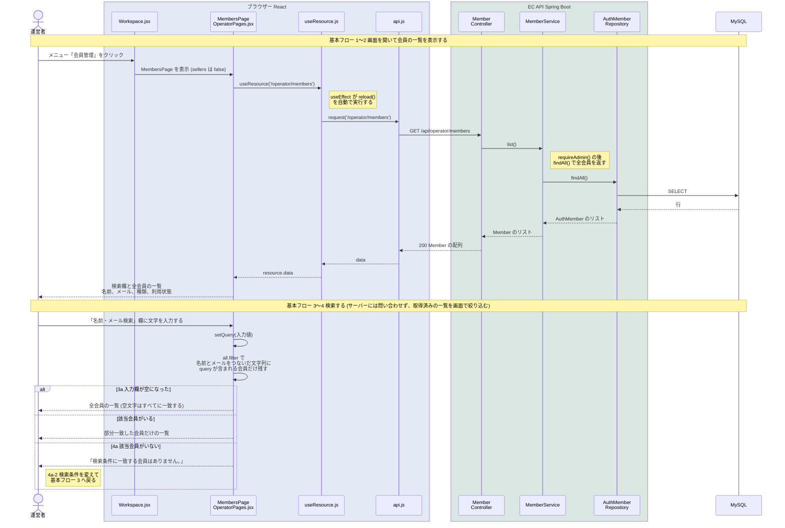

## EC-A01_会員を検索・確認する

```mermaid
sequenceDiagram
    actor User as 運営者
    box rgba(47,111,219,0.10) ブラウザー React
        participant Work as Workspace.jsx
        participant Page as MembersPage<br/>OperatorPages.jsx
        participant Hook as useResource.js
        participant Http as api.js
    end
    box rgba(27,127,92,0.12) EC API Spring Boot
        participant Ctrl as Member<br/>Controller
        participant Svc as MemberService
        participant Repo as AuthMember<br/>Repository
    end
    participant Db as MySQL

    Note over User,Db: 基本フロー 1〜2 画面を開いて会員の一覧を表示する
    User->>Work: メニュー「会員管理」をクリック
    Work->>Page: MembersPage を表示 (sellers は false)
    Page->>Hook: useResource('/operator/members')
    Note right of Hook: useEffect が reload()<br/>を自動で実行する
    Hook->>Http: request('/operator/members')
    Http->>Ctrl: GET /api/operator/members
    Ctrl->>Svc: list()
    Note right of Svc: requireAdmin() の後<br/>findAll() で全会員を返す
    Svc->>Repo: findAll()
    Repo->>Db: SELECT
    Db-->>Repo: 行
    Repo-->>Svc: AuthMember のリスト
    Svc-->>Ctrl: Member のリスト
    Ctrl-->>Http: 200 Member の配列
    Http-->>Hook: data
    Hook-->>Page: resource.data
    Page-->>User: 検索欄と全会員の一覧<br/>名前、メール、種類、利用状態

    Note over User,Db: 基本フロー 3〜4 検索する (サーバーには問い合わせず、取得済みの一覧を画面で絞り込む)
    User->>Page: 「名前・メール検索」欄に文字を入力する
    Page->>Page: setQuery(入力値)
    Page->>Page: all.filter で<br/>名前とメールをつないだ文字列に<br/>query が含まれる会員だけ残す
    alt 3a 入力欄が空になった
        Page-->>User: 全会員の一覧 (空文字はすべてに一致する)
    else 該当会員がいる
        Page-->>User: 部分一致した会員だけの一覧
    else 4a 該当会員がいない
        Page-->>User: 「検索条件に一致する会員はありません。」
        Note right of User: 4a-2 検索条件を変えて<br/>基本フロー 3 へ戻る
    end
```