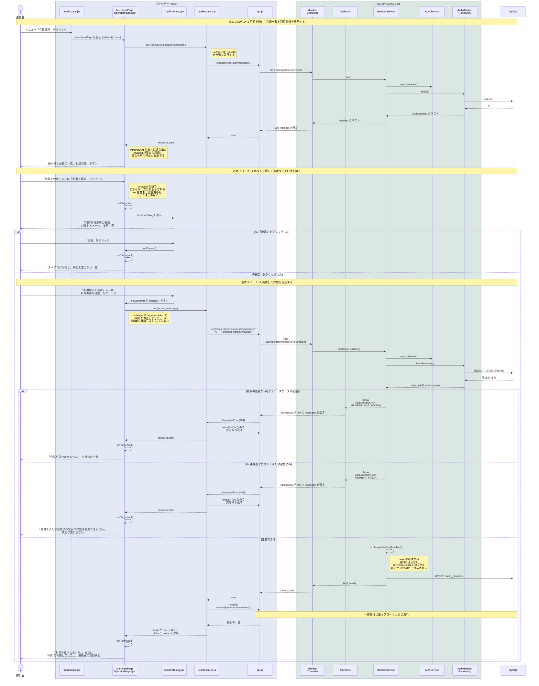

#### EC-A02 アカウントの利用状況を変更する

```mermaid
sequenceDiagram
    actor User as 運営者
    box rgba(47,111,219,0.10) ブラウザー React
        participant Work as Workspace.jsx
        participant Page as MembersPage<br/>OperatorPages.jsx
        participant Dlg as ConfirmDialog.jsx
        participant Hook as useResource.js
        participant Http as api.js
    end
    box rgba(27,127,92,0.12) EC API Spring Boot
        participant Ctrl as Member<br/>Controller
        participant Errs as ApiErrors
        participant Svc as MemberService
        participant Auth as AuthService
        participant Repo as AuthMember<br/>Repository
    end
    participant Db as MySQL

    Note over User,Db: 基本フロー 1〜2 画面を開いて会員一覧と利用状態を表示する
    User->>Work: メニュー「会員管理」をクリック
    Work->>Page: MembersPage を表示 (sellers は false)
    Page->>Hook: useResource('/operator/members')
    Note right of Hook: useEffect が reload()<br/>を自動で実行する
    Hook->>Http: request('/operator/members')
    Http->>Ctrl: GET /api/operator/members
    Ctrl->>Svc: list()
    Svc->>Auth: requireAdmin()
    Svc->>Repo: findAll()
    Repo->>Db: SELECT
    Db-->>Repo: 行
    Repo-->>Svc: AuthMember のリスト
    Svc-->>Ctrl: Member のリスト
    Ctrl-->>Http: 200 Member の配列
    Http-->>Hook: data
    Hook-->>Page: resource.data
    Note right of Page: withdrawnAt があれば退会済み<br/>enabled が真なら利用中<br/>偽なら利用停止と表示する
    Page-->>User: 検索欄と会員の一覧、利用状態、ボタン

    Note over User,Db: 基本フロー 3〜4 ボタンを押して確認ダイアログを開く
    User->>Page: 「利用を停止」または「利用を再開」をクリック
    Note right of Page: enabled の値で<br/>どちらか一方だけ表示される<br/>6a 運営者と退会済みも<br/>ここでは止めない
    Page->>Page: setTarget(m)
    Page->>Dlg: ConfirmDialog を表示
    Dlg-->>User: 「利用状況変更の確認」<br/>対象名とメール、変更内容

    alt 5a 「取消」をクリックした
        User->>Dlg: 「取消」をクリック
        Dlg->>Page: onCancel()
        Page->>Page: setTarget(null)
        Page-->>User: ダイアログが閉じ、状態を変えない一覧
    else 「確定」をクリックした
        Note over User,Db: 基本フロー 5〜6 確定して状態を更新する
        User->>Dlg: 「利用停止を確定」または<br/>「利用再開を確定」をクリック
        Dlg->>Page: onConfirm() が change() を呼ぶ
        Page->>Hook: run(action, message)
        Note right of Page: message は target.enabled で<br/>「利用を停止しました。」か<br/>「利用を再開しました。」になる
        Hook->>Http: write('/operator/members/{id}/enabled',<br/>'PUT', { enabled: !target.enabled })
        Http->>Ctrl: PUT<br/>/api/operator/members/{id}/enabled
        Ctrl->>Svc: enable(id, enabled)
        Svc->>Auth: requireAdmin()
        Svc->>Repo: lockMember(id)
        Repo->>Db: SELECT ... FOR UPDATE
        Db-->>Repo: 行 または 空
        Repo-->>Svc: Optional の AuthMember
        alt 対象の会員がいない (ユースケース未記載)
            Svc--xErrs: throw<br/>ApiException(404,<br/>MEMBER_NOT_FOUND)
            Errs-->>Http: business() が 404 と message を返す
            Http--xHook: throw ApiError(404)
            Hook->>Http: reload() 404 なので<br/>一覧を取り直す
            Hook-->>Page: resource.error
            Page->>Page: setTarget(null)
            Page-->>User: 「会員が見つかりません。」と最新の一覧
        else 6a 運営者アカウントまたは退会済み
            Svc--xErrs: throw<br/>ApiException(409,<br/>MEMBER_FIXED)
            Errs-->>Http: business() が 409 と message を返す
            Http--xHook: throw ApiError(409)
            Hook->>Http: reload() 409 なので<br/>一覧を取り直す
            Hook-->>Page: resource.error
            Page->>Page: setTarget(null)
            Page-->>User: 「管理者または退会済み会員の状態は変更できません。」<br/>状態は変わらない
        else 変更できる
            Svc->>Svc: m.changeEnabled(enabled)
            Note right of Svc: save は呼ばない<br/>通知も送らない<br/>@Transactional の終了時に<br/>変更が UPDATE で保存される
            Svc->>Db: UPDATE auth_members
            Svc-->>Ctrl: 戻る (void)
            Ctrl-->>Http: 200 enabled
            Http-->>Hook: data
            Hook->>Http: reload()<br/>request('/operator/members')
            Note over Http,Db: 一覧取得は基本フロー 2 と同じ流れ
            Http-->>Hook: 最新の一覧
            Hook-->>Page: run() が true を返す。<br/>data と notice を更新
            Page->>Page: setTarget(null)
            Page-->>User: 「利用を停止しました。」または<br/>「利用を再開しました。」、更新後の利用状態
        end
    end
```