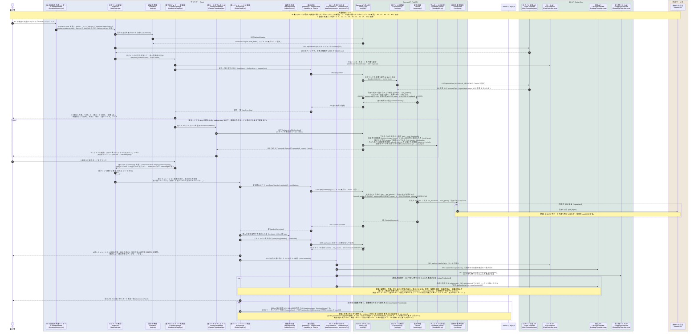

# UC-01-1 庭プロジェクトを開く

```mermaid
sequenceDiagram
    autonumber
    actor User as 購入者
    box rgba(47,111,219,0.10) ブラウザー React
        participant EcHeader as EC の画面の共通ヘッダー<br/>KusakariHeader<br/>(KusakariHeader.jsx)
        participant Gate as ログインの確認<br/>AuthGate<br/>(AuthGate.jsx)
        participant AuthJs as 認証の準備<br/>authMode<br/>(auth.js)
        participant List as 庭プロジェクト一覧画面<br/>GardenListPage<br/>(GardenListPage.jsx)
        participant Card as 庭カードのサムネイル<br/>GardenThumbnail<br/>(GardenThumbnail.jsx)
        participant Editor as 庭シミュレーション画面<br/>EditorPage<br/>(EditorPage.jsx)
        participant Store as 編集中の庭<br/>useEditorStore<br/>(editorStore.js)
        participant Http as 庭の通信<br/>gardenApi、requestJson<br/>(gardens.js、http.js)
        participant Commerce as EC への問い合わせ<br/>useCommerce、commerceApi<br/>(useCommerce.js、commerce.js)
    end
    box rgba(27,127,92,0.12) Canvas API FastAPI
        participant Main as Canvas API の入口<br/>create_app<br/>(main.py)
        participant AuthPy as ログインの確認<br/>AuthBoundary<br/>(auth.py)
        participant Svc as 庭の処理<br/>service<br/>(service.py)
        participant ThumbPy as サムネイルの処理<br/>thumbnail_router<br/>(thumbnails.py)
        participant Media as 画像の置き場所<br/>MediaStore<br/>(media.py)
    end
    participant Db as Canvas の MySQL
    box rgba(27,127,92,0.12) EC API Spring Boot
        participant EcAuth as ログイン状態API<br/>AuthController<br/>(AuthController.java)
        participant Cart as カートAPI<br/>CartController<br/>(CartController.java)
        participant Catalog as 商品API<br/>CatalogController<br/>(CatalogController.java)
        participant Shopping as 買い物リストAPI<br/>ShoppingController<br/>(ShoppingController.java)
    end
    box rgba(180,120,20,0.12) 外部サービス
        participant S3 as 画像の保存先<br/>Amazon S3
    end

    Note over User,S3: 共通代替フロー<br/>*b 未ログインの場合: 6 (画面を開いたときのログインの確認)、11、27 (庭を開いたときのログインの確認)、30、43、44、45、46 に適用<br/>*a 通信に失敗した場合: 4、6、11、27、30、39、43、44、45、46 に適用

    User->>EcHeader: EC の画面の共通ヘッダーの「Canvas」をクリック
    EcHeader->>Gate: Canvas の URL を開く (follow → EC の App.jsx の navigateFromHeader が<br/>window.location.assign)。App.jsx が AuthGate の中に GardenListPage を置く
    Gate->>AuthJs: 認証の方式を確かめるよう頼む (authMode)
    AuthJs->>Main: GET /api/auth/status
    Main-->>AuthJs: 200 mode=cognito (auth_status。ログインの確認なしで通す)
    Gate->>EcAuth: GET /api/auth/me (EC のセッションの Cookie 付き)
    EcAuth-->>Gate: 200 ログイン中で、会員の種類が USER か ADMIN (me)
    Gate->>List: ログイン中の会員を渡して、庭一覧画面を表示<br/>(setState('authenticated')、AuthContext)
    List->>Cart: 共通ヘッダーのカートの件数を読む<br/>(SiteHeader の useEcCart → GET /api/cart)
    List->>Http: 庭の一覧を取りに行く (useQuery → listGardens → requestJson)
    Http->>Main: GET /api/gardens
    Main->>AuthPy: ログイン中の会員を確かめるよう頼む<br/>(backend_identity → authenticate)
    AuthPy->>EcAuth: GET /api/auth/me (KUSAKARI_SESSION の Cookie を渡す)
    EcAuth-->>AuthPy: 200 会員 ID と accountType (request.state.owner_id に会員 ID を入れる)
    Main->>Svc: 会員の庭の一覧を作るよう頼む (gardens → list_gardens)。<br/>会員の庭と配置の数を、更新の新しい順に読む<br/>(SELECT gardens LEFT JOIN 配置の数 WHERE owner_id ORDER BY updated_at DESC)
    Svc-->>Main: 庭の概要の一覧 (GardenSummary)
    Main-->>Http: 200 庭の概要の配列
    Http-->>List: 庭の一覧 (gardens.data)
    List-->>User: 2「保存した庭」「N件」と、庭カード (名前、「配置 N点」、<br/>「最終保存」の日時)。最後に「新しい庭をつくる」カード
    loop 庭カードごと (img の読み込み。loading=lazy なので、画面の外のカードは表示されるまで読まない)
        List->>Card: 庭カードのサムネイルを表示 (GardenThumbnail)
        Card->>Main: GET /api/gardens/{id}/thumbnail<br/>(ログインの確認は 12〜14 と同じ)
        Main->>ThumbPy: サムネイルを読むよう頼む (get → read_thumbnail)。<br/>最新の生成画像 (garden_image_history) を 640×400 以内に縮めたもの (small_png)、<br/>無ければ今の revision で撮影したサムネイル (garden_thumbnails)、<br/>それも無ければ配置の位置 (placed_objects) から描いた配置図 (placement_plan)。<br/>画像のキーがあれば S3 から読む (MediaStore.get → get_object)
        Main-->>Card: 200 PNG (X-Thumbnail-Source に generated、scene、layout)
        Card-->>User: サムネイルの画像。表示できない (エラーの応答など) ときは<br/>多角形のアイコン (onError → setFailed(true))
    end

    User->>List: 3 開きたい庭のカードをクリック
    List->>Gate: 庭の URL /gardens/{id} を開く (window.location.assign(gardenEntryUrl))。<br/>App.jsx が URL から庭の ID を取り出し、AuthGate の中に EditorPage を置く
    Gate->>Gate: ログインを確かめ直す (流れは 3〜7 と同じ)
    Gate->>Editor: 庭シミュレーション画面を表示。読み込みの間は<br/>「庭を開いています」「保存した庭をAPIから読み込んでいます…」
    Editor->>Http: 庭を読みに行く (useQuery(['garden', gardenId]) → getGarden)
    Http->>Main: GET /api/gardens/{id} (ログインの確認は 12〜14 と同じ)
    Main->>Svc: 庭を読むよう頼む (get → get_garden)。会員の庭と配置を読む<br/>(owned_garden の SELECT gardens WHERE id と owner_id、SELECT placed_objects ORDER BY id)
    Svc->>Media: 写真を data URL に戻す (as_document → load_photo)。写真が無ければ null
    opt 写真が S3 にある (imageKey)
        Media->>S3: 写真を読む (get_object)
        Note over Media,S3: 結果: SHA-256 でキーと中身を照らし合わせ、写真の dataUrl にする。
    end
    Svc-->>Main: 庭 (GardenDocument)
    Main-->>Http: 200 GardenDocument
    Http-->>Editor: 庭 (gardenQuery.data)
    Editor->>Store: 読んだ庭を編集中の庭に入れる (hydrate)。isDirty は false
    Editor->>Http: アセットの一覧を読む (useQuery(['assets']) → listAssets)
    Http->>Main: GET /api/assets (ログインの確認なしで通す)
    Main-->>Http: 200 アセットの配列 (assets → list_assets、SELECT assets ORDER BY id)
    Editor-->>User: 4 庭シミュレーション画面 (写真＋設計の表示)。写真があれば写真と輪郭と配置物、<br/>無ければ「庭の写真をアップロードする」
    Editor->>Commerce: EC の商品と買い物リストを読むよう頼む (useCommerce)
    Commerce->>Cart: GET /api/cart (useEcCart)。カートが返る
    Commerce->>Catalog: GET /api/products (products)。公開中の全店舗の商品の一覧が返る
    Commerce->>Shopping: GET /api/shopping-lists/{id}/saved-items (savedItems)。<br/>EC で買い物リストに入れた商品が返る
    opt 商品の配置か、EC で買い物リストに入れた商品がある (uniqueProductIds)
        Commerce->>Catalog: 商品を照会する (references)。GET /api/auth/csrf で CSRF トークンを取ってから<br/>POST /api/products/references (productIds)
        Note over Editor,Catalog: 結果: 店舗名、在庫、買えるかと理由が返る。庭ごとに 1 回、削除・店舗の閉鎖・店舗の停止・組織の停止で<br/>買えない商品の配置を外し (useUnavailablePlacements → removeObjects)、自動保存で保存する (UC-07)。<br/>画面: 外したときは「庭から外した商品があります」と「○○の商品は購入できなくなったため、庭から外しました。」
    end
    Editor-->>User: 右のパネルに買い物リストと商品一覧 (CommercePanel)
    opt 未保存の編集が無く、配置物のモデルを読み終えた (useGardenThumbnail)
        Editor->>Main: 600ms 後に撮影した 640×400 以内の PNG (captureImage、thumbnailImage) を、<br/>CSRF トークンを付けて送る (requestJson)。POST /api/gardens/{id}/thumbnail (本文は revision と dataUrl)
        Note over Editor,Db: 結果: 形式と大きさを確かめ、revision が同じなら画像を置き (S3 の設定なら put_object)、<br/>garden_thumbnails を追加か更新して 204。revision が違えば 409 THUMBNAIL_STALE で、1.5 秒後にやり直す (3 回まで)。<br/>画面: 何も出さない。撮影できない (写真が無いなど) ときは通信せず、1.5 秒後にやり直す (3 回まで)。
    end
```

