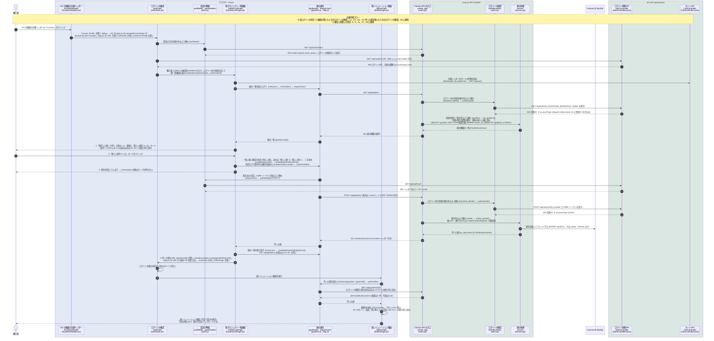

# UC-01 庭プロジェクトを新規作成する

```mermaid
sequenceDiagram
    autonumber
    actor User as 購入者
    box rgba(47,111,219,0.10) ブラウザー React
        participant EcHeader as EC の画面の共通ヘッダー<br/>KusakariHeader<br/>(KusakariHeader.jsx)
        participant Gate as ログインの確認<br/>AuthGate<br/>(AuthGate.jsx)
        participant AuthJs as 認証の準備<br/>authMode、authHeaders<br/>(auth.js)
        participant List as 庭プロジェクト一覧画面<br/>GardenListPage<br/>(GardenListPage.jsx)
        participant Http as 庭の通信<br/>gardenApi、requestJson<br/>(gardens.js、http.js)
        participant Editor as 庭シミュレーション画面<br/>EditorPage<br/>(EditorPage.jsx)
    end
    box rgba(27,127,92,0.12) Canvas API FastAPI
        participant Main as Canvas API の入口<br/>create_app<br/>(main.py)
        participant AuthPy as ログインの確認<br/>AuthBoundary<br/>(auth.py)
        participant Svc as 庭の処理<br/>service<br/>(service.py)
    end
    participant Db as Canvas の MySQL
    box rgba(27,127,92,0.12) EC API Spring Boot
        participant EcAuth as ログイン状態API<br/>AuthController<br/>(AuthController.java)
        participant Cart as カートAPI<br/>CartController<br/>(CartController.java)
    end

    Note over User,Cart: 共通代替フロー<br/>*b 未ログインの場合: 6 (画面を開いたときのログインの確認)、11、24、26、37 (作った庭を開いたときのログインの確認)、40 に適用<br/>*a 通信に失敗した場合: 4、6、11、37、40 に適用

    User->>EcHeader: EC の画面の共通ヘッダーの「Canvas」をクリック
    EcHeader->>Gate: Canvas の URL を開く (follow → EC の App.jsx の navigateFromHeader が<br/>window.location.assign)。App.jsx が URL を見て AuthGate の中に GardenListPage を置く
    Gate->>AuthJs: 認証の方式を確かめるよう頼む (authMode)
    AuthJs->>Main: GET /api/auth/status
    Main-->>AuthJs: 200 mode=cognito (auth_status。ログインの確認なしで通す)
    Gate->>EcAuth: GET /api/auth/me (EC のセッションの Cookie 付き)
    EcAuth-->>Gate: 200 ログイン中で、会員の種類 (accountType) (me)
    Gate->>List: 購入者 (USER) か運営者 (ADMIN) なので、ログイン中の会員を渡して<br/>庭一覧画面を表示 (setState('authenticated')、AuthContext)
    List->>Cart: 共通ヘッダーのカートの件数を読む<br/>(SiteHeader の useEcCart → GET /api/cart)
    List->>Http: 庭の一覧を取りに行く (useQuery → listGardens → requestJson)
    Http->>Main: GET /api/gardens
    Main->>AuthPy: ログイン中の会員を確かめるよう頼む<br/>(backend_identity → authenticate)
    AuthPy->>EcAuth: GET /api/auth/me (KUSAKARI_SESSION の Cookie を渡す)
    EcAuth-->>AuthPy: 200 会員 ID と accountType (request.state.owner_id に会員 ID を入れる)
    Main->>Svc: 会員の庭の一覧を作るよう頼む (gardens → list_gardens)。<br/>会員の庭と配置の数を、更新の新しい順に読む<br/>(SELECT gardens LEFT JOIN 配置の数 WHERE owner_id ORDER BY updated_at DESC)
    Svc-->>Main: 庭の概要の一覧 (GardenSummary)
    Main-->>Http: 200 庭の概要の配列
    Http-->>List: 庭の一覧 (gardens.data)
    List-->>User: 2「保存した庭」「N件」と庭カード、最後に「新しい庭をつくる」カード<br/>(庭カードのサムネイルの読み込みは UC-01-1 の図と同じ流れ)

    User->>List: 3「新しい庭をつくる」カードをクリック
    List->>Http: 一覧に無い既定の名前 (「新しい庭」、あれば「新しい庭 2」「新しい庭 3」…) を決め<br/>(createNewGarden → nextDefaultGardenName)、<br/>名前だけで庭を作る通信を始める (createGarden.mutate → createGarden)
    List-->>User: 4「庭を作成しています…」(isPending の間はカードを押せない)
    Http->>AuthJs: 書き込みの前に CSRF トークンを取るよう頼む<br/>(requestJson → authHeaders('POST'))
    AuthJs->>EcAuth: GET /api/auth/csrf
    EcAuth-->>AuthJs: 200 ヘッダー名とトークン (csrf)
    Http->>Main: POST /api/gardens (本文は { name }、X-CSRF-TOKEN 付き)
    Main->>AuthPy: ログイン中の会員を確かめるよう頼む (backend_identity → authenticate)
    AuthPy->>EcAuth: POST /api/auth/verify (Cookie と CSRF トークンを渡す)
    EcAuth-->>AuthPy: 200 会員 ID と accountType (verify)
    Main->>Svc: 庭を作るよう頼む (create → create_garden)。<br/>幅 10m・奥行き 8m は CreateGardenRequest の既定値
    Svc->>Db: 庭を追加してコミットする (INSERT gardens。id は uuid4、revision は 0)
    Svc-->>Main: 作った庭 (as_document の GardenDocument)
    Main-->>Http: 201 GardenDocument (Location ヘッダー付き)
    Http-->>List: 作った庭
    List->>Http: 庭の一覧を取り直す (onSuccess → invalidateQueries(['gardens']))。<br/>GET /api/gardens の流れは 10〜18 と同じ
    List->>Gate: 5 作った庭の URL /gardens/{id} を開く (window.location.assign(gardenEntryUrl))。<br/>App.jsx が URL から庭の ID を取り出し、AuthGate の中に EditorPage を置く
    Gate->>Gate: ログインを確かめ直す (流れは 3〜7 と同じ)
    Gate->>Editor: 庭シミュレーション画面を表示
    Editor->>Http: 作った庭を読む (useQuery(['garden', gardenId]) → getGarden)
    Http->>Main: GET /api/gardens/{id}<br/>(ログインの確認と庭の読み込みは UC-01-1 の図と同じ流れ)
    Main-->>Http: 200 GardenDocument (配置は 0 件、写真は null)
    Http-->>Editor: 作った庭
    Editor->>Editor: 編集中の庭に入れ (hydrate)、アセットの一覧と、<br/>EC のカート・商品・買い物リストを読む (UC-01-1 の図と同じ流れ)
    Editor-->>User: 庭シミュレーション画面 (写真＋設計の表示)。<br/>写真が無いので「庭の写真をアップロードする」
```

