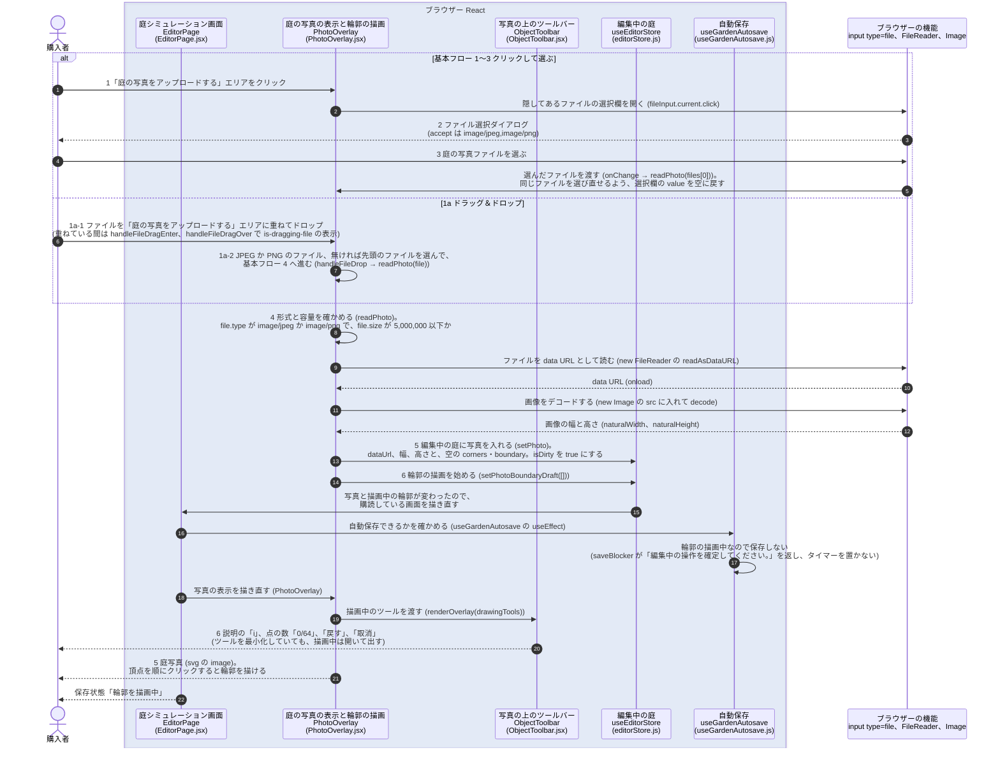

# UC-02 庭の写真をアップロードする

```mermaid
sequenceDiagram
    autonumber
    actor User as 購入者
    box rgba(47,111,219,0.10) ブラウザー React
        participant Editor as 庭シミュレーション画面<br/>EditorPage<br/>(EditorPage.jsx)
        participant Overlay as 庭の写真の表示と輪郭の描画<br/>PhotoOverlay<br/>(PhotoOverlay.jsx)
        participant Toolbar as 写真の上のツールバー<br/>ObjectToolbar<br/>(ObjectToolbar.jsx)
        participant Store as 編集中の庭<br/>useEditorStore<br/>(editorStore.js)
        participant Save as 自動保存<br/>useGardenAutosave<br/>(useGardenAutosave.js)
    end
    participant Dom as ブラウザーの機能<br/>input type=file、FileReader、Image

    alt 基本フロー 1〜3 クリックして選ぶ
        User->>Overlay: 1「庭の写真をアップロードする」エリアをクリック
        Overlay->>Dom: 隠してあるファイルの選択欄を開く (fileInput.current.click)
        Dom-->>User: 2 ファイル選択ダイアログ<br/>(accept は image/jpeg,image/png)
        User->>Dom: 3 庭の写真ファイルを選ぶ
        Dom->>Overlay: 選んだファイルを渡す (onChange → readPhoto(files[0]))。<br/>同じファイルを選び直せるよう、選択欄の value を空に戻す
    else 1a ドラッグ＆ドロップ
        User->>Overlay: 1a-1 ファイルを「庭の写真をアップロードする」エリアに重ねてドロップ<br/>(重ねている間は handleFileDragEnter、handleFileDragOver で is-dragging-file の表示)
        Overlay->>Overlay: 1a-2 JPEG か PNG のファイル、無ければ先頭のファイルを選んで、<br/>基本フロー 4 へ進む (handleFileDrop → readPhoto(file))
    end
    Overlay->>Overlay: 4 形式と容量を確かめる (readPhoto)。<br/>file.type が image/jpeg か image/png で、file.size が 5,000,000 以下か
    Overlay->>Dom: ファイルを data URL として読む (new FileReader の readAsDataURL)
    Dom-->>Overlay: data URL (onload)
    Overlay->>Dom: 画像をデコードする (new Image の src に入れて decode)
    Dom-->>Overlay: 画像の幅と高さ (naturalWidth、naturalHeight)
    Overlay->>Store: 5 編集中の庭に写真を入れる (setPhoto)。<br/>dataUrl、幅、高さと、空の corners・boundary。isDirty を true にする
    Overlay->>Store: 6 輪郭の描画を始める (setPhotoBoundaryDraft([]))
    Store->>Editor: 写真と描画中の輪郭が変わったので、<br/>購読している画面を描き直す
    Editor->>Save: 自動保存できるかを確かめる (useGardenAutosave の useEffect)
    Save->>Save: 輪郭の描画中なので保存しない<br/>(saveBlocker が「編集中の操作を確定してください。」を返し、タイマーを置かない)
    Editor->>Overlay: 写真の表示を描き直す (PhotoOverlay)
    Overlay->>Toolbar: 描画中のツールを渡す (renderOverlay(drawingTools))
    Toolbar-->>User: 6 説明の「i」、点の数「0/64」、「戻す」、「取消」<br/>(ツールを最小化していても、描画中は開いて出す)
    Overlay-->>User: 5 庭写真 (svg の image)。<br/>頂点を順にクリックすると輪郭を描ける
    Editor-->>User: 保存状態「輪郭を描画中」
```

