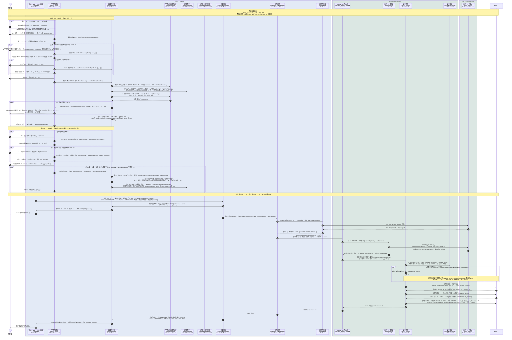

# UC-03 施工範囲を指定・修正する

```mermaid
sequenceDiagram
    autonumber
    actor User as 購入者
    box rgba(47,111,219,0.10) ブラウザー React
        participant Editor as 庭シミュレーション画面<br/>EditorPage<br/>(EditorPage.jsx)
        participant Overlay as 写真の編集<br/>PhotoOverlay<br/>(PhotoOverlay.jsx)
        participant Store as 編集中の庭<br/>useEditorStore<br/>(editorStore.js)
        participant Proj as 写真と地面の対応<br/>photoProjection<br/>(photoProjection.js)
        participant Edge as 辺の長さ<br/>edgeCalibration<br/>(edgeCalibration.js)
        participant Calib as 地平線と実寸範囲<br/>calibratedProjection<br/>(calibratedProjection.js)
        participant Auto as 自動保存<br/>useGardenAutosave<br/>(useGardenAutosave.js)
        participant Http as 庭の通信<br/>gardenApi、requestJson<br/>(gardens.js、http.js)
        participant AuthJs as 通信の準備<br/>authHeaders<br/>(auth.js)
    end
    box rgba(27,127,92,0.12) Canvas API FastAPI
        participant Main as Canvas API の入口<br/>backend_identity・update<br/>(main.py)
        participant AuthPy as ログインの確認<br/>AuthBoundary<br/>(auth.py)
        participant Svc as 庭の処理<br/>update_garden<br/>(service.py)
        participant Valid as 庭の検証<br/>validate_document<br/>(validation.py)
    end
    box rgba(27,127,92,0.12) EC API Spring Boot
        participant EcAuth as ログイン状態API<br/>AuthController<br/>(AuthController.java)
    end
    participant Db as MySQL

    Note over User,Db: 共通代替フロー<br/>*b 未ログインの場合: 39、42 に適用<br/>*a 通信に失敗した場合: 39、42、44、49、50、52、54 に適用

    Note over User,Store: 基本フロー 1〜7 施工範囲を指定する
    alt 基本フロー 1 写真をアップロードした直後
        User->>Overlay: 庭の写真を選ぶ (UC-02。readPhoto → setPhoto)
    else 1a 描画が始まっていない (輪郭が未確定の写真がある)
        User->>Overlay: 1a-1 写真ツールバーの「庭の領域を描く」をクリック (startBoundary)
    end
    Overlay->>Store: 輪郭の描画を空で始める (setPhotoBoundaryDraft([]))
    Overlay-->>User: 右上のツールバーが輪郭の描画用に切り替わる。

    loop 基本フロー 2〜4 頂点が3 点以上になるまで
        User->>Overlay: 2 写真の上で頂点の位置をクリック (onImageClick → imagePoint で画像の中の 0〜1 の座標にする)
        Overlay->>Store: 頂点を足す (setPhotoBoundaryDraft([...draft, p]))
        Overlay-->>User: 3 頂点の番号、直前の点と結んだ線、ポインターまでの破線、「n/64」
        opt 2a 指定した点を取り消す
            User->>Overlay: 2a-1「戻す」(最後の点を戻す) をクリック
            Overlay->>Store: 2a-2 最後の点を除く (setPhotoBoundaryDraft(draft.slice(0, -1)))
            Overlay-->>User: 最後の頂点を除いた線と「n/64」。2a-3 基本フロー 2 へ戻る
        end
    end

    User->>Overlay: 5 始点 (1 番の頂点) をクリック
    Overlay->>Store: 輪郭を確定するよう頼む (finishBoundary → confirmPhotoBoundary)
    Store->>Proj: 輪郭を囲む長方形を、庭の幅×奥行きに当てる四隅 (corners) にする (withPhotoBoundary)
    Store->>Edge: 辺の長さ (UC-04 の入力値) を新しい輪郭に合わせる (withEdgeLengthsForBoundary)。<br/>辺から求めたカメラがあれば測り直し、無くて辺の数が変わっていれば捨てる
    Store->>Proj: 6 輪郭が成り立つかを確かめる (validSurface → validBoundary)<br/>3〜64 点、近すぎる頂点、線の交差、面積
    Proj-->>Store: 成り立つか (true / false)
    break 6a 範囲が成立しない
        Store-->>Overlay: 輪郭を確定しない (confirmPhotoBoundary が false)。描いた点はそのまま残す
        Overlay-->>User: 「輪郭は3〜64点必要です。線の交差、面積不足、重複や近すぎる頂点を修正してください。」<br/>6a-2 基本フロー 2 へ戻る
    end
    Store->>Store: 庭の写真を書き換え、描画を終え、未保存にする<br/>(set で document.photo、photoBoundaryDraft を null、isDirty を true)
    Overlay-->>User: 7「輪郭と寸法」の編集を開く (setEditingEdges(true))。

    Note over User,Store: 基本フロー 8〜9 施工範囲を修正する (確定した輪郭の頂点を動かす)
    opt 8b 範囲を書き直す
        User->>Overlay: 8b-1「庭の領域を書き直す」をクリック
        Overlay->>Store: 8b-2 輪郭の描画を空で始める (startBoundary → setPhotoBoundaryDraft([]))
        Overlay-->>User: 「0/64」の描画の表示。8b-3 基本フロー 2 へ戻る
    end
    opt 8a「輪郭と寸法」の編集が開いていない
        User->>Overlay: 8a-1 写真ツールバーの「輪郭と寸法」をクリック
        Overlay->>Store: 8a-2 選んでいる商品と配置物を外す (setMode(true) → selectAsset(null)、selectObject(null))
        Overlay-->>User: 頂点と辺を操作できる表示。8a-3 基本フロー 8 へ戻る
    end
    User->>Overlay: 8 頂点を押してドラッグ (onPointerDown → setDragging(index))
    loop ポインターが動くたび (ボタンを離すと onPointerUp → setDragging(null) で終わる)
        Overlay->>Store: 頂点を動かすよう頼む (onPointerMove → updatePoint → moveBoundaryVertex)
        Store->>Proj: 動かした輪郭で四隅を作り直し、成り立つかを確かめる (withPhotoBoundary、validSurface)
        Store->>Calib: カメラのある写真で、頂点が地平線か庭の実寸範囲を<br/>新しく越えたかを確かめる (calibratedBoundaryError)。カメラが無ければ越えない
        Store->>Edge: 辺の長さを新しい輪郭に合わせ (setPhoto → withEdgeLengthsForBoundary)、<br/>庭の写真を書き換えて未保存にする (document.photo、isDirty を true、saveError を null)
        Overlay-->>User: 9 修正した輪郭と各辺の長さ
    end

    Note over User,Db: 指定 (基本フロー 6) と修正 (基本フロー 9) のあとの自動保存
    Editor->>Auto: 基本フロー 6・9 で変わった庭と未保存の印を渡す (useGardenAutosave の useEffect)。<br/>送ってよいかを確かめる (saveBlocker。描画中でない、範囲外の配置物が無い、輪郭が成り立つ)
    Auto->>Store: 最後の変更から 500ms 待って保存を始め (setTimeout → save)、<br/>保存中にする (setSaving(true))
    Store->>Editor: 保存中になったので、購読している画面を描き直す (isSaving)
    Editor-->>User: 保存の状態「保存中…」
    Auto->>Http: 庭の全体を保存するよう頼む (saveGarden(structuredClone(submitted)) → requestJson)
    Http->>AuthJs: 書き込みの前に CSRF トークンを取るよう頼む (authHeaders('PUT'))
    AuthJs->>EcAuth: GET /api/auth/csrf (Cookie 付き)
    EcAuth-->>AuthJs: 200 ヘッダー名とトークン (csrf)
    AuthJs-->>Http: 書き込みに付けるヘッダー ({ X-CSRF-TOKEN: トークン })
    Http->>Main: PUT /api/gardens/{id} (X-CSRF-TOKEN 付き)<br/>庭の全体 (写真、輪郭、四隅、辺の長さ、配置物、revision)
    Main->>AuthPy: ログインを確かめるよう頼む (backend_identity → authenticate)
    AuthPy->>EcAuth: POST /api/auth/verify<br/>(KUSAKARI_SESSION の Cookie と X-CSRF-TOKEN)
    EcAuth-->>AuthPy: 200 会員 ID と accountType (verify)。購入者なので通す
    AuthPy-->>Main: 確認が通った。会員 ID を request.state.owner_id に入れる (authenticate)
    Main->>Svc: 本文の形と値の範囲を確かめ (GardenDocumentRequest)、<br/>庭を保存するよう頼む (update → update_garden)
    Svc->>Valid: 庭の中身を確かめるよう頼む (validate_document → validate_photo)<br/>画像の形式と寸法、四隅、3〜64 点、近すぎる点、交差、面積
    opt 画像の保存先が s3 の設定 (KUSAKARI_CANVAS_MEDIA_STORAGE)
        Svc->>Svc: 写真を画像の保存先に置く (media.store_photo)
        Note over Svc,Db: 結果: 先に庭の版を確かめ (owned_garden、SELECT gardens。違えば 409)、<br/>写真を S3 に置いて、data URL を imageKey に置き換える。
    end
    Svc->>Db: 庭の行をロックして読む<br/>(owned_garden(lock=True)、SELECT ... FOR UPDATE gardens)
    Db-->>Svc: 庭の行。revision を比べる (違えば 409 REVISION_CONFLICT)
    Svc->>Db: 配置物のアセットがカタログにあるかを読む (SELECT assets)
    Db-->>Svc: カタログにあるアセットの ID (足りなければ 400 UNKNOWN_ASSET)
    Svc->>Db: 庭を書き換え、配置物を入れ直してコミットする (UPDATE gardens の photo_json と revision + 1、<br/>DELETE と INSERT placed_objects。with session.begin() の 1 トランザクション)
    Svc-->>Main: 保存した庭 (GardenDocument)
    Main-->>Http: 200 GardenDocument
    Http-->>Auto: 保存した庭
    Auto->>Store: 保存済みにする (markSaved)。保存中に編集が続いていれば<br/>revision だけを受け取り、未保存のまま次の 500ms 後にまた送る
    Store->>Editor: 保存の状態が変わったので、購読している画面を描き直す (isSaving、isDirty)
    Editor-->>User: 保存の状態「保存済み」
```

