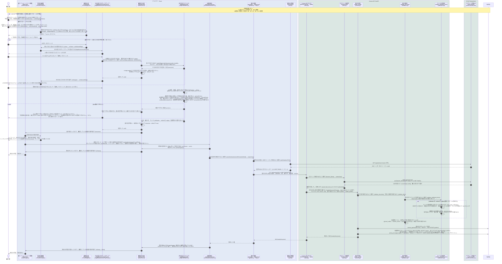

# UC-04 施工範囲の実寸を定義する

```mermaid
sequenceDiagram
    autonumber
    actor User as 購入者
    box rgba(47,111,219,0.10) ブラウザー React
        participant Editor as 庭シミュレーション画面<br/>EditorPage<br/>(EditorPage.jsx)
        participant Overlay as 写真の編集<br/>PhotoOverlay<br/>(PhotoOverlay.jsx)
        participant Edges as 輪郭の辺<br/>PhotoEdges<br/>(PhotoEdges.jsx)
        participant Pop as 辺の長さのポップアップ<br/>EdgeMeasurementPopover<br/>(EdgeMeasurementPopover.jsx)
        participant Store as 編集中の庭<br/>useEditorStore<br/>(editorStore.js)
        participant Calib as 辺の長さとカメラ<br/>applyEdgeLength<br/>(edgeCalibration.js)
        participant Auto as 自動保存<br/>useGardenAutosave<br/>(useGardenAutosave.js)
        participant Http as 庭の通信<br/>gardenApi、requestJson<br/>(gardens.js、http.js)
        participant AuthJs as 通信の準備<br/>authHeaders<br/>(auth.js)
    end
    box rgba(27,127,92,0.12) Canvas API FastAPI
        participant Main as Canvas API の入口<br/>backend_identity・update<br/>(main.py)
        participant AuthPy as ログインの確認<br/>AuthBoundary<br/>(auth.py)
        participant Svc as 庭の処理<br/>update_garden<br/>(service.py)
        participant Valid as 庭の検証<br/>validate_document<br/>(validation.py)
        participant CalPy as カメラの検証<br/>validate_calibrated_photo<br/>(calibration.py)
    end
    box rgba(27,127,92,0.12) EC API Spring Boot
        participant EcAuth as ログイン状態API<br/>AuthController<br/>(AuthController.java)
    end
    participant Db as MySQL

    Note over User,Db: 共通代替フロー<br/>*b 未ログインの場合: 36、39 に適用<br/>*a 通信に失敗した場合: 36、39、41、50、51 に適用

    alt UC-03 で輪郭を確定した直後 (基本フロー 1 は不要)
        User->>Overlay: 始点をクリックして輪郭を確定する (UC-03 の基本フロー 5)。<br/>「輪郭と寸法」の編集は開いたまま (finishBoundary → setEditingEdges(true))
    else 基本フロー 1 それ以外
        User->>Overlay: 1 写真ツールバーの「輪郭と寸法」(入力済みの辺の数のバッジ付き) をクリック。<br/>選んでいる商品と配置物を外す (setMode(true) → selectAsset(null)、selectObject(null))
    end
    Overlay->>Edges: 輪郭の辺を表示する (editMode のとき PhotoEdges)。辺ごとに長さの目安を求める<br/>(edgeLength、polygonEdges.js。入力済みなら入力値、未入力なら今の投影で測った値)
    Edges-->>User: 2 各辺と「n.nn m」のラベル
    Overlay-->>User: 2「輪郭と寸法」を編集するツールバーが出る

    loop 基本フロー 9 未入力の辺が残る間、辺ごとに
        User->>Edges: 3 辺を 1 本クリック
        Edges->>Overlay: 選んだ辺と表示する位置を伝える (select → onSelect = setSelectedEdge)
        Overlay->>Pop: 辺の長さのポップアップを表示する (EdgeMeasurementPopover)
        Pop-->>User: 4 選んだ辺の実寸入力フォームを出す
        User->>Pop: 5〜6 長さ (m) を入力して「適用」をクリック
        Pop->>Store: 7 空欄なら今の長さを使い、数字の形かを確かめて (apply)、<br/>辺の長さを記録するよう頼む (setPhotoEdgeLength(index, Number(text)))
        Store->>Calib: 長さを当てはめる (applyEdgeLength(document, index, length))。<br/>0 以下か、0.01m 未満か 100m 超かを確かめる
        Calib-->>Store: その辺の長さを記録した庭 (document)
        Store->>Store: 8 edgeLengths にその辺の長さだけを記録し (縮尺は変えない)、<br/>未保存にする (set で document、isDirty を true)
        Store-->>Pop: 記録した (null)
        Pop->>Overlay: 次の未入力の辺と文を渡す (onNavigate → setSelectedEdge)
        Overlay-->>User: 8 次の辺の実寸入力フォームを出す (記録したことと残りの辺の数を知らせる)
    end

    User->>Pop: 最後の未入力の辺の長さを入力して「適用」をクリック (流れは 6〜12 と同じ)
    Calib->>Calib: 10 画角・俯角・傾きと高さを求める (fitCamera → refine)。<br/>全辺に 1% 以内で合うカメラ、なければいちばん近いカメラ
    Calib->>Calib: 輪郭を地面に投影して外接長方形を幅・奥行きにし (groundPoints)、<br/>配置物の写真の上の接地位置を保って地面の位置を求め直す (imagePoint → groundPoint)。<br/>幅・奥行きが 1〜50m か (isValidGardenSize)、輪郭が地平線より下で実寸範囲に入るか<br/>(calibratedBoundaryError)、配置物の基準点が施工範囲にあるか (containsAnchor) を確かめる
    break 10a 補正できない
        Calib-->>Store: 補正できない理由 ({ error })
        Store-->>Pop: 補正できない理由の文。庭は書き換えない (縮尺も辺の長さも変えない)
        Pop-->>User: 10a-1 補正できない理由の文 (「写真上の輪郭からパースを求められません。…」<br/>「変更後の庭の幅・奥行きが1〜50mに収まる長さを指定してください。」「配置物が庭の外に出るため変更できません。」など)。<br/>10a-2 基本フロー 3 へ戻る
    end
    Calib-->>Store: 11 幅・奥行き、カメラ (calibration、method は edges)、配置物の位置を変えた庭
    Store->>Store: 庭を書き換え、未保存にする (set で document、isDirty を true)
    Store-->>Pop: 記録した (null)
    Store->>Editor: 庭が変わったので、購読している画面を描き直す (document)
    Editor->>Overlay: 写真の表示を描き直す
    Overlay-->>User: 11「パース：辺の実寸から推定」、補正後の面積・外周、<br/>新しいカメラで描き直したグリッドと配置物 (PhotoCanvas.jsx)。ポップアップは開いたまま

    Editor->>Auto: 基本フロー 8・11 で変わった庭と未保存の印を渡す (useGardenAutosave の useEffect)。<br/>送ってよいかを確かめる (saveBlocker。ドラッグ中・描画中でない、範囲外の配置物が無い、輪郭が成り立つ)
    Auto->>Store: 最後の変更から 500ms 待って保存を始め (setTimeout → save)、<br/>保存中にする (setSaving(true))
    Store->>Editor: 保存中になったので、購読している画面を描き直す (isSaving)
    Editor-->>User: 保存の状態「保存中…」
    Auto->>Http: 庭の全体を保存するよう頼む (saveGarden(structuredClone(submitted)) → requestJson)
    Http->>AuthJs: 書き込みの前に CSRF トークンを取るよう頼む (authHeaders('PUT'))
    AuthJs->>EcAuth: GET /api/auth/csrf (Cookie 付き)
    EcAuth-->>AuthJs: 200 ヘッダー名とトークン (csrf)
    AuthJs-->>Http: 書き込みに付けるヘッダー ({ X-CSRF-TOKEN: トークン })
    Http->>Main: PUT /api/gardens/{id} (X-CSRF-TOKEN 付き)<br/>庭の全体 (edgeLengths、calibration、幅、奥行き、配置物、revision)
    Main->>AuthPy: ログインを確かめるよう頼む (backend_identity → authenticate)
    AuthPy->>EcAuth: POST /api/auth/verify<br/>(KUSAKARI_SESSION の Cookie と X-CSRF-TOKEN)
    EcAuth-->>AuthPy: 200 会員 ID と accountType (verify)。購入者なので通す
    AuthPy-->>Main: 確認が通った。会員 ID を request.state.owner_id に入れる (authenticate)
    Main->>Svc: 本文の形と値の範囲を確かめ (GardenDocumentRequest。edgeLengths は 3〜64 個で、<br/>それぞれ 0.01〜100 か null)、庭を保存するよう頼む (update → update_garden)
    Svc->>Valid: 庭の中身を確かめるよう頼む (validate_document)。写真と輪郭を確かめる (validate_photo)
    Valid->>CalPy: 辺の長さとカメラを確かめるよう頼む (validate_calibrated_photo)。<br/>edgeLengths の数が輪郭の辺の数と同じか
    opt calibration の method が edges (基本フロー 11 のあと)
        CalPy->>CalPy: カメラが物理的に成り立つかを確かめる (verify_edge_calibration)。<br/>全辺が入力済みか、回転行列が正規直交か、縦画角が 15〜110 度か、カメラが地面より 5cm 以上上か
        CalPy->>CalPy: 輪郭の点を地面に投影し (ground_points)、<br/>地平線より下か、庭の幅・奥行き (+5cm) に入るかを確かめる
    end
    Valid->>Valid: 配置物ごとに、基準点が施工範囲の中で Y=0 か<br/>(ground_outline、contains_anchor、placement_bounds.py)、回転と倍率を確かめる
    Svc->>Db: 庭の行をロックして読む<br/>(owned_garden(lock=True)、SELECT ... FOR UPDATE gardens)
    Svc->>Db: 配置物のアセットがカタログにあるかを読み (SELECT assets。足りなければ 400 UNKNOWN_ASSET)、<br/>庭を書き換え、配置物を入れ直してコミットする (UPDATE gardens の幅・奥行き・<br/>photo_json (edgeLengths と calibration)・revision + 1、DELETE と INSERT placed_objects (求め直した位置)。1 トランザクション)
    Svc-->>Main: 保存した庭 (GardenDocument)
    Main-->>Http: 200 GardenDocument
    Http-->>Auto: 保存した庭
    Auto->>Store: 保存済みにする (markSaved)。保存中に編集が続いていれば<br/>revision だけを受け取り、未保存のまま次の 500ms 後にまた送る
    Store->>Editor: 保存の状態が変わったので、購読している画面を描き直す (isSaving、isDirty)
    Editor-->>User: 保存の状態「保存済み」
```

