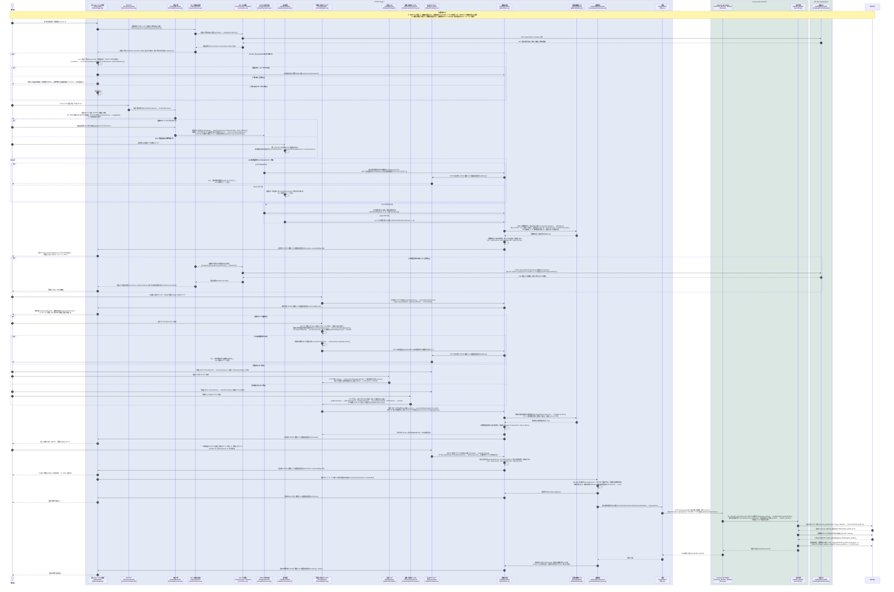

# UC-05 庭オブジェクトを配置・編集する

```mermaid
sequenceDiagram
    autonumber
    actor User as 購入者
    box rgba(47,111,219,0.10) ブラウザー React
        participant Editor as 庭シミュレーション画面<br/>EditorPage<br/>(EditorPage.jsx)
        participant Panel as サイドバー<br/>CommercePanel<br/>(CommercePanel.jsx)
        participant Browser as 商品一覧<br/>ProductBrowser<br/>(ProductBrowser.jsx)
        participant Commerce as EC の商品の取得<br/>useCommerce<br/>(useCommerce.js)
        participant ComApi as EC との通信<br/>commerceApi・request<br/>(commerce.js)
        participant Drop as ドロップの受け取り<br/>DropPlacement<br/>(DropPlacement.jsx)
        participant Ground as 庭の地面<br/>GardenGround<br/>(GardenGround.jsx)
        participant Placed as 配置した庭オブジェクト<br/>PlacedObject<br/>(PlacedObject.jsx)
        participant Ring as 回転リング<br/>RotationRing<br/>(RotationRing.jsx)
        participant Controls as 移動・拡縮のハンドル<br/>PlacementControls<br/>(PlacementControls.jsx)
        participant Toolbar as 右上のツールバー<br/>ObjectToolbar<br/>(ObjectToolbar.jsx)
        participant Store as 編集中の庭<br/>useEditorStore<br/>(editorStore.js)
        participant Editing as 配置の編集ルール<br/>gardenEditing<br/>(gardenEditing.js)
        participant Auto as 自動保存<br/>useGardenAutosave<br/>(useGardenAutosave.js)
        participant Http as 通信<br/>requestJson<br/>(http.js)
    end
    box rgba(27,127,92,0.12) Canvas API FastAPI
        participant Main as Canvas API の入口<br/>backend_identity・update<br/>(main.py)
        participant Svc as 庭の処理<br/>update_garden<br/>(service.py)
    end
    box rgba(27,127,92,0.12) EC API Spring Boot
        participant Catalog as 商品API<br/>CatalogController<br/>(CatalogController.java)
    end
    participant Db as MySQL

    Note over User,Db: 共通代替フロー<br/>*b 未ログインの場合: 4、店舗名の照会の 31、自動保存の 70 (CSRF トークンの取得と EC でのログインの確認を含む) に適用<br/>*a 通信に失敗した場合: 4、店舗名の照会の 31、自動保存の 70 と、MySQL を読み書きする 72、74、76 に適用

    User->>Editor: 庭一覧で庭を開く (事前条件。UC-01-1)
    Editor->>Commerce: 画面を開いたときに、EC の商品の一覧を取るよう頼む<br/>(useCommerce の useQuery(['ec-products']))
    Commerce->>ComApi: 商品の一覧を取るよう頼む (products → request('/products'))
    ComApi->>Catalog: GET /api/products (Cookie 付き)
    Catalog-->>ComApi: 200 商品の配列 (名前、価格、店舗名、植物の構成)
    ComApi-->>Commerce: 商品の配列 (useCommerce の products.data になる)
    Commerce-->>Editor: 商品の一覧 (commerce.products.data)。届くまでは空で、届いた時点で受け取る (useQuery)
    opt 1a EC から productId を付けて開いた
        Editor->>Editor: 1a-1 商品の一覧から productId の商品を探し、その 3D モデルを求める<br/>(useEffect → commerce.products.data.find、productAsset、productModels.js)
        alt 商品があり、3D モデルもある
            Editor->>Store: その商品を選んだ状態にするよう頼む (selectAsset(asset.id))
        else 一覧に無い (記述なし)
            Editor-->>User: 「選択した商品は現在購入・新規配置できません。公開状態または店舗を確認してください。」(何も選ばない)
        else 一覧にあるが 3D モデルが無い
            Editor->>Editor: 何も選ばない
        end
    end

    User->>Panel: サイドバーの「商品一覧」タブをクリック
    Panel->>Browser: 商品一覧を表示する (setTab('products') → ProductBrowser)
    Browser-->>User: 商品のカード。名前、カテゴリ、店舗名、価格、<br/>3D モデルが無ければ「3Dモデル未設定」でドラッグできない (productAsset → draggable)。<br/>1a の商品は選んだ表示

    alt 基本フロー 1 ドラッグ＆ドロップ
        User->>Browser: 商品を庭写真 (3D 表示では庭の土台) の上へドラッグ＆ドロップ
        Browser->>Drop: 商品の ID を渡す (onDragStart → startProductDrag の dataTransfer、drop の listener)<br/>描画中・ドラッグ中でないか、庭写真があるかを確かめ (drop → placementBlockedReason)、<br/>2 ドロップした位置から地面 (Y=0) との交点を求める (raycaster.ray.intersectPlane)
    else 1a-2 商品を選んだ状態で開いた
        User->>Ground: 庭写真の上の設置したい位置をクリック
        Ground->>Ground: 押してから 5px 以内で離したか、庭写真があるか、<br/>施工範囲の内側かを確かめる (finishPlacement → placementBlockedReason、containsAnchor)
    end
    break 2a 施工範囲の外 (containsAnchor が偽)
        alt ドラッグ＆ドロップ
            Drop->>Store: 交点が施工範囲の外なので設置せず (containsAnchor)、<br/>エラーの文を設定する (setEditError('庭の地面の範囲内へドロップしてください。'))
            Store->>Toolbar: エラーの文が変わったので、購読している画面を描き直す (editError)
            Toolbar-->>User: 2a-1「庭の地面の範囲内へドロップしてください。」<br/>2a-2 基本フロー 1 へ戻る
        else 1a-2 クリック
            Ground->>Ground: 設置せず、何も表示しない (finishPlacement が何もせずに終わる)<br/>2a-2 基本フロー 1 へ戻る
        end
    end
    alt ドラッグ＆ドロップ
        Drop->>Store: その位置に置くよう頼み、商品の選択を外す<br/>(addAssetAt(asset, x, z)、selectAsset(null))
    else 1a-2 クリック
        Ground->>Store: 1a-3 その位置に置くよう頼む (addAssetAt(selectedAsset, x, z))
    end

    Store->>Editing: 3 新しい配置物を作り、庭に足すよう頼む (createPlacedObject → addObject)<br/>新しい UUID、Y=0、回転 0、倍率 1、商品なら productId・materialCode・modelComposition。<br/>200 個未満、Y=0、施工範囲の内側、ID が重ならないかを確かめる
    Editing-->>Store: 配置物を足した庭 (足せなければ null)
    Store->>Store: 配置物を足した庭に書き換え、足したものを選び、未保存にする<br/>(set で document、selectedObjectId、isDirty を true)
    Store->>Editor: 庭が変わったので、購読している画面を描き直す (document、selectedObjectId)
    Editor-->>User: 庭オブジェクト (PlacedObject.jsx が 3D モデルを描く)、<br/>「配置したもの」の行 (X・Z) と「n / 200」
    opt その商品が初めて庭に入った (記述なし)
        Commerce->>ComApi: 店舗名と今買えるかを照会するよう頼む<br/>(useQuery(['ec-product-references']) → references)
        ComApi->>Catalog: POST /api/products/references (本文は productIds)<br/>先に EC の GET /api/auth/csrf で CSRF トークンを取る (authHeaders('POST'))
        Catalog-->>ComApi: 200 商品ごとの店舗名、在庫、買えるかとその理由
        ComApi-->>Commerce: 照会の結果 (references.data)
        Commerce-->>Editor: 商品ごとの照会の結果 (commerce.referenceMap)。届くまでは前の結果のまま (keepPreviousData)
        Editor-->>User: 「配置したもの」の行に店舗名
    end

    User->>Placed: 4 設置した庭オブジェクト、または「配置したもの」の行をクリック
    Placed->>Store: その庭オブジェクトを選ぶ (beginObjectDrag → selectObject(object.id)。<br/>行なら PlacedObjects の onSelectObject → selectObject)
    Store->>Editor: 選択が変わったので、購読している画面を描き直す (selectedObjectId)
    Editor-->>User: 選択の枠 (SelectionOutline) と移動の矢印 (PlacementControls)、<br/>ツールバーに「削除」(3D 表示では「移動」「回転」「拡縮」も)

    alt 基本フロー 5 移動する
        User->>Placed: 庭オブジェクトをドラッグして離す
        Placed->>Placed: ポインターが動くたび (5px を超えてから) ドラッグ中にし、地面との交点へ動かし、<br/>基準点が施工範囲の内側かを確かめる (moveObjectOnGround → setTransformDragging(true)、<br/>constrainTransform → containsAnchor)。離したら確定する (finishObjectDrag → commit)
        opt 5a 施工範囲の外へ出る
            Placed->>Placed: 範囲内で最後にあった位置に戻す (constrainTransform → node.position.set(lastPosition))
            Placed->>Store: エラーの文を設定する (setEditError('施工範囲の外へは移動できません。'))
            Store->>Toolbar: エラーの文が変わったので、購読している画面を描き直す (editError)
            Toolbar-->>User: 5a-1「施工範囲の外へは移動できません。」<br/>5a-2 基本フロー 5 へ戻る
        end
    else 回転する (3D 表示)
        User->>Toolbar: 「回転」をクリック (onSetTool → setTool('rotate'))。回転リング (RotationRing) が出る
        User->>Ring: 回転リングをドラッグして離す
        Ring->>Placed: ドラッグ中にし (begin → setTransformDragging(true))、Y 軸の角度だけを足し (move)、<br/>離したら回転した結果を確定するよう頼む (finish → onCommit = commit)
    else 拡大縮小する (3D 表示)
        User->>Toolbar: 「拡縮」をクリック (onSetTool → setTool('scale'))。拡縮のハンドルが出る
        User->>Controls: 拡縮のハンドルをドラッグして離す
        Controls->>Placed: ドラッグ中にし、動くたびに大きさを整え、離したら確定するよう頼む<br/>(onMouseDown → setDragging(true)、onObjectChange → constrainTransform、onMouseUp → commit)<br/>5c 倍率を 0.25〜3 で止め、3 軸をそろえる (MathUtils.clamp)
    end

    Placed->>Store: 位置・向き・大きさを変えるよう頼む (commit → transformObject(object.id, next))<br/>変わっていなければ頼まない。終わったらドラッグを終える (setTransformDragging(false))
    Store->>Editing: 制限の内側かを確かめて置き換える (changeObjectTransform → isValidTransform)<br/>Y=0、施工範囲の内側、回転は Y 軸だけ、倍率 0.25〜3 で一様
    Editing-->>Store: 置き換えた庭 (制限の外なら null)
    Store->>Store: 6 配置物を置き換えた庭に書き換え、未保存にする (set で document、isDirty を true)
    Store-->>Placed: 受け付けた (true)。受け付けなければ false で元の位置に戻す
    Store->>Editor: 庭が変わったので、購読している画面を描き直す (document)
    Editor-->>User: 新しい位置・向き・大きさと、「配置したもの」の X・Z

    User->>Toolbar: 7 不要な庭オブジェクトを選び (基本フロー 4 と同じ)、8「削除」をクリック<br/>(Delete キーか Backspace キーでも消せる)
    Toolbar->>Store: 選んでいる庭オブジェクトを消すよう頼む (onDelete → deleteSelected)<br/>キーなら EditorPage の handleDeleteKey → deleteSelected。入力欄の中やドラッグ中は消さない
    Store->>Store: 庭から取り除き (gardenEditing.js の removeObject)、残りの先頭を選び、未保存にする<br/>(set で document、selectedObjectId、isDirty を true)
    Store->>Editor: 庭が変わったので、購読している画面を描き直す (document、selectedObjectId)
    Editor-->>User: 9 庭と「配置したもの」から取り除き、「n / 200」を減らす

    Editor->>Auto: 基本フロー 3・6・9 で変わった庭と未保存の印を渡す (useGardenAutosave の useEffect)
    Auto->>Auto: 送ってよいかを確かめ (saveBlocker。ドラッグ中・描画中でない、範囲外の配置物が無い、<br/>輪郭が成り立つ)、最後の変更から 500ms 後に保存を始める (setTimeout → save)
    Auto->>Store: 保存中にする (setSaving(true))
    Store->>Editor: 保存中になったので、購読している画面を描き直す (isSaving)
    Editor-->>User: 保存の状態「保存中…」
    Auto->>Http: 庭の全体を保存するよう頼む (saveGarden(structuredClone(submitted)) → requestJson)
    Http->>Main: PUT /api/gardens/{id} 庭の全体 (配置物、写真、revision)<br/>先に EC の GET /api/auth/csrf で CSRF トークンを取る (authHeaders('PUT'))
    Main->>Svc: EC の POST /api/auth/verify でログインを確かめ (backend_identity → AuthBoundary.authenticate)、<br/>本文の形を確かめて (GardenDocumentRequest)、庭を保存するよう頼む (update → update_garden)。<br/>中身は UC-07 の図と同じ流れ
    Svc->>Db: 庭の行をロックして読む (owned_garden(lock=True)、SELECT ... FOR UPDATE gardens)
    Db-->>Svc: 庭の行。revision を比べる (違えば 409 REVISION_CONFLICT)
    Svc->>Db: 配置物のアセットがカタログにあるかを読む (SELECT assets)
    Db-->>Svc: カタログにあるアセットの ID (足りなければ 400 UNKNOWN_ASSET)
    Svc->>Db: 庭を書き換え、配置物を入れ直してコミットする (UPDATE gardens の revision + 1、<br/>DELETE placed_objects、INSERT placed_objects。1 トランザクション)
    Svc-->>Main: 保存した庭 (GardenDocument)
    Main-->>Http: 200 保存した庭 (GardenDocument)
    Http-->>Auto: 保存した庭
    Auto->>Store: 保存済みにする (markSaved)。保存中に編集が続いていれば<br/>revision だけを受け取り、未保存のまま次の 500ms 後にまた送る
    Store->>Editor: 保存の状態が変わったので、購読している画面を描き直す (isSaving、isDirty)
    Editor-->>User: 保存の状態「保存済み」
```

