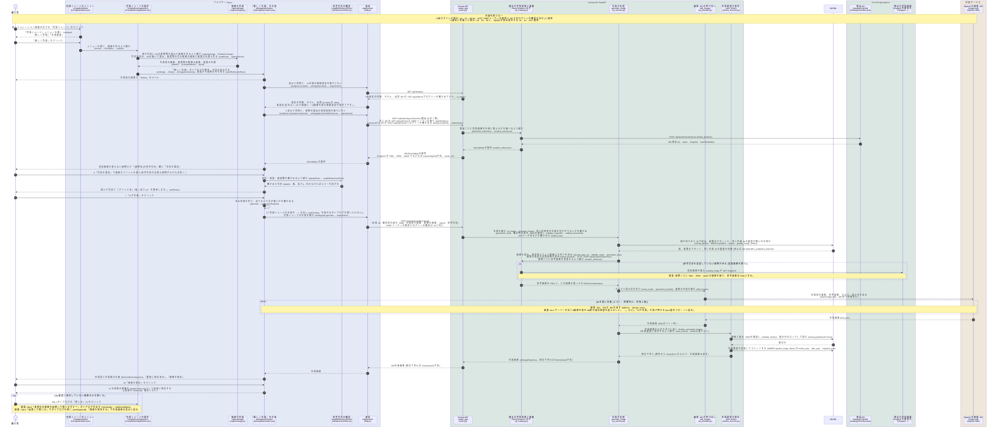

# UC-06 完成イメージ画像を生成・保存する

```mermaid
sequenceDiagram
    autonumber
    actor User as 購入者
    box rgba(47,111,219,0.10) ブラウザー React
        participant Menu as 完成イメージのメニュー<br/>CompletionMenu<br/>(CompletionMenu.jsx)
        participant Action as 完成イメージの操作<br/>CompletionImageAction<br/>(CompletionImageAction.jsx)
        participant Capture as 画像の作成<br/>captureImage<br/>(captureImage.js)
        participant Gen as 「新しく生成」の中身<br/>AiImageGeneration<br/>(AiImageGeneration.jsx)
        participant Ref as 参考写真の確認<br/>readAiReferencePhoto<br/>(aiReferencePhoto.js)
        participant Http as 通信<br/>requestJson<br/>(http.js)
    end
    box rgba(27,127,92,0.12) Canvas API FastAPI
        participant Main as Canvas API<br/>create_app<br/>(main.py)
        participant Catalog as 商品の登録情報と画像<br/>linked_products ほか<br/>(ai_catalog.py)
        participant AiSvc as 生成の処理<br/>generate_image<br/>(ai_service.py)
        participant Provider as 画像 API の呼び出し<br/>edit_images<br/>(ai_provider.py)
        participant History as 生成履歴の保存<br/>save_history<br/>(history_service.py)
    end
    participant Db as MySQL
    box rgba(27,127,92,0.12) EC API Spring Boot
        participant EcCat as 商品API<br/>CatalogController<br/>(CatalogController.java)
        participant EcImg as 商品の登録画像<br/>imageUrl の配信先<br/>(/images/…)
    end
    box rgba(180,120,20,0.12) 外部サービス
        participant OpenAi as OpenAI の画像 API<br/>images.edit<br/>(OpenAI SDK)
    end

    Note over User,OpenAi: 共通代替フロー<br/>*b 未ログインの場合: 10、14、29 (14・29 は CSRF トークンの取得と EC でのログインの確認を含む) に適用<br/>*a 通信に失敗した場合: 10、14、29 と、MySQL を読み書きする 31、41、43 に適用

    User->>Menu: 庭シミュレーション画面の右下の「完成イメージ」をクリック
    Menu-->>User: 「完成イメージ」メニューを開く (setOpen)<br/>「新しく作成」「生成履歴」
    User->>Menu: 「新しく作成」をクリック
    Menu->>Action: メニューを閉じ、画像を作るよう頼む<br/>(choose → onCapture → capture)
    Action->>Capture: 庭の写真に 3D の配置物を重ねた画像を作るよう頼む (captureImage、includeCoverage)<br/>写真を読み、3D を描いて重ね、配置物の写る範囲の画像と配置の位置も作る (loadPhoto、captureScene)
    Capture-->>Action: 生成前の画像、配置物の範囲の画像、配置の位置<br/>(dataUrl、coverageDataUrl、layout)
    Action->>Gen: 「新しく生成」ダイアログを開き、中身を表示する<br/>(setImage → Dialog → AiImageGeneration)。配置から植物の行を作る (plantReferenceRows)
    Gen-->>User: 生成前の画像と「Before」のラベル

    Gen->>Http: 表示と同時に、AI 生成の接続設定を取りに行く<br/>(useQuery ai-status → aiImageApi.status → requestJson)
    Http->>Main: GET /api/ai/status
    Main-->>Http: 200 設定の有無、モデル、品質 (EC の GET /api/auth/me でログインを確かめてから。ai_status)
    Http-->>Gen: 設定の有無、モデル、品質 (ai-status の data)。<br/>未設定 (記述なし) なら画面に「AI画像生成の接続設定が未完了です。」
    Gen->>Http: 5 表示と同時に、植物の商品の登録情報を取りに行く<br/>(useQuery ai-product-references → aiImageApi.productReferences → requestJson)
    Http->>Main: POST /api/ai/product-references (商品 ID の一覧)<br/>先に EC の GET /api/auth/csrf で CSRF トークンを取り (authHeaders)、<br/>Canvas API は EC の POST /api/auth/verify でログインを確かめる (backend_identity → authenticate)
    Main->>Catalog: 商品ごとに登録画像を生成に使えるかを調べるよう頼む<br/>(automatic_references → product_references)
    Catalog->>EcCat: POST /api/products/references (linked_products)
    EcCat-->>Catalog: 200 商品 (id、name、imageUrl、hasPlantModel)
    Catalog-->>Main: AiCandidate の配列 (product_references)
    Main-->>Http: 200 AiCandidate の配列<br/>(imageUrl が PNG・JPEG・WebP でなければ requiresUpload が真。raster_url)
    Http-->>Gen: AiCandidate の配列
    Gen-->>User: 登録画像を使えない植物だけ「(植物名)の参考写真」欄と「写真を選択」

    User->>Gen: 6「写真を選択」で画像のファイルを選ぶ (参考写真が必要な植物がなければ省く)
    Gen->>Ref: 形式・容量・画素数を確かめるよう頼む (uploadPhoto → readAiReferencePhoto)
    Ref-->>Gen: 確かめた写真 (dataUrl、幅、高さ)。合わなければエラーを投げる
    Gen-->>User: 選んだ写真と「(ファイル名)（幅 × 高さ px）を使用します。」(setPhotos)

    User->>Gen: 7「AIで生成」をクリック
    Gen->>Gen: 送る内容を作り、足りないものが無いかを確かめる<br/>(generate → generationRequest)
    Gen->>Http: 8「完成イメージを生成中…」を出し (setPending。生成中はダイアログを閉じられない)、<br/>完成イメージの生成を頼む (aiImageApi.generate → requestJson)
    Http->>Main: POST /api/gardens/{id}/ai-image<br/>(生成 ID、撮影時の庭の JSON、生成前の画像、範囲の画像、layout、参考写真)<br/>CSRF トークンの取得とログインの確認は 14 と同じ
    Main->>AiSvc: 生成を頼む (ai_image → generate_image)。同じ利用者の生成が実行中でないかを確かめ<br/>(generation_lock)、撮影時の庭の JSON を検査し (validate_snapshot → validate_document)、<br/>API キーがあるかを確かめる (require_key)
    AiSvc->>Db: 庭を持ち主と ID で読み、配置のアセットと、同じ生成 ID の履歴が無いかを読む<br/>(owned_garden、SELECT gardens・assets・garden_image_history)
    Db-->>AiSvc: 庭、配置のアセット、同じ生成 ID の履歴の有無 (あれば 409 HISTORY_ALREADY_EXISTS)
    AiSvc->>Catalog: 画像を読み、書き換えてよい範囲と大きさを決め (decode_data_url、editable_mask、generation_size)、<br/>植物の商品の登録情報を読み (linked_products、EC の POST /api/products/references)、<br/>植物ごとに参考画像を用意するよう頼む (resolve_reference)
    opt 参考写真を追加していない植物がある (登録画像を使う)
        Catalog->>EcImg: 登録画像を取る (catalog_image が GET imageUrl)
        Note over Catalog,EcImg: 結果: 植物ごとに PNG・JPEG・WebP の画像を取り、参考画像の PNG にする。
    end
    Catalog-->>AiSvc: 参考画像の PNG と、どの画像を使ったか (ReferenceSummary)
    AiSvc->>Provider: マスクと指示文を作り (scene_mask、generation_prompt)、画像の生成を頼む (edit_images)
    Provider->>OpenAi: 生成前の画像、参考画像、マスク、指示文を送る<br/>(client.images.edit、180 秒で時間切れ)
    break 8a 生成に失敗 (エラー、時間切れ、利用上限)
        Note over Gen,OpenAi: 結果: 502、504 か 429 を返す (ApiError、domain_error)。<br/>画面: 8a-1 サーバーの文 (「AI画像生成が180秒の通信制限を超えました。…」など)。「AIで生成」を再び押せる (8a-2 基本フロー 7 へ戻る)
    end
    OpenAi-->>Provider: 生成画像 (b64_json)
    Provider-->>AiSvc: 生成画像 (PNG のバイト列)
    AiSvc->>History: 生成画像を元の大きさに戻し (finalize_generated_image)、<br/>9 生成履歴に保存するよう頼む (save_history。media は渡さない)
    History->>Db: 画像と庭の JSON を検査し (validate_history)、庭の行をロックして読む (owned_garden(lock=True))
    Db-->>History: 庭の行
    History->>Db: 生成履歴を追加してコミットする (INSERT garden_image_history の before_png・after_png・snapshot_json)
    History-->>AiSvc: 保存できた (例外なら historyError を入れて、生成画像は返す)
    AiSvc-->>Main: 生成画像 (AiImageResponse。保存できれば historySaved が真)
    Main-->>Http: 200 生成画像 (保存できれば historySaved が真)
    Http-->>Gen: 生成画像
    Gen-->>User: 生成前と生成後の比較 (BeforeAfterComparison)、「履歴に保存済み」、「画像を保存」

    User->>Gen: 10「画像を保存」をクリック
    Gen-->>User: 11 生成後の画像を kusakari-after.png として端末に保存する<br/>(a 要素の download。通信しない)
    opt 10a 履歴に保存していない画像のまま閉じる
        User->>Action: 10a-1 ダイアログの「閉じる」(×) をクリック
        Note over User,Action: 結果: 10a-2「未保存の画像を破棄して閉じますか？」ダイアログを出す (closeImage → setDiscardOpen)。<br/>画面: 10a-3「破棄して閉じる」でダイアログを閉じ (setImage(null))、「画像を保持する」で生成画像の表示に戻る
    end
```

