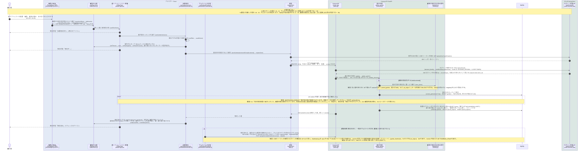

# UC-07 庭プロジェクトを保存する

```mermaid
sequenceDiagram
    autonumber
    actor User as 購入者
    box rgba(47,111,219,0.10) ブラウザー React
        participant Parts as 編集の部品<br/>PlacedObject ほか<br/>(PlacedObject.jsx ほか)
        participant Store as 編集中の庭<br/>useEditorStore<br/>(editorStore.js)
        participant Page as 庭シミュレーション画面<br/>EditorPage<br/>(EditorPage.jsx)
        participant Save as 自動保存<br/>useGardenAutosave<br/>(useGardenAutosave.js)
        participant Thumb as サムネイルの送信<br/>useGardenThumbnail<br/>(useGardenThumbnail.js)
        participant Http as 通信<br/>requestJson<br/>(http.js)
    end
    box rgba(27,127,92,0.12) Canvas API FastAPI
        participant Main as Canvas API<br/>create_app<br/>(main.py)
        participant Svc as 庭の処理<br/>update_garden<br/>(service.py)
        participant Media as 画像の保存先の読み書き<br/>MediaStore<br/>(media.py)
    end
    participant Db as MySQL
    box rgba(27,127,92,0.12) EC API Spring Boot
        participant EcAuth as ログイン状態API<br/>AuthController<br/>(AuthController.java)
    end

    Note over User,EcAuth: 共通代替フロー<br/>*b 未ログインの場合: 10、12、サムネイルの送信の 23 に適用 (10 と 12 は代替フロー 3d)<br/>*a 通信に失敗した場合: 10、12、サムネイルの送信の 23 と、MySQL を読み書きする 17、18、画像の保存先 (S3) に置く 16 に適用 (23 以外は代替フロー 3b)

    User->>Parts: 庭オブジェクトの配置・編集、輪郭の修正、辺の実寸の入力をする<br/>(UC-03〜UC-05)
    Parts->>Store: 編集中の庭を書き換えるよう頼む (transformObject、addAssetAt、<br/>confirmPhotoBoundary、setPhotoEdgeLength など)。<br/>新しい庭 (GardenDocument) にし、未保存にする (set、isDirty を真)
    Store-->>Page: 新しい庭と未保存の印 (useEditorStore)
    Page-->>User: 保存状態「自動保存待ち」(時計のアイコン)
    Page->>Save: 庭が変わったことを渡す (useGardenAutosave)
    Save->>Save: 保存できる状態かを確かめる (useEffect → saveBlocker)
    Save->>Store: 操作が止まって 500 ms たったら保存中にする<br/>(setTimeout → save → setSaving(true)、setSaveError(null)。庭が変わるたびにタイマーを置き直す)
    Page-->>User: 保存状態「保存中…」
    Save->>Http: 庭全体を保存するよう頼む (saveGarden(structuredClone(document)) → requestJson)
    Http->>EcAuth: 書き込みの前に CSRF トークンを取る GET /api/auth/csrf (authHeaders)
    EcAuth-->>Http: 200 ヘッダー名とトークン
    Http->>Main: PUT /api/gardens/{id}<br/>(庭全体の JSON。写真の dataUrl、輪郭、実寸、配置、revision を含む)
    Main->>EcAuth: ログインを確かめる POST /api/auth/verify<br/>(backend_identity → AuthBoundary.authenticate。Cookie の KUSAKARI_SESSION、X-CSRF-TOKEN)
    EcAuth-->>Main: 200 ログイン中の会員 (id、accountType)。会員 ID を持ち主として覚える (request.state.owner_id)
    Main->>Svc: 庭の保存を頼む (update → update_garden)<br/>庭の JSON を検査し、URL と本文の庭 ID を比べる (validate_document)
    opt 画像の保存先が S3 (media.external)
        Svc->>Media: 庭の写真を保存先に置くよう頼む (store_photo)
        Note over Svc,Media: 結果: 先に庭を持ち主と ID で読んで revision を比べ (owned_garden。違えば 409)、S3 に put_object し (キーは内容の SHA-256 から作る)、dataUrl の代わりに imageKey を入れた写真にする。
    end
    Svc->>Db: 庭の行をロックして読む<br/>(owned_garden(lock=True)、SELECT gardens … FOR UPDATE。持ち主が違えば 404)
    break 3c revision が違う (別の画面が先に保存した)
        Note over Page,Db: 結果: 409 REVISION_CONFLICT「庭が別の版で更新されています。最新データを取得してください。」を返す (setSaveError)。<br/>画面: 3c-1「別の保存結果と競合しました。編集内容は保持されています。再読み込み前に変更内容を確認してください。」と「再試行」、保存状態「保存できませんでした」(3c-2 編集内容は残る。3c-3 ユースケースを終える)
    end
    Svc->>Db: 配置のアセットがカタログにあるかを読み (SELECT assets。無ければ 400 UNKNOWN_ASSET)、<br/>庭を書き換えて revision を 1 増やし、配置を消して入れ直し、コミットする<br/>(UPDATE gardens、DELETE placed_objects、INSERT placed_objects)
    Main-->>Http: 200 GardenDocument (保存した庭。新しい revision)
    Http-->>Save: 保存した庭
    Save->>Store: 保存済みにする (markSaved(saved, submitted))。送信中に編集が続いていたら、<br/>未保存のまま revision だけ新しくする。庭のキャッシュを置き換え、庭一覧を取り直させる<br/>(setQueryData、invalidateQueries)
    Page-->>User: 保存状態「保存済み」とチェックのアイコン

    opt 関連情報 保存のあと、一覧のサムネイルを送る (画面には何も出さない)
        Thumb->>Main: 保存済みで、操作中でも輪郭の描画中でもなく、すべてのモデルを読み込んだら (ready)、<br/>600 ms 後に今の表示を 640×400 px 以内の PNG にして送る (captureImage、thumbnailImage)<br/>POST /api/gardens/{id}/thumbnail (revision、dataUrl)
        Note over Thumb,Db: 結果: CSRF トークンの取得とログインの確認は 10〜14 と同じ。thumbnails.py の save が PNG で 330,000 バイト以内かを確かめ、revision が同じなら撮影画像を追加か更新してコミットし (garden_thumbnails。S3 のときは put_object)、204 を返す。revision が違えば 409 THUMBNAIL_STALE を返す。<br/>画面: 何も出さない。409 なら 1.5 秒後に撮り直して送る (3 回まで)
    end
```

