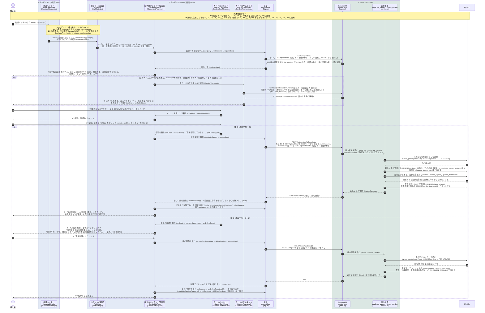

# UC-08 庭プロジェクトを管理する

```mermaid
sequenceDiagram
    autonumber
    actor User as 購入者
    box rgba(47,111,219,0.10) ブラウザー EC の画面 React
        participant Header as 共通ヘッダー<br/>KusakariHeader<br/>(KusakariHeader.jsx)
    end
    box rgba(47,111,219,0.10) ブラウザー Canvas の画面 React
        participant Gate as ログインの確認<br/>AuthGate<br/>(AuthGate.jsx)
        participant List as 庭プロジェクト一覧画面<br/>GardenListPage<br/>(GardenListPage.jsx)
        participant Card as カードのメニュー<br/>GardenCardMenu<br/>(GardenCardMenu.jsx)
        participant Thumb as カードのサムネイル<br/>GardenThumbnail<br/>(GardenThumbnail.jsx)
        participant Http as 通信<br/>requestJson<br/>(http.js)
    end
    box rgba(27,127,92,0.12) Canvas API FastAPI
        participant Main as Canvas API<br/>create_app<br/>(main.py)
        participant Svc as 庭の処理<br/>duplicate_garden・delete_garden<br/>(service.py)
    end
    participant Db as MySQL

    Note over User,Db: 共通代替フロー<br/>*b 未ログインの場合: 3、5、19、36 と、一覧の取り直しの 30、44 に適用<br/>*a 通信に失敗した場合: 3、5、10、19、36 と、一覧の取り直しの 30、44 と、MySQL を読み書きする 21、23、24、26、38、40 に適用

    User->>Header: 共通ヘッダーの「Canvas」をクリック
    Note over Header,Gate: ヘッダーは、押されたリンクの URL を<br/>EC の画面 (App.jsx) に渡す (follow → onNavigate)。<br/>EC の画面は、行き先が Canvas なので、ページごと移動する<br/>(navigateFromHeader → window.location.assign)
    Header->>Gate: Canvas の画面に切り替わる (window.location.assign)。<br>最初にログインの確認 (AuthGate) が動く
    Gate->>List: ログインを確かめて (GET /api/auth/status、EC の GET /api/auth/me)、<br/>庭一覧画面を表示する。詳しい流れは UC-01-1 の図と同じ
    List->>Http: 庭の一覧を取得する (useQuery → listGardens → requestJson)
    Http->>Main: GET /api/gardens<br/>(EC の GET /api/auth/me でログインを確かめる。詳しい流れは UC-01-1 の図と同じ)
    Main-->>Http: 200 庭の概要の配列 (list_gardens が MySQL から、配置の数と一緒に更新の新しい順に読む)
    Http-->>List: 庭の一覧 (gardens.data)
    List-->>User: 2 庭一覧画面を表示する。保存した庭のカード (名前、配置の数、最終保存の日時) と、<br/>最後に「新しい庭をつくる」カード
    loop 庭カードごと (img の読み込み。loading=lazy なので、画面の外のカードは表示されるまで読まない)
        List->>Thumb: 庭カードのサムネイルを表示 (GardenThumbnail)
        Thumb->>Main: GET /api/gardens/{id}/thumbnail (ログインの確認は 5 と同じ)<br/>最新の AI の画像、無ければ今の版の撮影画像、それも無ければ配置図にする<br/>(get → read_thumbnail。詳しい流れは UC-01-1 の図と同じ)
        Main-->>Thumb: 200 PNG (X-Thumbnail-Source に使った画像の種類)
        Thumb-->>User: サムネイルの画像。表示できない (エラーの応答など) ときは<br/>多角形のアイコン (onError → setFailed(true))
    end

    User->>Card: 3 対象の庭のカードの「…」(「(庭の名前)のオプション」) をクリック
    Card->>List: メニューを開くよう頼む (onToggle → setOpenMenuId)
    List-->>User: 4「複製」「削除」のメニュー
    User->>Card: 5「複製」または「削除」をクリック (select → onClose でメニューを閉じる)
    alt 複製 (基本フロー 6)
        Card->>List: 複製を頼む (onCopy → copyGarden)。「庭を複製しています…」(setCopying(true))
        List->>Http: 庭の複製を頼む (duplicateGarden → requestJson)
        Http->>Main: POST /api/gardens/{id}/duplicate<br/>先に EC の GET /api/auth/csrf で CSRF トークンを取り (authHeaders)、<br/>Canvas API は EC の POST /api/auth/verify でログインを確かめる
        Main->>Svc: 庭の複製を頼む (duplicate → duplicate_garden)<br/>duplicate_garden 全体が 1 つのトランザクション
        Svc->>Db: 元の庭の行をロックして読む<br/>(owned_garden(lock=True)、SELECT gardens … FOR UPDATE)
        Db-->>Svc: 元の庭の行
        Svc->>Db: 新しい庭を追加する (INSERT gardens。名前は「元の名前（複製）」(duplicate_name)、revision は 0、<br/>写真と shopping_targets_json はそのまま)
        Svc->>Db: 元の庭の配置と、撮影画像を読む (SELECT placed_objects、garden_thumbnails)
        Db-->>Svc: 配置の行と撮影画像 (撮影画像は今の版のときだけ写す)
        Svc->>Db: 配置を新しい ID で追加し (INSERT placed_objects)、<br/>撮影画像を写して (INSERT garden_thumbnails)、コミットする
        Svc-->>Main: 新しい庭の要約 (GardenSummary)
        Main-->>Http: 201 GardenSummary (新しい庭の要約)
        Http-->>List: 新しい庭の要約 (GardenSummary)。一覧画面は中身を使わず、終わるのを待つだけ (await)
        List->>Http: 成功でも失敗でも一覧を取り直す (finally → invalidateQueries(['gardens']) → listGardens)<br/>GET /api/gardens。流れは 5〜7 と同じ
        List-->>User: 6 一覧の先頭に「元の名前（複製）」のカード。<br/>「庭を複製しています…」を消す (setCopying(false))
    else 削除 (基本フロー 7〜9)
        Card->>List: 削除の確認を頼む (onDelete → removeGarden.reset、setDeleteTarget)
        List-->>User: 7「この庭を削除しますか？」ダイアログ<br/>「削除すると元に戻せません。」、庭の名前、<br/>「庭の写真、輪郭、配置したすべての素材と生成履歴を削除します。」、「取消」「庭を削除」
        User->>List: 8「庭を削除」をクリック
        List->>Http: 庭の削除を頼む (removeGarden.mutate → deleteGarden → requestJson)
        Http->>Main: DELETE /api/gardens/{id}<br/>CSRF トークンの取得とログインの確認は 19 と同じ
        Main->>Svc: 庭の削除を頼む (delete → delete_garden)
        Svc->>Db: 庭の行をロックして読む<br/>(owned_garden(lock=True)、SELECT gardens … FOR UPDATE)
        Db-->>Svc: 庭の行 (持ち主が違えば 404)
        Svc->>Db: 庭を消してコミットする (session.delete → DELETE gardens)<br/>配置、生成履歴、撮影画像は外部キーの ON DELETE CASCADE で消える
        Svc-->>Main: 返す値は無い (None)。庭を消し終わった
        Main-->>Http: 204
        Http-->>List: 削除できた (204 なので返す値は無い。undefined)
        List->>Http: ダイアログを閉じ (onSuccess → setDeleteTarget(null))、一覧を取り直す<br/>(invalidateQueries(['gardens']) → listGardens)。GET /api/gardens。流れは 5〜7 と同じ
        List-->>User: 9 一覧から庭が消える
    end
```

