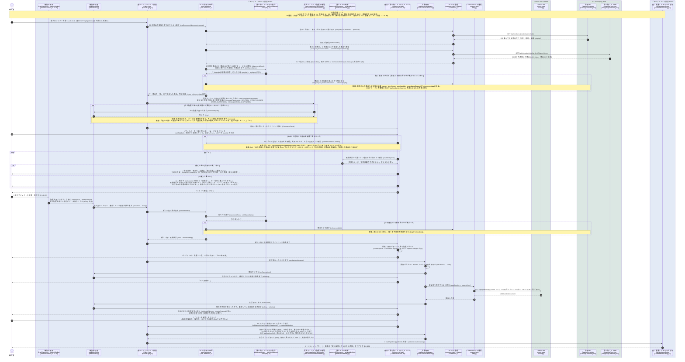

# UC-09 買い物リストを表示する

```mermaid
sequenceDiagram
    autonumber
    actor User as 購入者
    box rgba(47,111,219,0.10) ブラウザー Canvas の画面 React
        participant Parts as 編集の部品<br/>DropPlacement・ObjectToolbar<br/>(DropPlacement.jsx ほか)
        participant Store as 編集中の庭<br/>useEditorStore<br/>(editorStore.js)
        participant Editor as 庭シミュレーション画面<br/>EditorPage<br/>(EditorPage.jsx)
        participant Hook as EC の商品の取得<br/>useCommerce<br/>(useCommerce.js)
        participant Shop as 買い物リストの行の集計<br/>placementRows・withSavedItems<br/>(shopping.js)
        participant Unav as 買えなくなった配置の確認<br/>useUnavailablePlacements<br/>(useUnavailablePlacements.js)
        participant Avail as 買えるかの判断<br/>removedPlacements・availabilityNote<br/>(productAvailability.js)
        participant Panel as 商品・買い物リストのサイドバー<br/>CommercePanel<br/>(CommercePanel.jsx)
        participant Save as 自動保存<br/>useGardenAutosave<br/>(useGardenAutosave.js)
        participant Com as EC への通信<br/>commerceApi・request<br/>(commerce.js)
        participant Http as Canvas API への通信<br/>requestJson<br/>(http.js)
    end
    box rgba(27,127,92,0.12) Canvas API FastAPI
        participant Main as Canvas API<br/>create_app<br/>(main.py)
    end
    box rgba(27,127,92,0.12) EC API Spring Boot
        participant EcCat as 商品API<br/>CatalogController<br/>(CatalogController.java)
        participant EcShop as 買い物リストAPI<br/>ShoppingController<br/>(ShoppingController.java)
    end
    box rgba(47,111,219,0.10) ブラウザー EC の画面 React
        participant EcWeb as 庭に設置したものから追加<br/>GardenItemsDialog<br/>(GardenItemsDialog.jsx)
    end

    Note over User,EcWeb: 共通代替フロー<br/>*b 未ログインの場合: 4、8、照会の 13・32、自動保存の 43、移る前の保存の 51 と、再取得の 20 に適用<br/>*a 通信に失敗した場合: 4、8、照会の 13・32、自動保存の 43、移る前の保存の 51 と、再取得の 20 に適用 (8 と 20 は代替フロー 3b)

    User->>Editor: 庭プロジェクトを開く (UC-01-1。庭は GET /api/gardens/{id} で読み込み済み)
    Editor->>Hook: EC の商品の情報を取りに行くよう頼む (useCommerce(document, assets))
    Hook->>Com: 表示と同時に、購入できる商品の一覧を取る (useQuery ec-products → products)
    Com->>EcCat: GET /api/products (credentials include)
    EcCat-->>Com: 200 購入できる商品だけ (名前、画像、価格 priceYen)
    Com-->>Hook: 商品の配列 (products.data)
    Hook->>Com: 表示と同時に、この庭に EC で追加した商品を取る<br/>(useQuery ec-saved-items → savedItems(document.id))
    Com->>EcShop: GET /api/shopping-lists/{gardenId}/saved-items
    EcShop-->>Com: 200 EC で追加した商品 (listRevision、商品 ID と名前)
    Com-->>Hook: EC で追加した商品 (saved.data)。取れなければ CommerceError(data.message) を投げる (3b)
    Hook->>Shop: 2 配置を商品ごと (商品 ID が無ければアセットごと) に数え (placementRows)、<br/>配置に無い EC で追加した商品を足す (withSavedItems)
    Shop-->>Hook: 行 (quantity は配置の個数。足した行は quantity 1、unplaced が真)
    opt 行に商品 ID がある (商品 ID の組み合わせが変わるたびに送る)
        Hook->>Com: 商品ごとの店舗と買えるかを照会する<br/>(useQuery ec-product-references → references(ids))
        Note over Hook,EcCat: 結果: 削除された商品も含む照会結果 (name、storeName、purchasable、unavailableReason) が references.data になる。<br/>CSRF トークンの取得と POST /api/products/references の流れは UC-05 の図と同じ
    end
    Hook-->>Editor: 3 行、商品の一覧、EC で追加した商品、照会結果 (rows、referenceMap ほか)
    Editor->>Unav: 買えなくなった商品の配置を調べるよう頼む (useUnavailablePlacements)<br/>戻らない理由で買えない配置を選ぶ (removedPlacements。DELETED、STORE_CLOSED、<br/>STORE_SUSPENDED、ORGANIZATION_SUSPENDED)
    opt 外す配置がある (庭を開いて最初の 1 回だけ。記述なし)
        Unav->>Store: その配置を庭から外す (removeObjects)
        Store-->>Unav: 外した (true)
        Note over Store,Unav: 結果: 未保存になり、37〜 の自動保存が走る。外した商品の名前を返す (removed)。<br/>画面: 「庭から外した商品があります」ダイアログ「(商品名)の商品は購入できなくなったため、庭から外しました。」「OK」
    end
    Editor->>Panel: 商品・買い物リストのサイドバーを描く (CommercePanel)

    User->>Panel: 1 サイドバーの「買い物リスト（N）」タブをクリック<br/>(setTab('list')。最初から選ばれている。通信しない)。N は行の quantity の合計
    opt 3b EC で追加した商品を取得できなかった
        Panel->>Hook: 3b-2「ECで追加した商品を再取得」を押されたら、もう一度取るよう頼む (commerce.saved.refetch)
        Note over Hook,Panel: 結果: 同じ GET /api/shopping-lists/{gardenId}/saved-items を送り、取れたら行を作り直す (基本フロー 3 へ戻る)。<br/>画面: 3b-1「ECで追加した商品を取得できません。(EC かブラウザーのエラーの文)」と「ECで追加した商品を再取得」(配置した商品の行は出す)
    end
    loop 行ごと
        Panel->>Avail: 照会結果から買えない理由の文を作るよう頼む (availabilityNote)
        Avail-->>Panel: 「在庫なし」か「現在は購入できません」、買えるなら無し
        alt 購入できる (商品の一覧にある)
            Panel-->>User: 4 商品画像、商品名、店舗名、庭に設置した数のバッジ、<br/>「小計の目安」(priceYen × quantity)。EC で追加しただけの行は「ECで追加（庭に未配置）」
        else 3a 購入できない
            Panel-->>User: 3a-1 照会で purchasable が偽なら「在庫なし」か「現在は購入できません」、<br/>照会結果も商品の一覧の商品も無ければ「現在は販売されていないため購入できません。<br/>保存済みの配置は維持されます。」。画像と小計は出さない (3a-2 基本フロー 4 へ進む)
        end
    end
    Panel-->>User: 「リストを確認」ボタン

    User->>Parts: 5 庭オブジェクトを設置・削除する (UC-05)
    Parts->>Store: 配置を足すか消すよう頼む (addAssetAt、deleteSelected)<br/>庭の配置を新しい配列にし、未保存にする (isDirty を真)
    Store->>Editor: 庭が変わったので、購読している画面を描き直す (document、isDirty)
    Editor->>Hook: 新しい庭で描き直す (useCommerce)
    Hook->>Shop: 行を作り直す (placementRows、withSavedItems)
    Shop-->>Hook: 作り直した行
    opt 行の商品 ID の組み合わせが変わった
        Hook->>Com: 照会をやり直す (references(ids))
        Note over Hook,EcCat: 結果: 流れは 13 と同じ。届くまでは前の結果を使う (keepPreviousData)。
    end
    Hook-->>Editor: 新しい行と照会結果 (rows、referenceMap)
    Editor->>Panel: 新しい行と照会結果でサイドバーを描き直す
    Panel->>Panel: 最後に保存が済んだときの配置と比べる<br/>(savedObjects と document.objects が違うので objectsChanged が真)
    Panel-->>User: 6 タブの（N）、設置した数、小計の目安と、「ECへ未反映」
    Editor->>Save: 庭が変わったことを渡す (useGardenAutosave)
    Save->>Save: 操作が止まって 500 ms たったら保存を始める (setTimeout → save)
    Save->>Store: 保存中にする (setSaving(true))
    Store->>Panel: 保存中になったので、購読している画面を描き直す (isSaving)
    Panel-->>User: 「ECへ反映中…」
    Save->>Http: 庭全体を保存するよう頼む (saveGarden → requestJson)
    Http->>Main: PUT /api/gardens/{id} (CSRF トークンの取得とサーバーの中は UC-07 の図と同じ流れ)
    Main-->>Http: 200 GardenDocument
    Http-->>Save: 保存した庭
    Save->>Store: 保存済みにする (markSaved)
    Store->>Panel: 保存の状態が変わったので、購読している画面を描き直す (isDirty、isSaving)
    Panel-->>User: 保存が済んだ配置を覚え直し (setSavedObjects。objectsChanged が偽)、<br/>反映の状態を消す (反映済みの表示は無い)

    User->>Panel: 7「リストを確認」をクリック<br/>(輪郭の描画中、操作中、カタログの読み込み中は押せない)
    Panel->>Editor: EC のカート画面の URL へ移るよう頼む<br/>(onNavigate(/cart?garden={gardenId}) → requestNavigation)
    Editor->>Save: 保存が終わるのを待つ (flush)。7a 保存中か、未保存の編集があれば、<br/>7a-1 保存中ならその応答を待ち、まだ未保存なら save をくり返す<br/>(PUT /api/gardens/{id}。流れは 42〜45 と同じ)。保存済みなら送らない
    Save-->>Editor: 保存がすべて済んだ (true)。保存できなければ false で、画面は移らない
    Editor->>EcWeb: 8 /cart?garden={gardenId} を開く (window.location.assign)
    EcWeb-->>User: 8「ショッピングカート」画面の「庭に設置したものから追加」ダイアログ (EC-B24)
```

