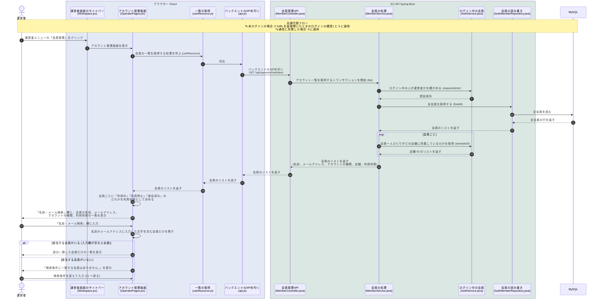

# EC-A01 会員を検索・確認する

```mermaid
sequenceDiagram
    autonumber
    actor User as 運営者
    box rgba(47,111,219,0.10) ブラウザー React
        participant Work as 運営者画面のサイドバー<br/>(Workspace.jsx)
        participant Page as アカウント管理画面<br/>(OperatorPages.jsx)
        participant Hook as 一覧の取得<br/>(useResource.js)
        participant Http as バックエンドのAPIを叩く<br/>(api.js)
    end
    box rgba(27,127,92,0.12) EC API Spring Boot
        participant Ctrl as 会員管理API<br/>(MemberController.java)
        participant Svc as 会員の処理<br/>(MemberService.java)
        participant Auth as ログイン中の会員<br/>(AuthService.java)
        participant Repo as 会員の読み書き<br/>(AuthMemberRepository.java)
    end
    participant Db as MySQL

    Note over User,Db: 共通代替フロー<br/>*b 未ログインの場合: 2 (URL を直接開いたときのログインの確認) と 5 に適用<br/>*a 通信に失敗した場合: 5 に適用

    User->>Work: 運営者メニューの「会員管理」をクリック
    Work->>Page: アカウント管理画面を表示
    Page->>Hook: 会員の一覧を取得する処理を呼ぶ (useResource)
    Hook->>Http: 同左
    Http->>Ctrl: バックエンドのAPIを叩く<br/>GET /api/operator/members
    Ctrl->>Svc: アカウント一覧を取得するトランザクションを開始 (list)
    Svc->>Auth: ログイン中の人が運営者かを確かめる (requireAdmin)
    Auth-->>Svc: 認証成功
    Svc->>Repo: 全会員を取得する (findAll)
    Repo->>Db: 全会員を読む
    Db-->>Repo: 全会員の行を返す
    Repo-->>Svc: 会員のリストを返す
    loop 会員ごと
        Svc->>Auth: 会員一人ひとりがどの店舗に所属しているのかを取得 (storeIdsOf)
        Auth-->>Svc: 店舗 ID のリストを返す
    end
    Svc-->>Ctrl: 会員のリストを返す<br/>(名前、メールアドレス、アカウントの種類、店舗、利用状態)
    Ctrl-->>Http: 会員のリストを返す
    Http-->>Hook: 会員のリストを返す
    Hook-->>Page: 会員のリストを返す
    Page->>Page: 会員ごとに「利用中」「利用停止」「退会済み」の<br/>どれかを利用状態として決める
    Page-->>User: 「名前・メール検索」欄と、会員の名前、メールアドレス、<br/>アカウントの種類、利用状態の一覧を表示

    User->>Page: 「名前・メール検索」欄に入力
    Page->>Page: 名前かメールアドレスに入力した文字を含む会員だけを残す
    alt 該当する会員がいる (入力欄が空なら全員)
        Page-->>User: 部分一致した会員だけの一覧を表示
    else 該当する会員がいない
        Page-->>User: 「検索条件に一致する会員はありません。」を表示
        User->>Page: 検索条件を変えて入力 (21 へ戻る)
    end
```

