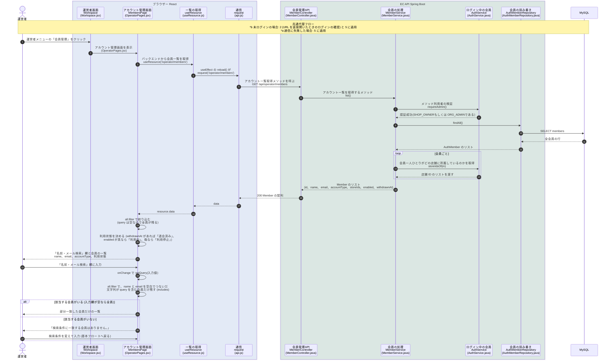

# EC-A01 会員を検索・確認する

```mermaid
sequenceDiagram
    autonumber
    actor User as 運営者
    box rgba(47,111,219,0.10) ブラウザー React
        participant Work as 運営者画面<br/>Workspace<br/>(Workspace.jsx)
        participant Page as アカウント管理画面<br/>MembersPage<br/>(OperatorPages.jsx)
        participant Hook as 一覧の取得<br/>useResource<br/>(useResource.js)
        participant Http as 通信<br/>request<br/>(api.js)
    end
    box rgba(27,127,92,0.12) EC API Spring Boot
        participant Ctrl as 会員管理API<br/>MemberController<br/>(MemberController.java)
        participant Svc as 会員の処理<br/>MemberService<br/>(MemberService.java)
        participant Auth as ログイン中の会員<br/>AuthService<br/>(AuthService.java)
        participant Repo as 会員の読み書き<br/>AuthMemberRepository<br/>(AuthMemberRepository.java)
    end
    participant Db as MySQL

    Note over User,Db: 共通代替フロー<br/>*b 未ログインの場合: 2 (URL を直接開いたときのログインの確認) と 5 に適用<br/>*a 通信に失敗した場合: 5 に適用

    User->>Work: 運営者メニューの「会員管理」をクリック
    Work->>Page: アカウント管理画面を表示<br/>(OperatorPages.jsx)
    Page->>Hook: バックエンドから会員一覧を取得<br>useResource('/operator/members')
    Hook->>Http: useEffect の reload() が<br/>request('/operator/members')
    Http->>Ctrl: アカウント一覧取得メソッドを呼ぶ<br>GET /api/operator/members
    Ctrl->>Svc: アカウント一覧を取得するメソッド<br>list()
    Svc->>Auth: メソッド利用者の検証<br>requireAdmin()
    Auth-->>Svc: 認証成功(SHOP_OWNERもしくは ORG_ADMINである)
    Svc->>Repo: findAll()
    Repo->>Db: SELECT members
    Db-->>Repo: 全会員の行
    Repo-->>Svc: AuthMember のリスト
    loop 会員ごと
        Svc->>Auth: 会員一人ひとりがどの店舗に所属しているのかを取得<br>storeIdsOf(m)
        Auth-->>Svc: 店舗 ID のリストを渡す
    end
    Svc-->>Ctrl: Member のリスト<br/>(id、name、email、accountType、storeIds、enabled、withdrawnAt)
    Ctrl-->>Http: 200 Member の配列
    Http-->>Hook: data
    Hook-->>Page: resource.data
    Page->>Page: all.filter で絞り込む<br/>(query は空なので全員が残る)
    Page->>Page: 利用状態を決める (withdrawnAt があれば「退会済み」、<br/>enabled が真なら「利用中」、偽なら「利用停止」)
    Page-->>User: 「名前・メール検索」欄と会員の一覧<br/>name、email、accountType、利用状態

    User->>Page: 「名前・メール検索」欄に入力
    Page->>Page: onChange で setQuery(入力値)
    Page->>Page: all.filter で、name と email を空白でつないだ<br/>文字列が query を含む会員だけ残す (includes)
    alt 該当する会員がいる (入力欄が空なら全員)
        Page-->>User: 部分一致した会員だけの一覧
    else 該当する会員がいない
        Page-->>User: 「検索条件に一致する会員はありません。」
        User->>Page: 検索条件を変えて入力 (基本フロー 3 へ戻る)
    end
```

