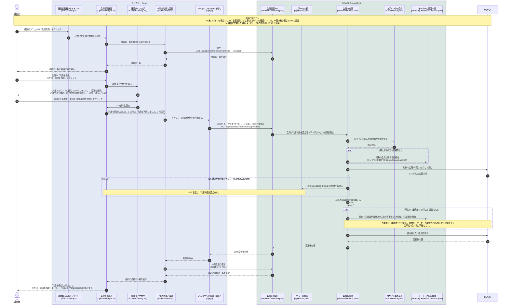

# EC-A02 アカウントの利用状況を変更する

```mermaid
sequenceDiagram
    autonumber
    actor User as 運営者
    box rgba(47,111,219,0.10) ブラウザー React
        participant Work as 運営者画面のサイドバー<br>(Workspace.jsx)
        participant Page as 会員管理画面<br/>(OperatorPages.jsx)
        participant Dlg as 確認ダイアログ<br/>(ConfirmDialog.jsx)
        participant Hook as 一覧の取得と変更<br/>(useResource.js)
        participant Http as バックエンドのAPIを叩く<br/>(api.js)
    end
    box rgba(27,127,92,0.12) EC API Spring Boot
        participant Ctrl as 会員管理API<br/>(MemberController.java)
        participant Errs as エラーの応答<br/>(ApiErrors.java)
        participant Svc as 会員の処理<br/>(MemberService.java)
        participant Auth as ログイン中の会員<br/>(AuthService.java)
        participant Pend as オーナーの譲渡申請<br>(PendingOwnerSuccession.java)
    end
    participant Db as MySQL

    Note over User,Db: 共通代替フロー<br/>*b 未ログインの場合: 2 (URL を直接開いたときのログインの確認)、4、15、一覧の取り直しの 30 に適用<br/>*a 通信に失敗した場合: 4、15、一覧の取り直しの 30 に適用

    User->>Work: 運営者メニューの「会員管理」をクリック
    Work->>Page: アカウント管理者画面を表示
    Page->>Hook: 会員の一覧を取得する処理を呼ぶ
    Hook->>Ctrl: 同左<br/>GET /api/operator/members (reload → request)
    Ctrl-->>Hook: 会員の一覧を返す
    Hook-->>Page: 会員の一覧
    Page-->>User: 会員の一覧と利用状態 を表示

    User->>Page: 会員の「利用を停止」<br/>または「利用を再開」をクリック
    Page->>Dlg: 確認ダイアログを表示
    Dlg-->>User: 対象アカウントの氏名（メールアドレス）、変更の説明、<br/>「利用停止を確定」か「利用再開を確定」、「取消」ボタンを表示

    User->>Dlg: 「利用停止を確定」または「利用再開を確定」をクリック
    Dlg->>Page: 11の操作を反映
    Page->>Hook: 「利用を停止しました。」または「利用を再開しました。」を表示
    Hook->>Http: アカウントの有効状態を切り替える
    Http->>Ctrl: CSRF トークンを付けて、バックエンドのAPIを叩く<br/>PUT /api/operator/members/{id}/enabled
    Ctrl->>Svc: 会員の利用状態を変えるトランザクション処理を開始
    Svc->>Auth: ログイン中の人が運営者かを確かめる 
    Auth-->>Svc: 認証成功
    opt 停止するとき (記述なし)
        Svc->>Pend: 対象の会員が属する組織を<br>ロックする処理を呼ぶ (lockOrganizationOf)
    end
    Svc->>Db: 対象の会員の行をロックして読む
    Db-->>Svc: ロックした会員の行
    break 6a 対象が運営者アカウントか退会済みの場合
        Svc--xErrs: 409 MEMBER_FIXED の例外を投げる 
        Note over Errs,Page:  409 を返し、利用状態は変えない。
    end
    Svc->>Svc: 会員の利用状態を書き換える
    opt 停止で、組織をロックした (記述なし)
        Svc->>Pend: 停止する会員が譲渡の申し出の当事者なら無効にする処理を開始
        Note over Svc,Db: 当事者なら承認待ちを空にし、履歴と、オーナーと譲渡先への通知 2 件を保存する<br>当事者でなければ何もしない。
    end
    Svc->>Db: 書き換えた行を保存する
    Db-->>Svc: 変更後の値
    Svc-->>Ctrl: 変更後の値
    Ctrl-->>Http: 200 変更後の値
    Http-->>Hook: 変更後の値
    Hook->>Ctrl: 一覧を取り直す <br/>流れは 4〜5 と同じ
    Ctrl-->>Hook: 最新の会員の一覧を返す
    Hook-->>Page: 最新の会員の一覧を返す
    Page-->>User: 「利用を停止しました。」<br/>または「利用を再開しました。」を表示して更新後の利用状態にする
```

