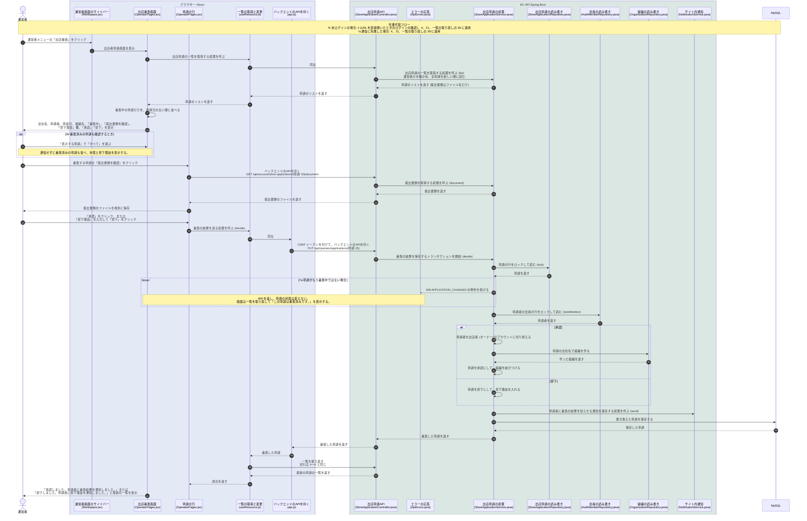

# EC-A03 出店申請を審査する

```mermaid
sequenceDiagram
    autonumber
    actor User as 運営者
    box rgba(47,111,219,0.10) ブラウザー React
        participant Work as 運営者画面のサイドバー<br>(Workspace.jsx)
        participant Page as 出店審査画面<br/>(OperatorPages.jsx)
        participant Row as 申請の行<br/>(OperatorPages.jsx)
        participant Hook as 一覧の取得と変更<br/>(useResource.js)
        participant Http as バックエンドのAPIを叩く<br/>(api.js)
    end
    box rgba(27,127,92,0.12) EC API Spring Boot
        participant Ctrl as 出店申請API<br/>(StoreApplicationController.java)
        participant Errs as エラーの応答<br/>(ApiErrors.java)
        participant Svc as 出店申請の処理<br/>(StoreApplicationService.java)
        participant AppRepo as 出店申請の読み書き<br/>(StoreApplicationRepository.java)
        participant MemRepo as 会員の読み書き<br/>(AuthMemberRepository.java)
        participant OrgRepo as 組織の読み書き<br/>(OrganizationRepository.java)
        participant Notices as サイト内通知<br/>(NotificationService.java)
    end
    participant Db as MySQL

    Note over User,Db: 共通代替フロー<br/>*b 未ログインの場合: 2 (URL を直接開いたときのログインの確認)、4、21、一覧の取り直しの 39 に適用<br/>*a 通信に失敗した場合: 4、21、一覧の取り直しの 39 に適用

    User->>Work: 運営者メニューの「出店審査」をクリック
    Work->>Page: 出店者申請画面を表示
    Page->>Hook: 出店申請の一覧を取得する処理を呼ぶ
    Hook->>Ctrl: 同左
    Ctrl->>Svc: 出店申請の一覧を取得する処理を呼ぶ (list)<br/>運営者かを確かめ、全申請を新しい順に読む
    Svc-->>Ctrl: 申請のリストを返す (提出書類はファイル名だけ)
    Ctrl-->>Hook: 申請のリストを返す
    Hook-->>Page: 申請のリストを返す
    Page->>Page: 審査中の申請だけを、申請日の古い順に並べる
    Page-->>User: 会社名、申請者、申請日、連絡先、「審査中」、「提出書類を確認」、<br/>「却下理由」欄、「承認」「却下」を表示
    opt 3b 審査済みの申請も確認するとき
        User->>Page: 「表示する申請」で「すべて」を選ぶ
        Note over User,Page: 通信せずに審査済みの申請も並べ、状態と却下理由を表示する。
    end

    User->>Row: 審査する申請の「提出書類を確認」をクリック
    Row->>Ctrl: バックエンドのAPIを叩く<br/>GET /api/account/store-applications/{申請 ID}/document
    Ctrl->>Svc: 提出書類を取得する処理を呼ぶ (document)
    Svc-->>Ctrl: 提出書類を返す
    Ctrl-->>Row: 提出書類のファイルを返す
    Row-->>User: 提出書類のファイルを端末に保存

    User->>Row: 「承認」をクリック、または<br/>「却下理由」を入力して「却下」をクリック
    Row->>Hook: 審査の結果を送る処理を呼ぶ (decide)
    Hook->>Http: 同左
    Http->>Ctrl: CSRF トークンを付けて、バックエンドのAPIを叩く<br/>PUT /api/operator/applications/{申請 ID}
    Ctrl->>Svc: 審査の結果を保存するトランザクションを開始 (decide)
    Svc->>AppRepo: 申請の行をロックして読む (lock)
    AppRepo-->>Svc: 申請を返す
    break 7a 申請がもう審査中ではない場合
        Svc--xErrs: 409 APPLICATION_CHANGED の例外を投げる
        Note over Errs,Page: 409 を返し、申請の状態は変えない。<br/>画面は一覧を取り直して「この申請は審査済みです。」を表示する。
    end
    Svc->>MemRepo: 申請者の会員の行をロックして読む (lockMember)
    MemRepo-->>Svc: 申請者を返す
    alt 承認
        Svc->>Svc: 申請者を出店者 (オーナー) のアカウントに切り替える
        Svc->>OrgRepo: 申請の会社名で組織を作る
        OrgRepo-->>Svc: 作った組織を返す
        Svc->>Svc: 申請を承認にして、組織を結びつける
    else 却下
        Svc->>Svc: 申請を却下にして、却下理由を入れる
    end
    Svc->>Notices: 申請者に審査の結果を知らせる通知を保存する処理を呼ぶ (send)
    Svc->>Db: 書き換えた申請を保存する
    Db-->>Svc: 保存した申請
    Svc-->>Ctrl: 審査した申請を返す
    Ctrl-->>Http: 審査した申請を返す
    Http-->>Hook: 審査した申請
    Hook->>Ctrl: 一覧を取り直す<br/>流れは 4〜8 と同じ
    Ctrl-->>Hook: 最新の申請の一覧を返す
    Hook-->>Row: 成功を返す
    Page-->>User: 「承認しました。申請者に審査結果を通知しました。」または<br/>「却下しました。申請者に却下理由を通知しました。」と最新の一覧を表示
```

