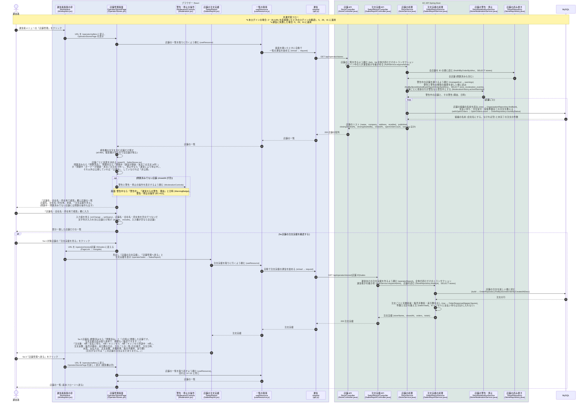

# EC-A05 店舗情報を確認する

```mermaid
sequenceDiagram
    autonumber
    actor User as 運営者
    box rgba(47,111,219,0.10) ブラウザー React
        participant Work as 運営者画面の枠<br/>Workspace<br/>(Workspace.jsx)
        participant Page as 店舗管理画面<br/>OperatorStoresPage<br/>(OperatorStores.jsx)
        participant Mod as 警告・停止の操作<br/>ModerationControls<br/>(Moderation.jsx)
        participant Sales as 店舗の注文実績<br/>SalesReport<br/>(SalesReport.jsx)
        participant Hook as 一覧の取得<br/>useResource<br/>(useResource.js)
        participant Http as 通信<br/>request<br/>(api.js)
    end
    box rgba(27,127,92,0.12) EC API Spring Boot
        participant Ctrl as 店舗API<br/>StoreController<br/>(StoreController.java)
        participant SCtrl as 注文実績API<br/>SalesReportController<br/>(SalesReportController.java)
        participant Svc as 店舗の処理<br/>StoreService<br/>(StoreService.java)
        participant SSvc as 注文実績の処理<br/>SalesReportService<br/>(SalesReportService.java)
        participant Mods as 店舗の警告・停止<br/>StoreModerationService<br/>(StoreModerationService.java)
        participant Repo as 店舗の読み書き<br/>StoreRepository<br/>(StoreRepository.java)
    end
    participant Db as MySQL

    Note over User,Db: 共通代替フロー<br/>*b 未ログインの場合: 2・26 (URL を直接開いたときのログインの確認)、5、29、41 に適用<br/>*a 通信に失敗した場合: 5、29、41 に適用

    User->>Work: 運営者メニューの「店舗管理」をクリック
    Work->>Page: URL を /operator/sellers に変え、<br/>OperatorStoresPage を表示
    Page->>Hook: 店舗の一覧を取りに行くよう頼む (useResource)
    Hook->>Http: 画面を開いたときに自動で<br/>一覧の通信を始める (reload → request)
    Http->>Ctrl: GET /api/operator/stores
    Ctrl->>Svc: 店舗の一覧を作るよう頼む (list)。list 全体が読むだけのトランザクション<br/>ログイン中の人が運営者かを確かめる (AuthService.requireAdmin)
    Svc->>Repo: 全店舗を ID の順に読む (findAllByOrderByIdAsc、SELECT stores)
    Repo-->>Svc: 全店舗 (閉鎖済みも含む)
    Svc->>Mods: 警告中の店舗を調べるよう頼む (managedList → warnings)<br/>警告と警告の解除の履歴を新しい順に読み<br/>(findByStoreIdInAndEventTypeInOrderByIdDesc、SELECT store_moderation_events)、<br/>店舗ごとに最新の行が警告なら警告中とする (ModerationHistory.activeWarnings)
    Mods-->>Svc: 警告中の店舗と、その警告 (理由、日時)
    loop 店舗ごと
        Svc->>Db: 店舗の組織の名前を読み (view → OrganizationRepository.findById)、<br/>支払い待ち・注文受付・受取準備完了の注文を数える<br/>(withOpenOrders → OpenOrders.count → OrderRepository.countByStatus)
        Db-->>Svc: 組織の名前 (会社名にする。なければ空) と未完了の注文の件数
    end
    Svc-->>Ctrl: 店舗のリスト (name、company、address、enabled、published、<br/>closingStartedAt、closingStartedBy、closedAt、openOrderCount、warning ほか)
    Ctrl-->>Http: 200 店舗の配列
    Http-->>Hook: 店舗の一覧
    Hook-->>Page: 店舗の一覧
    Page->>Page: 検索欄の文字を含む店舗だけ残す<br/>(all.filter。検索欄が空なので全店舗が残る)
    Page->>Page: 店舗ごとに状態を決める (stateOf、SellerStores.jsx)<br/>閉鎖済みなら「閉鎖済み」、閉鎖中なら「閉鎖中（運営が開始・未完了の注文 N件）」<br/>か「閉鎖中（オーナーが開始・未完了の注文 N件）」、停止中なら「運営により停止中」、<br/>それ以外は公開していれば「公開中」、していなければ「非公開」
    opt 閉鎖済みでない店舗 (closedAt が空)
        Page->>Mod: 警告と警告・停止の操作を表示するよう頼む (ModerationControls)
        Note over Page,Mod: 画面: 警告中なら「警告中」、「運営からの警告：理由」と日時 (WarningBadge)、<br/>警告・停止の操作 (EC-A11)。
    end
    Page-->>User: 「店舗名・会社名・所在地で検索」欄と店舗の一覧<br/>店舗名、会社名 / 所在地、状態、「注文実績を見る」<br/>(閉鎖中・閉鎖済みでない店舗には閉鎖の操作も出す)

    User->>Page: 「店舗名・会社名・所在地で検索」欄に入力
    Page->>Page: 入力値を覚え (onChange → setQuery)、店舗名・会社名・所在地を空白でつないだ<br/>文字列が入力を含む店舗だけ残す (all.filter、includes。入力欄が空なら全店舗)
    Page-->>User: 部分一致した店舗だけの一覧

    alt 5a 店舗の注文実績を確認する
        User->>Page: 5a-1 対象店舗の「注文実績を見る」をクリック
        Page->>Work: URL を /operator/stores/{店舗 ID}/sales に変える<br/>(PageLink → navigate)
        Work->>Sales: 見出し「店舗の注文実績」、「店舗管理へ戻る」と<br/>注文実績を表示 (operatorSales → SalesReport)
        Sales->>Hook: 注文実績を取りに行くよう頼む (useResource)
        Hook->>Http: 自動で注文実績の通信を始める (reload → request)
        Http->>SCtrl: GET /api/operator/stores/{店舗 ID}/sales
        SCtrl->>SSvc: 運営向けの注文実績を作るよう頼む (operatorReport)。全体が読むだけのトランザクション<br/>運営者かを確かめ (AuthService.requireAdmin)、店舗を読む (StoreRepository.findById、SELECT stores)
        SSvc->>Db: 店舗の注文を新しい順に読む<br/>(build → OrderRepository.findByStoreIdOrderByCreatedAtDesc)
        Db-->>SSvc: 注文の行
        SSvc->>SSvc: 注文ごとに手数料率・販売手数料・差引額を出し (row → OrderResponseMapper.figures)、<br/>件数と合計を数える (SalesTotals。キャンセルと支払い待ちは合計に入れない)
        SSvc-->>SCtrl: 注文実績 (storeName、closedAt、orders、totals)
        SCtrl-->>Http: 200 注文実績
        Http-->>Hook: 注文実績
        Hook-->>Sales: 注文実績
        Sales-->>User: 5a-2 店舗名 (閉鎖済みなら「閉鎖済み」と「(日時)に閉鎖した店舗です。<br/>注文実績は読み取り専用で、期限なく確認できます。」)、<br/>「注文数：N件 / 支払い待ち：N件 / キャンセル：N件 / キャンセル申請中：N件」、<br/>注文金額・販売手数料・差引額の合計、注文ごとの一覧 (注文番号、注文日時、<br/>状態、支払方法、注文金額、手数料率、販売手数料、差引額)<br/>(注文がなければ「この店舗の注文はまだありません。」)
        User->>Work: 5a-3「店舗管理へ戻る」をクリック
        Work->>Page: URL を /operator/sellers に変え、<br/>OperatorStoresPage を新しく表示 (検索欄は空)
        Page->>Hook: 店舗の一覧を取り直すよう頼む (useResource)。<br/>流れは 4〜16 と同じ
        Hook-->>Page: 店舗の一覧
        Page-->>User: 店舗の一覧 (基本フロー 2 へ戻る)
    end
```

