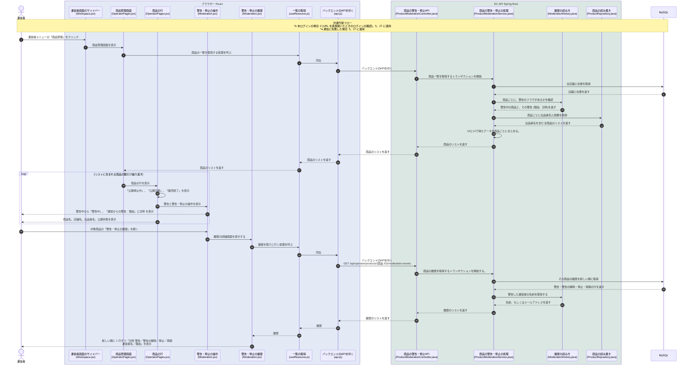

# EC-A06 商品情報を確認する

```mermaid
sequenceDiagram
    autonumber
    actor User as 運営者
    box rgba(47,111,219,0.10) ブラウザー React
        participant Work as 運営者画面のサイドバー<br/>(Workspace.jsx)
        participant Page as 商品管理画面<br/>(OperatorPages.jsx)
        participant Row as 商品の行<br/>(OperatorPages.jsx)
        participant Mod as 警告・停止の操作<br/>(Moderation.jsx)
        participant Ev as 警告・停止の履歴<br/>(Moderation.jsx)
        participant Hook as 一覧の取得<br/>(useResource.js)
        participant Http as バックエンドのAPIを叩く<br/>(api.js)
    end
    box rgba(27,127,92,0.12) EC API Spring Boot
        participant Ctrl as 商品の警告・停止API<br/>(ProductModerationController.java)
        participant Svc as 商品の警告・停止の処理<br/>(ProductModerationService.java)
        participant Hist as 履歴の読み方<br/>(ModerationHistory.java)
        participant Repo as 商品の読み書き<br/>(ProductRepository.java)
    end
    participant Db as MySQL

    Note over User,Db: 共通代替フロー<br/>*b 未ログインの場合: 2 (URL を直接開いたときのログインの確認)、5、27 に適用<br/>*a 通信に失敗した場合: 5、27 に適用

    User->>Work: 運営者メニューの「商品管理」をクリック
    Work->>Page: 商品管理画面を表示
    Page->>Hook: 商品の一覧を取得する処理を呼ぶ
    Hook->>Http: 同左
    Http->>Ctrl: バックエンドのAPIを叩く
    Ctrl->>Svc: 商品一覧を取得するトランザクションを開始
    Svc->>Db: 全店舗と在庫を取得
    Db-->>Svc: 店舗と在庫を返す
    Svc->>Hist: 商品ごとに、警告のフラグがあるかを確認
    Hist-->>Svc: 警告中の商品と、その警告 (理由、日時)を返す
    Svc->>Repo: 商品ごとに出品者名と画像を取得
    Repo-->>Svc: 出品者名を含む 全商品のリストを返す
    Svc->>Svc: 10と12で得たデータを商品ごとにまとめる。
    Svc-->>Ctrl: 商品のリストを返す
    Ctrl-->>Http: 商品のリストを返す
    Http-->>Hook: 商品のリストを返す
    Hook-->>Page: 商品のリストを返す
    loop リストに含まれる商品の数だけ繰り返す
        Page->>Row: 商品の行を表示
        Row->>Row: 「公開停止中」、「公開可能」、「販売終了」を表示
        Row->>Mod: 警告と警告・停止の操作を表示 
        Mod-->>User: 警告中なら「警告中」、「運営からの警告：理由」と日時 を表示
        Row-->>User: 商品名、店舗名、出品者名、公開状態を表示
    end

    User->>Mod: 対象商品の「警告・停止の履歴」を開く
    Mod->>Ev: 履歴の詳細画面を表示する
    Ev->>Hook: 履歴を取りに行く処理を呼ぶ
    Hook->>Http: 同左
    Http->>Ctrl: バックエンドのAPIを叩く<br>GET /api/operator/products/{商品 ID}/moderation-events
    Ctrl->>Svc: 商品の履歴を取得するトランザクションを開始する。
    Svc->>Db: その商品の履歴を新しい順に取得
    Db-->>Svc: 警告・警告の解除・停止・再開の行を返す
    Svc->>Hist: 警告した運営者の名前を取得する
    Hist-->>Svc: 名前、もしくはメールアドレスを返す
    Svc-->>Ctrl: 履歴のリストを返す
    Ctrl-->>Http: 履歴のリストを返す
    Http-->>Hook: 履歴
    Hook-->>Ev: 履歴
    Ev-->>User: 新しい順に 1 行ずつ「日時 警告／警告の解除／停止／再開<br>運営者名／理由」を表示
```

