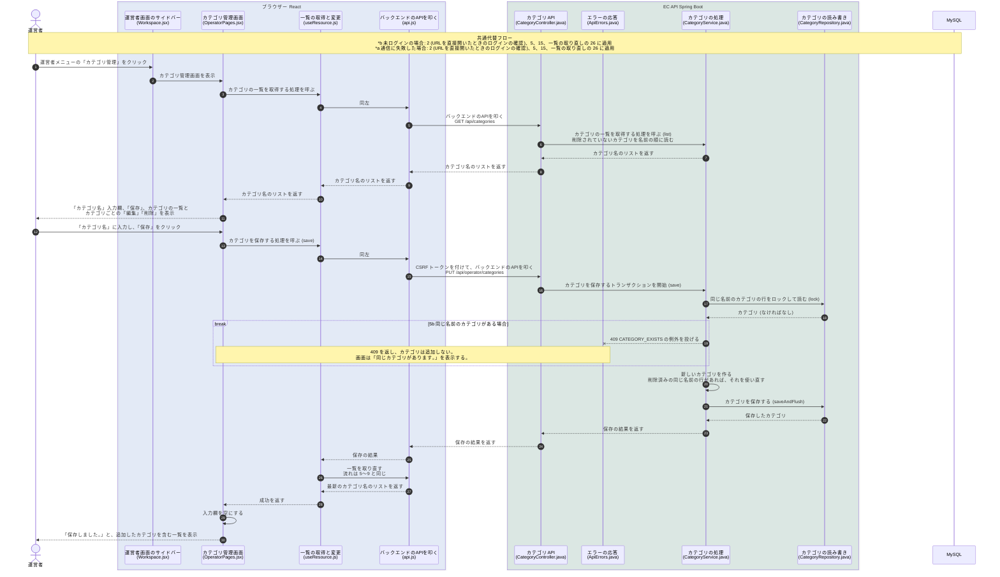

# EC-A07 商品カテゴリを追加する

```mermaid
sequenceDiagram
    autonumber
    actor User as 運営者
    box rgba(47,111,219,0.10) ブラウザー React
        participant Work as 運営者画面のサイドバー<br/>(Workspace.jsx)
        participant Page as カテゴリ管理画面<br/>(OperatorPages.jsx)
        participant Hook as 一覧の取得と変更<br/>(useResource.js)
        participant Http as バックエンドのAPIを叩く<br/>(api.js)
    end
    box rgba(27,127,92,0.12) EC API Spring Boot
        participant Ctrl as カテゴリAPI<br/>(CategoryController.java)
        participant Errs as エラーの応答<br/>(ApiErrors.java)
        participant Svc as カテゴリの処理<br/>(CategoryService.java)
        participant Repo as カテゴリの読み書き<br/>(CategoryRepository.java)
    end
    participant Db as MySQL

    Note over User,Db: 共通代替フロー<br/>*b 未ログインの場合: 2 (URL を直接開いたときのログインの確認)、5、15、一覧の取り直しの 26 に適用<br/>*a 通信に失敗した場合: 2 (URL を直接開いたときのログインの確認)、5、15、一覧の取り直しの 26 に適用

    User->>Work: 運営者メニューの「カテゴリ管理」をクリック
    Work->>Page: カテゴリ管理画面を表示
    Page->>Hook: カテゴリの一覧を取得する処理を呼ぶ
    Hook->>Http: 同左
    Http->>Ctrl: バックエンドのAPIを叩く<br/>GET /api/categories
    Ctrl->>Svc: カテゴリの一覧を取得する処理を呼ぶ (list)<br/>削除されていないカテゴリを名前の順に読む
    Svc-->>Ctrl: カテゴリ名のリストを返す
    Ctrl-->>Http: カテゴリ名のリストを返す
    Http-->>Hook: カテゴリ名のリストを返す
    Hook-->>Page: カテゴリ名のリストを返す
    Page-->>User: 「カテゴリ名」入力欄、「保存」、カテゴリの一覧と<br/>カテゴリごとの「編集」「削除」を表示

    User->>Page: 「カテゴリ名」に入力し、「保存」をクリック
    Page->>Hook: カテゴリを保存する処理を呼ぶ (save)
    Hook->>Http: 同左
    Http->>Ctrl: CSRF トークンを付けて、バックエンドのAPIを叩く<br/>PUT /api/operator/categories
    Ctrl->>Svc: カテゴリを保存するトランザクションを開始 (save)
    Svc->>Repo: 同じ名前のカテゴリの行をロックして読む (lock)
    Repo-->>Svc: カテゴリ (なければなし)
    break 5b 同じ名前のカテゴリがある場合
        Svc--xErrs: 409 CATEGORY_EXISTS の例外を投げる
        Note over Errs,Page: 409 を返し、カテゴリは追加しない。<br/>画面は「同じカテゴリがあります。」を表示する。
    end
    Svc->>Svc: 新しいカテゴリを作る<br/>削除済みの同じ名前の行があれば、それを使い直す
    Svc->>Repo: カテゴリを保存する (saveAndFlush)
    Repo-->>Svc: 保存したカテゴリ
    Svc-->>Ctrl: 保存の結果を返す
    Ctrl-->>Http: 保存の結果を返す
    Http-->>Hook: 保存の結果
    Hook->>Http: 一覧を取り直す<br/>流れは 5〜9 と同じ
    Http-->>Hook: 最新のカテゴリ名のリストを返す
    Hook-->>Page: 成功を返す
    Page->>Page: 入力欄を空にする
    Page-->>User: 「保存しました。」と、追加したカテゴリを含む一覧を表示
```

