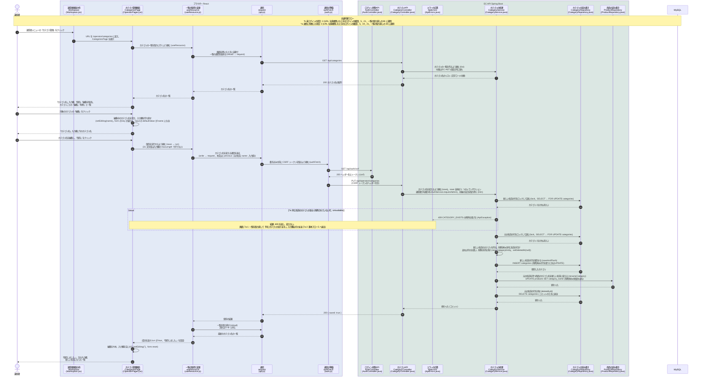

# EC-A08 商品カテゴリを編集する

```mermaid
sequenceDiagram
    autonumber
    actor User as 運営者
    box rgba(47,111,219,0.10) ブラウザー React
        participant Work as 運営者画面の枠<br/>Workspace<br/>(Workspace.jsx)
        participant Page as カテゴリ管理画面<br/>CategoriesPage<br/>(OperatorPages.jsx)
        participant Hook as 一覧の取得と変更<br/>useResource<br/>(useResource.js)
        participant Http as 通信<br/>request<br/>(api.js)
        participant AuthJs as 通信の準備<br/>authFetch<br/>(auth.js)
    end
    box rgba(27,127,92,0.12) EC API Spring Boot
        participant AuthCtrl as ログイン状態API<br/>AuthController<br/>(AuthController.java)
        participant Ctrl as カテゴリAPI<br/>CategoryController<br/>(CategoryController.java)
        participant Errs as エラーの応答<br/>ApiErrors<br/>(ApiErrors.java)
        participant Svc as カテゴリの処理<br/>CategoryService<br/>(CategoryService.java)
        participant CatRepo as カテゴリの読み書き<br/>CategoryRepository<br/>(CategoryRepository.java)
        participant ProdRepo as 商品の読み書き<br/>ProductRepository<br/>(ProductRepository.java)
    end
    participant Db as MySQL

    Note over User,Db: 共通代替フロー<br/>*b 未ログインの場合: 2 (URL を直接開いたときのログインの確認)、5、21、一覧の取り直しの 38 に適用<br/>*a 通信に失敗した場合: 2 (URL を直接開いたときのログインの確認)、5、19、21、一覧の取り直しの 38 に適用

    User->>Work: 運営者メニューの「カテゴリ管理」をクリック
    Work->>Page: URL を /operator/categories に変え、<br/>CategoriesPage を表示
    Page->>Hook: カテゴリの一覧を取りに行くよう頼む (useResource)
    Hook->>Http: 画面を開いたときに自動で<br/>一覧の通信を始める (reload → request)
    Http->>Ctrl: GET /api/categories
    Ctrl->>Svc: カテゴリの一覧を作るよう頼む (list)<br/>中身は EC-A07 の図と同じ流れ
    Svc-->>Ctrl: カテゴリ名のリスト (文字コードの順)
    Ctrl-->>Http: 200 カテゴリ名の配列
    Http-->>Hook: カテゴリ名の一覧
    Hook-->>Page: カテゴリ名の一覧
    Page-->>User: 「カテゴリ名」入力欄、「保存」「編集を取消」、<br/>カテゴリごとの「編集」「削除」と一覧

    User->>Page: 対象のカテゴリの「編集」をクリック
    Page->>Page: 編集中のカテゴリ名を覚え、入力欄を作り直す<br/>(setEditing(name)。form の key が変わり、Input の defaultValue が name になる)
    Page-->>User: 「カテゴリ名」入力欄に今のカテゴリ名
    User->>Page: カテゴリ名を編集し、「保存」をクリック
    Page->>Hook: 保存を実行するよう頼む (save → run)<br/>(31 文字目は入力欄の maxLength で打てない)
    Hook->>Http: カテゴリ名を変える通信を送る<br/>(write → request、本文は { previous: 元の名前, name: 入力値 })
    Http->>AuthJs: 書き込みの前に CSRF トークンを取るよう頼む (authFetch)
    AuthJs->>AuthCtrl: GET /api/auth/csrf
    AuthCtrl-->>AuthJs: 200 ヘッダー名とトークン (csrf)
    AuthJs->>Ctrl: PUT /api/operator/categories<br/>(CSRF トークンのヘッダー付き)
    Ctrl->>Svc: カテゴリ名を変えるよう頼む (save)。save 全体が 1 つのトランザクション<br/>運営者かを確かめ (AuthService.requireAdmin)、前後の空白を取り除く (trim)
    Svc->>CatRepo: 新しい名前の行をロックして読む (lock、SELECT ... FOR UPDATE categories)
    CatRepo-->>Svc: カテゴリ (なければなし)
    break 7a 同じ名前のカテゴリがある (削除されていない行、isAvailable)
        Svc--xErrs: 409 CATEGORY_EXISTS の例外を投げる (ApiException)
        Note over Errs,Page: 結果: 409 を返し、変えない。<br/>画面: 7a-1 一覧を取り直して「同じカテゴリがあります。」入力欄はそのまま (7a-2 基本フロー 5 へ戻る)
    end
    Svc->>CatRepo: 元の名前の行をロックして読む (lock、SELECT ... FOR UPDATE categories)
    CatRepo-->>Svc: カテゴリ (なければなし)
    Svc->>Svc: 新しい名前のカテゴリを作る。削除済みの同じ名前の行が<br/>あればそれを使い、削除の印を消す (new CategoryEntity、setDeletedAt(null))
    Svc->>CatRepo: 新しい名前の行を保存する (saveAndFlush)<br/>INSERT categories (削除済みの行を使うときは UPDATE)
    CatRepo-->>Svc: 保存したカテゴリ
    Svc->>ProdRepo: 元の名前を持つ商品のカテゴリ名を新しい名前に変える (renameCategory)<br/>UPDATE products SET category_name (削除済みの商品も含む)
    ProdRepo-->>Svc: 終わった
    Svc->>CatRepo: 元の名前の行を消す (deleteById)<br/>DELETE categories (コミットのときに送る)
    CatRepo-->>Svc: 終わった
    Svc-->>Ctrl: 終わった (コミット)
    Ctrl-->>Http: 200 { saved: true }
    Http-->>Hook: 保存の結果
    Hook->>Http: 一覧を取り直す (reload)<br/>流れは 5〜9 と同じ
    Http-->>Hook: 最新のカテゴリ名の一覧
    Hook-->>Page: 成功を返す (run が true、「保存しました。」を設定)
    Page->>Page: 編集をやめ、入力欄を空にする (setEditing('')、form.reset)
    Page-->>User: 「保存しました。」、空の入力欄、<br/>新しい名前になった一覧
```

