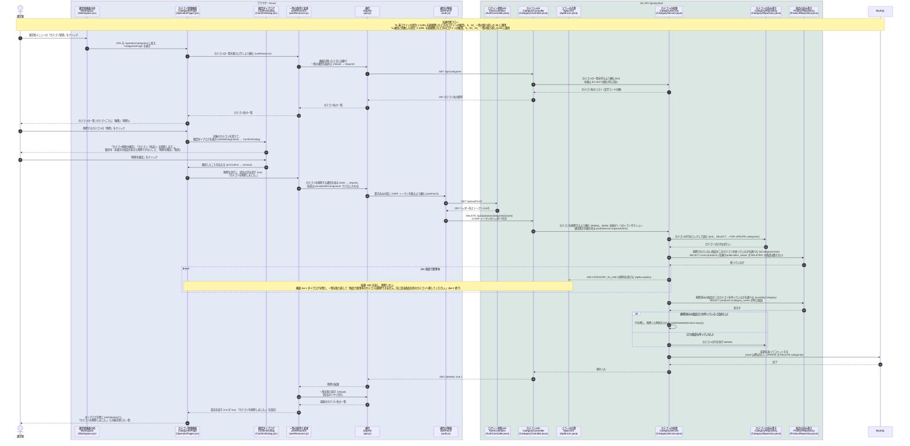

# EC-A09 商品カテゴリを削除する

```mermaid
sequenceDiagram
    autonumber
    actor User as 運営者
    box rgba(47,111,219,0.10) ブラウザー React
        participant Work as 運営者画面の枠<br/>Workspace<br/>(Workspace.jsx)
        participant Page as カテゴリ管理画面<br/>CategoriesPage<br/>(OperatorPages.jsx)
        participant Dlg as 確認ダイアログ<br/>ConfirmDialog<br/>(ConfirmDialog.jsx)
        participant Hook as 一覧の取得と変更<br/>useResource<br/>(useResource.js)
        participant Http as 通信<br/>request<br/>(api.js)
        participant AuthJs as 通信の準備<br/>authFetch<br/>(auth.js)
    end
    box rgba(27,127,92,0.12) EC API Spring Boot
        participant AuthCtrl as ログイン状態API<br/>AuthController<br/>(AuthController.java)
        participant Ctrl as カテゴリAPI<br/>CategoryController<br/>(CategoryController.java)
        participant Errs as エラーの応答<br/>ApiErrors<br/>(ApiErrors.java)
        participant Svc as カテゴリの処理<br/>CategoryService<br/>(CategoryService.java)
        participant CatRepo as カテゴリの読み書き<br/>CategoryRepository<br/>(CategoryRepository.java)
        participant ProdRepo as 商品の読み書き<br/>ProductRepository<br/>(ProductRepository.java)
    end
    participant Db as MySQL

    Note over User,Db: 共通代替フロー<br/>*b 未ログインの場合: 2 (URL を直接開いたときのログインの確認)、5、22、一覧の取り直しの 38 に適用<br/>*a 通信に失敗した場合: 2 (URL を直接開いたときのログインの確認)、5、20、22、一覧の取り直しの 38 に適用

    User->>Work: 運営者メニューの「カテゴリ管理」をクリック
    Work->>Page: URL を /operator/categories に変え、<br/>CategoriesPage を表示
    Page->>Hook: カテゴリの一覧を取りに行くよう頼む (useResource)
    Hook->>Http: 画面を開いたときに自動で<br/>一覧の通信を始める (reload → request)
    Http->>Ctrl: GET /api/categories
    Ctrl->>Svc: カテゴリの一覧を作るよう頼む (list)<br/>中身は EC-A07 の図と同じ流れ
    Svc-->>Ctrl: カテゴリ名のリスト (文字コードの順)
    Ctrl-->>Http: 200 カテゴリ名の配列
    Http-->>Hook: カテゴリ名の一覧
    Hook-->>Page: カテゴリ名の一覧
    Page-->>User: カテゴリの一覧 (カテゴリごとに「編集」「削除」)

    User->>Page: 削除するカテゴリの「削除」をクリック
    Page->>Dlg: 対象のカテゴリを覚えて、<br/>確認ダイアログを表示 (setDeleting(name) → ConfirmDialog)
    Dlg-->>User: 「カテゴリ削除の確認」、「カテゴリ「(名前)」を削除します。」、<br/>販売中・非表示の商品があると削除できないこと、「削除を確定」「取消」
    User->>Dlg: 「削除を確定」をクリック
    Dlg->>Page: 確定したことを伝える (onConfirm → remove)
    Page->>Hook: 削除を実行し、成功の文を渡す (run)<br/>「カテゴリを削除しました。」
    Hook->>Http: カテゴリを削除する通信を送る (write → request、<br/>名前は encodeURIComponent でパスに入れる)
    Http->>AuthJs: 書き込みの前に CSRF トークンを取るよう頼む (authFetch)
    AuthJs->>AuthCtrl: GET /api/auth/csrf
    AuthCtrl-->>AuthJs: 200 ヘッダー名とトークン (csrf)
    AuthJs->>Ctrl: DELETE /api/operator/categories/{name}<br/>(CSRF トークンのヘッダー付き)
    Ctrl->>Svc: カテゴリを削除するよう頼む (delete)。delete 全体が 1 つのトランザクション<br/>運営者かを確かめる (AuthService.requireAdmin)
    Svc->>CatRepo: カテゴリの行をロックして読む (lock、SELECT ... FOR UPDATE categories)
    CatRepo-->>Svc: カテゴリ (なければなし)
    Svc->>ProdRepo: 削除されていない商品がこのカテゴリを使っているかを調べる (isCategoryInUse)<br/>SELECT count products (在庫の publication_status が DELETED の商品は数えない)
    ProdRepo-->>Svc: 使っているか
    break 6a 商品で使用中
        Svc--xErrs: 409 CATEGORY_IN_USE の例外を投げる (ApiException)
        Note over Errs,Page: 結果: 409 を返し、削除しない。<br/>画面: 6a-1 ダイアログを閉じ、一覧を取り直して「商品で使用中のカテゴリは削除できません。先に該当商品を別のカテゴリへ移してください。」(6a-2 終了)
    end
    Svc->>ProdRepo: 削除済みの商品がこのカテゴリを持っているかを調べる (existsByCategory)<br/>SELECT products (category_name が同じ商品)
    ProdRepo-->>Svc: あるか
    alt 削除済みの商品だけが持っている (記述なし)
        Svc->>Svc: 行を残し、削除した時刻を入れる (setDeletedAt(Instant.now()))
    else どの商品も持っていない
        Svc->>CatRepo: カテゴリの行を消す (delete)
    end
    Svc->>Db: 変更を送ってコミットする<br/>(save は呼ばない。UPDATE か DELETE categories)
    Db-->>Svc: 完了
    Svc-->>Ctrl: 終わった
    Ctrl-->>Http: 200 { deleted: true }
    Http-->>Hook: 削除の結果
    Hook->>Http: 一覧を取り直す (reload)<br/>流れは 5〜9 と同じ
    Http-->>Hook: 最新のカテゴリ名の一覧
    Hook-->>Page: 成功を返す (run が true、「カテゴリを削除しました。」を設定)
    Page-->>User: ダイアログを閉じ (setDeleting(''))、<br/>「カテゴリを削除しました。」と対象を除いた一覧
```

