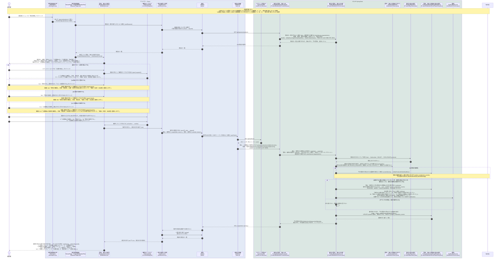

# EC-A10 商品の公開を停止・再開する

```mermaid
sequenceDiagram
    autonumber
    actor User as 運営者
    box rgba(47,111,219,0.10) ブラウザー React
        participant Work as 運営者画面の枠<br/>Workspace<br/>(Workspace.jsx)
        participant Page as 商品管理画面<br/>ReviewPage・ProductModerationRow<br/>(OperatorPages.jsx)
        participant Mod as 警告・停止の操作<br/>ModerationControls<br/>(Moderation.jsx)
        participant Dlg as 確認ダイアログ<br/>ConfirmDialog<br/>(ConfirmDialog.jsx)
        participant Hook as 一覧の取得と変更<br/>useResource<br/>(useResource.js)
        participant Http as 通信<br/>request<br/>(api.js)
        participant AuthJs as 通信の準備<br/>authFetch<br/>(auth.js)
    end
    box rgba(27,127,92,0.12) EC API Spring Boot
        participant AuthCtrl as ログイン状態API<br/>AuthController<br/>(AuthController.java)
        participant Ctrl as 商品の警告・停止API<br/>ProductModerationController<br/>(ProductModerationController.java)
        participant Svc as 商品の警告・停止の処理<br/>ProductModerationService<br/>(ProductModerationService.java)
        participant Hist as 警告・停止の履歴の決まり<br/>ModerationHistory<br/>(ModerationHistory.java)
        participant ProdRepo as 商品の読み書き<br/>ProductRepository<br/>(ProductRepository.java)
        participant EvRepo as 警告・停止の履歴の読み書き<br/>ProductModerationEventRepository<br/>(ProductModerationEventRepository.java)
        participant Notices as 通知<br/>NotificationService<br/>(NotificationService.java)
    end
    participant Db as MySQL

    Note over User,Db: 共通代替フロー<br/>*b 未ログインの場合: 2 (URL を直接開いたときのログインの確認)、5、27、一覧の取り直しの 41 に適用<br/>*a 通信に失敗した場合: 2 (URL を直接開いたときのログインの確認)、5、25、27、一覧の取り直しの 41 に適用

    User->>Work: 運営者メニューの「商品管理」をクリック
    Work->>Page: URL を /operator/products に変え、<br/>ReviewPage (products) を表示
    Page->>Hook: 商品の一覧を取りに行くよう頼む (useResource)
    Hook->>Http: 画面を開いたときに自動で<br/>一覧の通信を始める (reload → request)
    Http->>Ctrl: GET /api/operator/products
    Ctrl->>Svc: 商品の一覧を作るよう頼む (list)。運営者かを確かめ (AuthService.requireAdmin)、<br/>店舗、在庫、警告の履歴、追加した人、商品を読む<br/>(findAll、findByEventTypeInOrderByIdDesc、findAllCreatorNames。中身は EC-A06 の図と同じ流れ)
    Svc-->>Ctrl: 商品の一覧 (公開できるか、停止中か、今の警告、追加した人)
    Ctrl-->>Http: 200 商品の配列
    Http-->>Hook: 商品の一覧
    Hook-->>Page: 商品の一覧
    Page->>Mod: 商品ごとに警告・停止の操作を表示<br/>(ProductModerationRow → ModerationControls)
    Mod-->>User: 商品名、店舗、追加した人、「公開停止中」「公開可能」「販売終了」、<br/>「警告する」(警告中なら「警告中」と理由、「もう一度警告する」「警告を解除」)、<br/>停止中なら「公開停止を解除」、そうでなければデンジャーエリアの「公開を停止」

    alt 基本フロー 公開を停止する
        User->>Mod: 3 デンジャーエリアの「公開を停止」をクリック
        Mod->>Dlg: 理由を空にして確認ダイアログを表示 (open('suspend'))
        Dlg-->>User: 4「公開停止の確認」、対象：商品名、購入者向けの画面に表示されず<br/>カートにあっても購入できなくなること、「理由（必須・出店者に通知します）」
    else 3a 停止せずに警告する
        User->>Mod: 3a-1「警告する」(警告中なら「もう一度警告する」) をクリック
        Note over User,Dlg: 結果: 理由を空にして確認ダイアログを表示 (open('warn'))。<br/>画面: 3a-2「警告の確認」、対象：商品名、公開・利用の状態は変わらないこと、「理由（必須・出店者に通知します）」
    else 3b 警告を解除する
        User->>Mod: 3b-1「警告を解除」(警告中のときだけ出る) をクリック
        Note over User,Dlg: 結果: 理由を空にして確認ダイアログを表示 (open('clear'))。<br/>画面: 3b-2「警告の解除の確認」、対象：商品名、「理由（任意・出店者に通知します）」
    else 3c 公開停止を解除する
        User->>Mod: 3c-1「公開停止を解除」(停止中のときだけ出る) をクリック
        Note over User,Dlg: 結果: 理由を空にして確認ダイアログを表示 (open('resume'))。<br/>画面: 3c-2「公開停止の解除の確認」、対象：商品名、出店者が非表示にしていなければ再び表示されること、「理由（任意・出店者に通知します）」
    end
    User->>Dlg: 理由を入力する (500 文字まで。任意の操作では空でもよい)
    User->>Dlg: 6「公開停止を確定」(3a「警告する」、3b「警告を解除する」、<br/>3c「公開停止の解除を確定」) をクリック
    Dlg->>Mod: 確定したことを伝える (onConfirm → confirm)
    Mod->>Hook: 操作を実行し、成功の文を渡す (run)
    Hook->>Http: 操作の通信を送る (send の write → request)<br/>停止・解除は { suspended, reason }、警告・解除は { warned, reason }
    Http->>AuthJs: 書き込みの前に CSRF トークンを取るよう頼む (authFetch)
    AuthJs->>AuthCtrl: GET /api/auth/csrf
    AuthCtrl-->>AuthJs: 200 ヘッダー名とトークン (csrf)
    AuthJs->>Ctrl: 停止・公開停止の解除は PUT /api/operator/products/{id}/moderation、<br/>警告・警告の解除は PUT /api/operator/products/{id}/warning<br/>(CSRF トークンのヘッダー付き)
    Ctrl->>Svc: 停止・解除は公開停止の状態を (moderate → suspend)、<br/>警告・解除は警告を (warning → warn) 変えるよう頼む。全体が 1 つのトランザクション<br/>運営者かを確かめる (AuthService.requireAdmin)
    Svc->>ProdRepo: 商品の行をロックして読む (lock → findLocked、SELECT ... FOR UPDATE products)
    ProdRepo-->>Svc: 商品 (なければなし)
    Svc->>Hist: 理由の前後の空白を除き、必須なら空でないかを確かめる (reasonFor)<br/>(空の必須の理由は 400 REASON_REQUIRED。画面の 5a が先に止めるので、画面からは届かない)
    opt 3b 警告の解除
        Svc->>EvRepo: 今の警告を求めるため履歴を読むよう頼む (currentWarning → findByProductIdOrderByIdDesc)
        Note over Svc,Db: 結果: 履歴を新しい順に読み (SELECT product_moderation_events)、<br/>今の警告を求める (ModerationHistory.activeWarning)。
    end
    alt 記録する (停止は停止していないとき、解除は停止中のとき、<br/>警告はいつも、警告の解除は警告中のとき)
        Svc->>EvRepo: 停止・解除のときは商品の公開停止の印を書き換え (moderate)、<br/>操作の履歴を保存する (record → save、INSERT product_moderation_events)<br/>SUSPEND、WARN、CLEAR_WARNING、RESUME のどれか
        Svc->>Notices: 出店者に知らせるよう頼む (toStore)<br/>「商品の公開を停止しました」(3a「商品に運営から警告がありました」、<br/>3b「商品への運営の警告が解除されました」、3c「商品の公開停止を解除しました」)、<br/>本文は商品名 / 理由 (noticeBody)。店舗の組織のオーナーと、<br/>店舗でロールのある担当者のうち、有効な会員ごとに INSERT notifications
    else すでにその状態 (二重の操作など)
        Svc->>Svc: 何も変えない。履歴も通知も足さない
    end
    Svc->>EvRepo: 書き換えを送り、今の警告を求めるため履歴を読む<br/>(state → flush、findByProductIdOrderByIdDesc)<br/>UPDATE products (停止・解除のとき)、SELECT product_moderation_events
    EvRepo-->>Svc: 履歴の行 (新しい順)
    Svc-->>Ctrl: 今の警告を求め (ModerationHistory.activeWarning)、<br/>停止中か、今の警告 (State) を返す。ここでコミット
    Ctrl-->>Http: 200 { suspended, warning }
    Http-->>Hook: 操作の結果 (画面では使わない)
    Hook->>Http: 一覧を取り直す (reload)<br/>流れは 5〜9 と同じ
    Http-->>Hook: 最新の商品の一覧
    Hook-->>Mod: 成功を返す (run が true、成功の文を設定)
    Mod-->>User: 履歴の表示を取り直す印を変え、ダイアログを閉じ (setVersion、setPending(null))、<br/>9「停止しました。出店者に通知しました。」と「公開停止中」、<br/>「公開停止を解除」(3a-5「警告しました。…」と「警告中」と理由、<br/>3b-5「警告を解除しました。…」で「警告中」が消える、<br/>3c-5「再開しました。…」と「公開可能」か「販売終了」、「公開を停止」)
```

