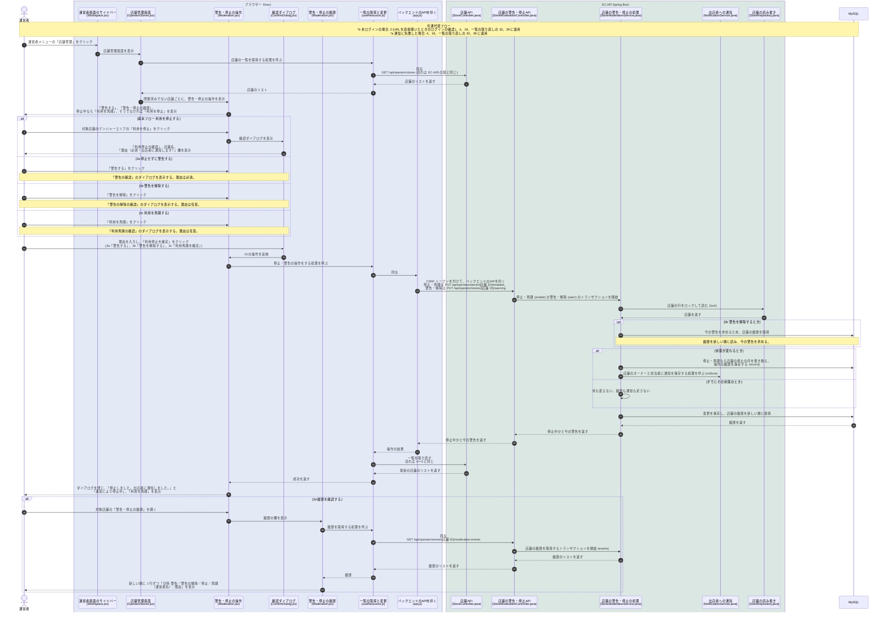

# EC-A11 店舗の利用を停止・再開する

```mermaid
sequenceDiagram
    autonumber
    actor User as 運営者
    box rgba(47,111,219,0.10) ブラウザー React
        participant Work as 運営者画面のサイドバー<br/>(Workspace.jsx)
        participant Page as 店舗管理画面<br/>(OperatorStores.jsx)
        participant Mod as 警告・停止の操作<br/>(Moderation.jsx)
        participant Dlg as 確認ダイアログ<br/>(ConfirmDialog.jsx)
        participant Ev as 警告・停止の履歴<br/>(Moderation.jsx)
        participant Hook as 一覧の取得と変更<br/>(useResource.js)
        participant Http as バックエンドのAPIを叩く<br/>(api.js)
    end
    box rgba(27,127,92,0.12) EC API Spring Boot
        participant SCtrl as 店舗API<br/>(StoreController.java)
        participant Ctrl as 店舗の警告・停止API<br/>(StoreModerationController.java)
        participant Svc as 店舗の警告・停止の処理<br/>(StoreModerationService.java)
        participant Notices as 出店者への通知<br/>(NotificationService.java)
        participant Repo as 店舗の読み書き<br/>(StoreRepository.java)
    end
    participant Db as MySQL

    Note over User,Db: 共通代替フロー<br/>*b 未ログインの場合: 2 (URL を直接開いたときのログインの確認)、4、19、一覧の取り直しの 32、39 に適用<br/>*a 通信に失敗した場合: 4、19、一覧の取り直しの 32、39 に適用

    User->>Work: 運営者メニューの「店舗管理」をクリック
    Work->>Page: 店舗管理画面を表示
    Page->>Hook: 店舗の一覧を取得する処理を呼ぶ
    Hook->>SCtrl: 同左<br/>GET /api/operator/stores (流れは EC-A05 の図と同じ)
    SCtrl-->>Hook: 店舗のリストを返す
    Hook-->>Page: 店舗のリスト
    Page->>Mod: 閉鎖済みでない店舗ごとに、警告・停止の操作を表示
    Mod-->>User: 「警告する」、「警告・停止の履歴」、<br/>停止中なら「利用を再開」、そうでなければ「利用を停止」を表示

    alt 基本フロー 利用を停止する
        User->>Mod: 対象店舗のデンジャーエリアの「利用を停止」をクリック
        Mod->>Dlg: 確認ダイアログを表示
        Dlg-->>User: 「利用停止の確認」、店舗名、<br/>「理由（必須・出店者に通知します）」欄を表示
    else 3a 停止せずに警告する
        User->>Mod: 「警告する」をクリック
        Note over User,Dlg: 「警告の確認」のダイアログを表示する。理由は必須。
    else 3b 警告を解除する
        User->>Mod: 「警告を解除」をクリック
        Note over User,Dlg: 「警告の解除の確認」のダイアログを表示する。理由は任意。
    else 3c 利用を再開する
        User->>Mod: 「利用を再開」をクリック
        Note over User,Dlg: 「利用再開の確認」のダイアログを表示する。理由は任意。
    end
    User->>Dlg: 理由を入力し、「利用停止を確定」をクリック<br/>(3a「警告する」、3b「警告を解除する」、3c「利用再開を確定」)
    Dlg->>Mod: 15 の操作を反映
    Mod->>Hook: 停止・警告の操作をする処理を呼ぶ
    Hook->>Http: 同左
    Http->>Ctrl: CSRF トークンを付けて、バックエンドのAPIを叩く<br/>停止・再開は PUT /api/operator/stores/{店舗 ID}/enabled、<br/>警告・解除は PUT /api/operator/stores/{店舗 ID}/warning
    Ctrl->>Svc: 停止・再開 (enable) か警告・解除 (warn) のトランザクションを開始
    Svc->>Repo: 店舗の行をロックして読む (lock)
    Repo-->>Svc: 店舗を返す
    opt 3b 警告を解除するとき
        Svc->>Db: 今の警告を求めるため、店舗の履歴を取得
        Note over Svc,Db: 履歴を新しい順に読み、今の警告を求める。
    end
    alt 状態が変わるとき
        Svc->>Db: 停止・再開なら店舗の停止の印を書き換え、<br/>操作の履歴を保存する (record)
        Svc->>Notices: 店舗のオーナーと担当者に通知を保存する処理を呼ぶ (toStore)
    else すでにその状態のとき
        Svc->>Svc: 何も変えない。履歴も通知も足さない
    end
    Svc->>Db: 変更を保存し、店舗の履歴を新しい順に取得
    Db-->>Svc: 履歴を返す
    Svc-->>Ctrl: 停止中かと今の警告を返す
    Ctrl-->>Http: 停止中かと今の警告を返す
    Http-->>Hook: 操作の結果
    Hook->>SCtrl: 一覧を取り直す<br/>流れは 4〜5 と同じ
    SCtrl-->>Hook: 最新の店舗のリストを返す
    Hook-->>Mod: 成功を返す
    Mod-->>User: ダイアログを閉じ、「停止しました。出店者に通知しました。」と<br/>「運営により停止中」、「利用を再開」を表示

    alt 3d 履歴を確認する
        User->>Mod: 対象店舗の「警告・停止の履歴」を開く
        Mod->>Ev: 履歴の欄を表示
        Ev->>Hook: 履歴を取得する処理を呼ぶ
        Hook->>Ctrl: 同左<br/>GET /api/operator/stores/{店舗 ID}/moderation-events
        Ctrl->>Svc: 店舗の履歴を取得するトランザクションを開始 (events)
        Svc-->>Ctrl: 履歴のリストを返す
        Ctrl-->>Hook: 履歴のリストを返す
        Hook-->>Ev: 履歴
        Ev-->>User: 新しい順に 1 行ずつ「日時 警告／警告の解除／停止／再開<br/>（運営者名）：理由」を表示
    end
```

