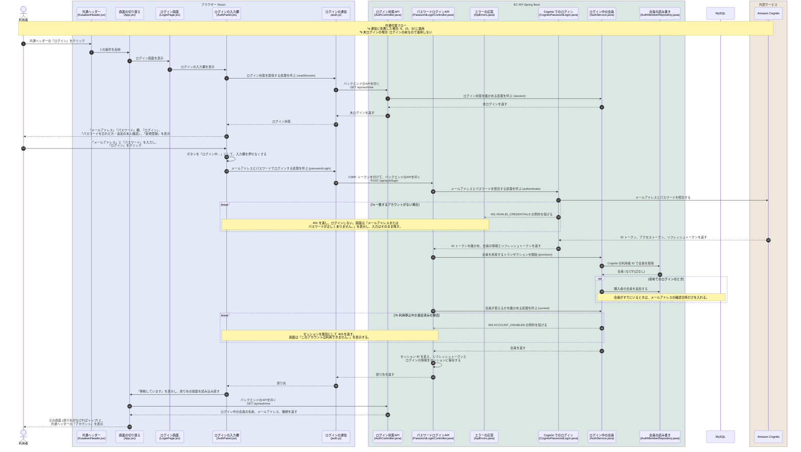

# EC-B01 ログインする

```mermaid
sequenceDiagram
    autonumber
    actor User as 利用者
    box rgba(47,111,219,0.10) ブラウザー React
        participant Header as 共通ヘッダー<br/>(KusakariHeader.jsx)
        participant App as 画面の切り替え<br/>(App.jsx)
        participant Login as ログイン画面<br/>(LoginPage.jsx)
        participant Panel as ログインの入力欄<br/>(AuthPanel.jsx)
        participant AuthJs as ログインの通信<br/>(auth.js)
    end
    box rgba(27,127,92,0.12) EC API Spring Boot
        participant AuthCtrl as ログイン状態API<br/>(AuthController.java)
        participant LoginCtrl as パスワードログインAPI<br/>(PasswordLoginController.java)
        participant Errs as エラーの応答<br/>(ApiErrors.java)
        participant CogP as Cognito でのログイン<br/>(CognitoPasswordLogin.java)
        participant AuthSvc as ログイン中の会員<br/>(AuthService.java)
        participant Repo as 会員の読み書き<br/>(AuthMemberRepository.java)
    end
    participant Db as MySQL
    box rgba(180,120,20,0.12) 外部サービス
        participant Cog as Amazon Cognito
    end

    Note over User,Cog: 共通代替フロー<br/>*a 通信に失敗した場合: 6、15、32 に適用<br/>*b 未ログインの場合: ログインの前なので適用しない

    User->>Header: 共通ヘッダーの「ログイン」をクリック
    Header->>App: 1 の操作を反映
    App->>Login: ログイン画面を表示
    Login->>Panel: ログインの入力欄を表示
    Panel->>AuthJs: ログイン状態を取得する処理を呼ぶ (readSession)
    AuthJs->>AuthCtrl: バックエンドのAPIを叩く<br/>GET /api/auth/me
    AuthCtrl->>AuthSvc: ログイン状態を確かめる処理を呼ぶ (session)
    AuthSvc-->>AuthCtrl: 未ログインを返す
    AuthCtrl-->>AuthJs: 未ログインを返す
    AuthJs-->>Panel: ログイン状態
    Panel-->>User: 「メールアドレス」「パスワード」欄、「ログイン」、<br/>「パスワードを忘れた方・追加の本人確認」、「新規登録」を表示

    User->>Panel: 「メールアドレス」と「パスワード」を入力し、<br/>「ログイン」をクリック
    Panel->>Panel: ボタンを「ログイン中…」にして、入力欄を押せなくする
    Panel->>AuthJs: メールアドレスとパスワードでログインする処理を呼ぶ (passwordLogin)
    AuthJs->>LoginCtrl: CSRF トークンを付けて、バックエンドのAPIを叩く<br/>POST /api/auth/login
    LoginCtrl->>CogP: メールアドレスとパスワードを照合する処理を呼ぶ (authenticate)
    CogP->>Cog: メールアドレスとパスワードを照合する
    break 7a 一致するアカウントがない場合
        CogP--xErrs: 401 INVALID_CREDENTIALS の例外を投げる
        Note over Errs,Panel: 401 を返し、ログインしない。画面は「メールアドレスまたは<br/>パスワードが正しくありません。」を表示し、入力はそのまま残す。
    end
    Cog-->>CogP: ID トークン、アクセストークン、リフレッシュトークンを返す
    CogP-->>LoginCtrl: ID トークンを確かめ、会員の情報とリフレッシュトークンを返す
    LoginCtrl->>AuthSvc: 会員を用意するトランザクションを開始 (provision)
    AuthSvc->>Repo: Cognito の利用者 ID で会員を取得
    Repo-->>AuthSvc: 会員 (なければなし)
    opt 初めてのログインのとき
        AuthSvc->>Repo: 購入者の会員を追加する
        Note over AuthSvc,Db: 会員がすでにいるときは、メールアドレスの確認日時だけを入れる。
    end
    LoginCtrl->>AuthSvc: 会員が使えるかを確かめる処理を呼ぶ (current)
    break 7b 利用停止中か退会済みの場合
        AuthSvc--xLoginCtrl: 403 ACCOUNT_DISABLED の例外を投げる
        Note over LoginCtrl,Panel: セッションを無効にして 403 を返す。<br/>画面は「このアカウントは利用できません。」を表示する。
    end
    AuthSvc-->>LoginCtrl: 会員を返す
    LoginCtrl->>LoginCtrl: セッション ID を変え、リフレッシュトークンと<br/>ログインの情報をセッションに保存する
    LoginCtrl-->>AuthJs: 戻り先を返す
    AuthJs-->>Panel: 戻り先
    Panel->>App: 「移動しています」を表示し、戻り先の画面を読み込み直す
    App->>AuthCtrl: バックエンドのAPIを叩く<br/>GET /api/auth/me
    AuthCtrl-->>App: ログイン中の会員の名前、メールアドレス、種類を返す
    App-->>User: 元の画面 (戻り先がなければトップ) と、<br/>共通ヘッダーの「アカウント」を表示
```

