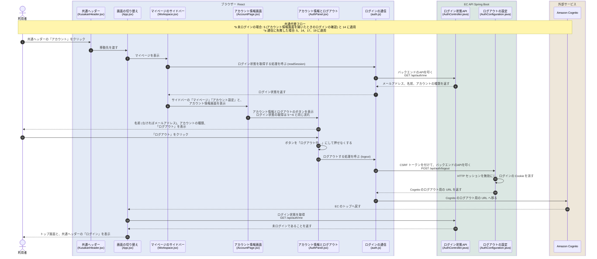

# EC-B02 ログアウトする

```mermaid
sequenceDiagram
    autonumber
    actor User as 利用者
    box rgba(47,111,219,0.10) ブラウザー React
        participant Header as 共通ヘッダー<br/>(KusakariHeader.jsx)
        participant App as 画面の切り替え<br/>(App.jsx)
        participant Work as マイページのサイドバー<br/>(Workspace.jsx)
        participant Acct as アカウント情報画面<br/>(AccountPage.jsx)
        participant Panel as アカウント情報とログアウト<br/>(AuthPanel.jsx)
        participant AuthJs as ログインの通信<br/>(auth.js)
    end
    box rgba(27,127,92,0.12) EC API Spring Boot
        participant AuthCtrl as ログイン状態API<br/>(AuthController.java)
        participant Sec as ログアウトの設定<br/>(AuthConfiguration.java)
    end
    box rgba(180,120,20,0.12) 外部サービス
        participant Cog as Amazon Cognito
    end

    Note over User,Cog: 共通代替フロー<br/>*b 未ログインの場合: 5 (アカウント情報画面を開いたときのログインの確認) と 14 に適用<br/>*a 通信に失敗した場合: 5、14、17、19 に適用

    User->>Header: 共通ヘッダーの「アカウント」をクリック
    Header->>App: 移動先を渡す
    App->>Work: マイページを表示
    Work->>AuthJs: ログイン状態を取得する処理を呼ぶ (readSession)
    AuthJs->>AuthCtrl: バックエンドのAPIを叩く<br/>GET /api/auth/me
    AuthCtrl-->>AuthJs: メールアドレス、名前、アカウントの種類を返す
    AuthJs-->>Work: ログイン状態を返す
    Work->>Acct: サイドバーの「マイページ」「アカウント設定」と、<br/>アカウント情報画面を表示
    Acct->>Panel: アカウント情報とログアウトのボタンを表示<br/>ログイン状態の取得は 5〜6 と同じ流れ
    Panel-->>User: 名前 (なければメールアドレス)、アカウントの種類、<br/>「ログアウト」を表示

    User->>Panel: 「ログアウト」をクリック
    Panel->>Panel: ボタンを「ログアウト中…」にして押せなくする
    Panel->>AuthJs: ログアウトする処理を呼ぶ (logout)
    AuthJs->>Sec: CSRF トークンを付けて、バックエンドのAPIを叩く<br/>POST /api/auth/logout
    Sec->>Sec: HTTP セッションを無効にし、ログインの Cookie を消す
    Sec-->>AuthJs: Cognito のログアウト用の URL を返す
    AuthJs->>Cog: Cognito のログアウト用の URL へ移る
    Cog-->>App: EC のトップへ戻す
    App->>AuthCtrl: ログイン状態を取得<br/>GET /api/auth/me
    AuthCtrl-->>App: 未ログインであることを返す
    App-->>User: トップ画面と、共通ヘッダーの「ログイン」を表示
```

