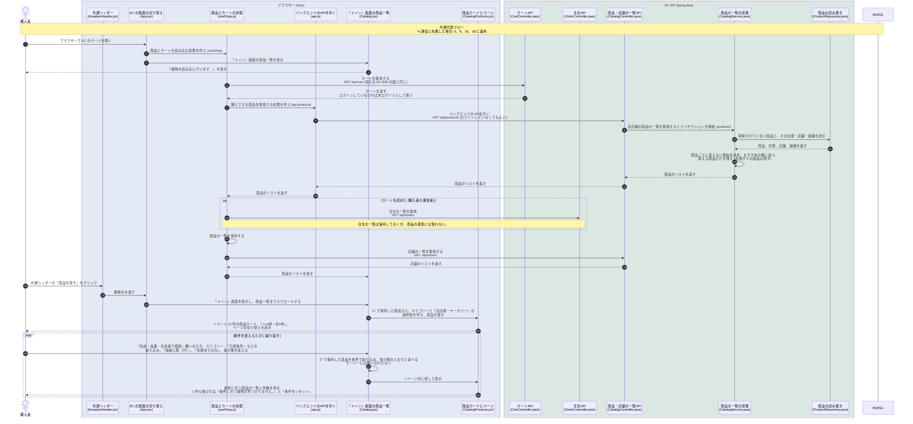

# EC-B03 商品を検索する

```mermaid
sequenceDiagram
    autonumber
    actor User as 購入者
    box rgba(47,111,219,0.10) ブラウザー React
        participant Header as 共通ヘッダー<br/>(KusakariHeader.jsx)
        participant App as EC の画面の切り替え<br/>(App.jsx)
        participant Shop as 商品とカートの状態<br/>(useShop.js)
        participant Http as バックエンドのAPIを叩く<br/>(api.js)
        participant Catalog as 「メイン」画面の商品一覧<br/>(Catalog.jsx)
        participant List as 商品カードとページ<br/>(CatalogProducts.jsx)
    end
    box rgba(27,127,92,0.12) EC API Spring Boot
        participant CartCtrl as カートAPI<br/>(CartController.java)
        participant OrderCtrl as 注文API<br/>(OrderController.java)
        participant CatCtrl as 商品・店舗の一覧API<br/>(CatalogController.java)
        participant Svc as 商品の一覧の処理<br/>(CatalogService.java)
        participant ProdRepo as 商品の読み書き<br/>(ProductRepository.java)
    end
    participant Db as MySQL

    Note over User,Db: 共通代替フロー<br/>*a 通信に失敗した場合: 5、8、16、18 に適用

    User->>App: ブラウザーで EC のページを開く
    App->>Shop: 商品とカートを読み込む処理を呼ぶ (useShop)
    App->>Catalog: 「メイン」画面の商品一覧を表示
    Catalog-->>User: 「植物を読み込んでいます…」を表示
    Shop->>CartCtrl: カートを取得する<br/>GET /api/cart (流れは EC-B08 の図と同じ)
    CartCtrl-->>Shop: カートを返す<br/>ログインしていなければ未ログインとして扱う
    Shop->>Http: 購入できる商品を取得する処理を呼ぶ (api.products)
    Http->>CatCtrl: バックエンドのAPIを叩く<br/>GET /api/products (ログインしていなくてもよい)
    CatCtrl->>Svc: 全店舗の商品の一覧を取得するトランザクションを開始 (products)
    Svc->>ProdRepo: 削除されていない商品と、その在庫・店舗・組織を読む
    ProdRepo-->>Svc: 商品、在庫、店舗、組織を返す
    Svc->>Svc: 商品ごとに買えない理由を決め、おすすめの順に並べ、<br/>買える商品だけを残す (在庫が 0 の商品は残す)
    Svc-->>CatCtrl: 商品のリストを返す
    CatCtrl-->>Http: 商品のリストを返す
    Http-->>Shop: 商品のリストを返す
    opt カートを読めた (購入者か運営者)
        Shop->>OrderCtrl: 注文の一覧を取得<br/>GET /api/orders
        Note over Shop,OrderCtrl: 注文の一覧は保持しておくが、商品の検索には使わない。
    end
    Shop->>Shop: 商品の一覧を保持する
    Shop->>CatCtrl: 店舗の一覧を取得する<br/>GET /api/stores
    CatCtrl-->>Shop: 店舗のリストを返す
    Shop-->>Catalog: 商品のリストを返す

    User->>Header: 共通ヘッダーの「商品を探す」をクリック
    Header->>App: 移動先を渡す
    App->>Catalog: 「メイン」画面を表示し、商品一覧までスクロールする
    Catalog->>List: 17 で保持した商品から、カテゴリーと「出店者・ナーセリー」の<br/>選択肢を作り、商品を渡す
    List-->>User: 1 ページ 12 件の商品カード、「n–m件 / 全N件」、<br/>ページの切り替えを表示

    loop 条件を変えるたびに繰り返す
        User->>Catalog: 「名前・品番・生産者で検索」欄への入力、カテゴリー、「日照条件」などの<br/>絞り込み、「価格上限（円）」、「在庫ありのみ」、並び順を変える
        Catalog->>Catalog: 17 で保持した商品を条件で絞り込み、並び順のとおりに並べる<br/>サーバーには問い合わせない
        Catalog->>List: 1 ページ目に戻して表示
        List-->>User: 条件に合う商品の一覧と件数を表示<br/>1 件も無ければ「条件に合う植物が見つかりません。」と「条件をリセット」
    end
```

