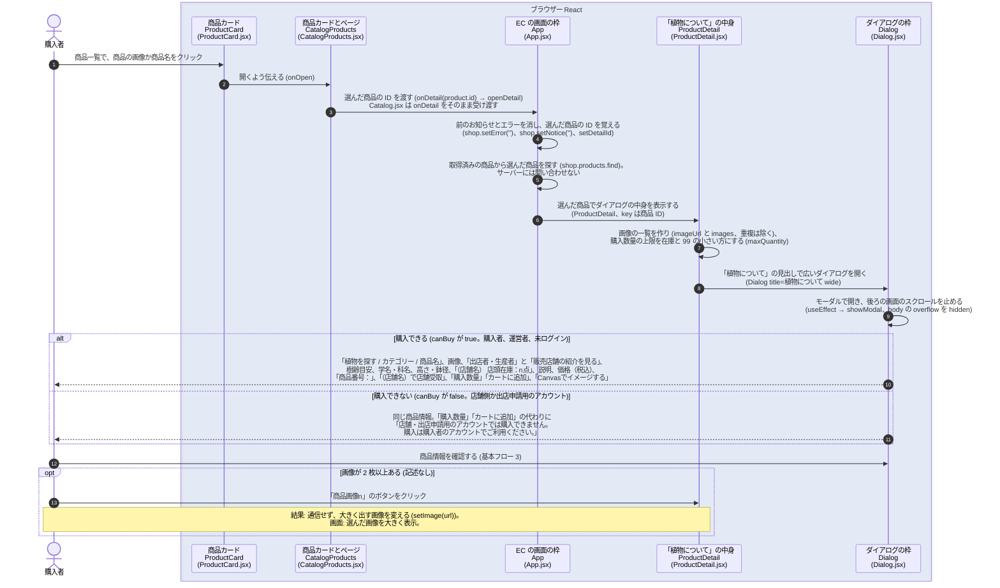

# EC-B04 商品詳細を確認する

```mermaid
sequenceDiagram
    autonumber
    actor User as 購入者
    box rgba(47,111,219,0.10) ブラウザー React
        participant Card as 商品カード<br/>ProductCard<br/>(ProductCard.jsx)
        participant List as 商品カードとページ<br/>CatalogProducts<br/>(CatalogProducts.jsx)
        participant App as EC の画面の枠<br/>App<br/>(App.jsx)
        participant Detail as 「植物について」の中身<br/>ProductDetail<br/>(ProductDetail.jsx)
        participant Dlg as ダイアログの枠<br/>Dialog<br/>(Dialog.jsx)
    end

    User->>Card: 商品一覧で、商品の画像か商品名をクリック
    Card->>List: 開くよう伝える (onOpen)
    List->>App: 選んだ商品の ID を渡す (onDetail(product.id) → openDetail)<br/>Catalog.jsx は onDetail をそのまま受け渡す
    App->>App: 前のお知らせとエラーを消し、選んだ商品の ID を覚える<br/>(shop.setError('')、shop.setNotice('')、setDetailId)
    App->>App: 取得済みの商品から選んだ商品を探す (shop.products.find)。<br/>サーバーには問い合わせない
    App->>Detail: 選んだ商品でダイアログの中身を表示する<br/>(ProductDetail、key は商品 ID)
    Detail->>Detail: 画像の一覧を作り (imageUrl と images、重複は除く)、<br/>購入数量の上限を在庫と 99 の小さい方にする (maxQuantity)
    Detail->>Dlg: 「植物について」の見出しで広いダイアログを開く<br/>(Dialog title=植物について wide)
    Dlg->>Dlg: モーダルで開き、後ろの画面のスクロールを止める<br/>(useEffect → showModal、body の overflow を hidden)
    alt 購入できる (canBuy が true。購入者、運営者、未ログイン)
        Dlg-->>User: 「植物を探す / カテゴリー / 商品名」、画像、「出店者・生産者」と「販売店舗の紹介を見る」、<br/>樹齢目安、学名・科名、高さ・鉢径、「（店舗名） 店頭在庫：n点」、説明、価格（税込）、<br/>「商品番号：」、「（店舗名）で店舗受取」、「購入数量」「カートに追加」、「Canvasでイメージする」
    else 購入できない (canBuy が false。店舗側か出店申請用のアカウント)
        Dlg-->>User: 同じ商品情報。「購入数量」「カートに追加」の代わりに<br/>「店舗・出店申請用のアカウントでは購入できません。<br/>購入は購入者のアカウントでご利用ください。」
    end

    User->>Dlg: 商品情報を確認する (基本フロー 3)
    opt 画像が 2 枚以上ある (記述なし)
        User->>Detail: 「商品画像n」のボタンをクリック
        Note over User,Detail: 結果: 通信せず、大きく出す画像を変える (setImage(url))。<br/>画面: 選んだ画像を大きく表示。
    end
```

