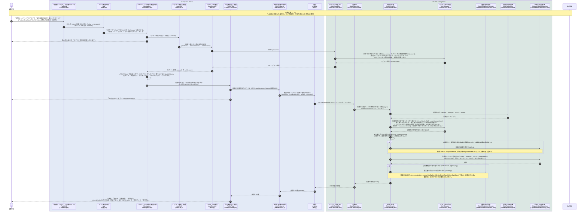

# EC-B05 販売店舗の情報を確認する

```mermaid
sequenceDiagram
    autonumber
    actor User as 購入者
    box rgba(47,111,219,0.10) ブラウザー React
        participant StoreLink as 「植物について」の店舗のリンク<br/>PageLink<br/>(Common.jsx)
        participant App as EC の画面の枠<br/>App<br/>(App.jsx)
        participant Work as アカウント・店舗の画面の枠<br/>Workspace<br/>(Workspace.jsx)
        participant UseAuth as ログイン状態の取得<br/>useAuth<br/>(useAuth.js)
        participant AuthJs as ログインの通信<br/>readSession<br/>(auth.js)
        participant Profile as 「店舗紹介」画面<br/>ProfilePage<br/>(PartnerForms.jsx)
        participant Res as 店舗の情報の取得<br/>useResource<br/>(useResource.js)
        participant Http as 通信<br/>request<br/>(api.js)
    end
    box rgba(27,127,92,0.12) EC API Spring Boot
        participant AuthCtrl as ログイン状態API<br/>AuthController<br/>(AuthController.java)
        participant Ctrl as 店舗API<br/>StoreController<br/>(StoreController.java)
        participant Svc as 店舗の処理<br/>StoreService<br/>(StoreService.java)
        participant AuthSvc as ログイン中の会員<br/>AuthService<br/>(AuthService.java)
        participant Mod as 運営者の警告<br/>StoreModerationService<br/>(StoreModerationService.java)
        participant StoreRepo as 店舗の読み書き<br/>StoreRepository<br/>(StoreRepository.java)
        participant OrgRepo as 組織の読み書き<br/>OrganizationRepository<br/>(OrganizationRepository.java)
    end
    participant Db as MySQL

    Note over User,Db: 共通代替フロー<br/>*a 通信に失敗した場合: 7、17 (「再取得」で送り直したときも) に適用

    User->>StoreLink: 「植物について」ダイアログの「販売店舗の紹介を見る」をクリック<br/>(ProductDetail.jsx が href に /store/{商品の店舗 ID} を渡す)
    StoreLink->>App: URL を /store/{店舗 ID} に変え (follow → navigate)、<br/>新しいパスを渡す (usePath)
    App->>Work: パスが / でも /cart でもないので Workspace を表示する。<br/>「植物について」ダイアログは描かなくなり、閉じる
    Work->>UseAuth: ログイン状態を読むよう頼む (useAuth)
    Work-->>User: 読み終わるまで「ログイン状態を確認しています。」
    UseAuth->>AuthJs: 画面を開いたときに自動で読む<br/>(useEffect → refreshSession → readSession)
    AuthJs->>AuthCtrl: GET /api/auth/me
    AuthCtrl->>AuthSvc: ログイン状態を作るよう頼む (session)。ログイン中の会員を確かめ (current)、<br/>未ログインなら 401 を受け止めて authenticated が false、<br/>ログイン中なら会員と組織・店舗の所属を読む
    AuthSvc-->>AuthCtrl: ログイン状態 (SessionView)
    AuthCtrl-->>AuthJs: 200 ログイン状態
    AuthJs-->>Work: ログイン状態 (useAuth の setSession)
    Work->>Work: パスが /store/ で始まるので、未ログインでもログイン欄を出さない (publicStore)。<br/>見出しは「店舗紹介」、サイドバーは「マイページ」「アカウント設定」
    Work->>Profile: 店舗 ID を渡して読み取り専用で表示する<br/>(ProfilePage storeId readOnly)
    Profile->>Res: 店舗の情報を取りに行くよう頼む (useResource('/stores/{店舗 ID}'))
    Res->>Http: 画面を開いたときに自動で通信を始める<br/>(useEffect → setData(null) → reload → request)
    Profile-->>User: 「読み込んでいます。」(ResourceStatus)
    Http->>Ctrl: GET /api/stores/{id} (ログインしていなくてもよい)
    Ctrl->>Svc: 店舗の公開ページの情報を作るよう頼む (get)<br/>読み取り専用のトランザクション
    Svc->>StoreRepo: 店舗を読む (require → findById、SELECT stores)
    StoreRepo-->>Svc: 店舗 (なければなし)
    Svc->>AuthSvc: 店舗側の立場で見られるかを確かめる (canViewAsStaff → canManageView)<br/>運営者なら見られる。運営者が利用停止した店舗は運営者だけ。<br/>オーナーは自分の組織の店舗、担当者は所属する店舗なら見られる。<br/>未ログイン (current の 401) と利用できないアカウント (403) は見られない
    AuthSvc-->>Svc: 店舗側の立場で見られるか (staff)
    Svc->>Svc: 購入者に見せる店舗かを確かめる (publiclyVisible)<br/>公開中で、運営者の利用停止も閉鎖済みもないか
    opt 公開中で、運営者の利用停止も閉鎖済みもない (組織の確認は記述なし)
        Svc->>OrgRepo: 店舗の組織を読む (findById)
        Note over Svc,OrgRepo: 結果: SELECT organizations。組織が停止 (suspended) でなければ購入者に見せる。
    end
    Svc->>OrgRepo: 会社名のために組織を読む (view → findById、SELECT organizations)<br/>(読んでいれば、同じトランザクションの中ではもう読まない)
    OrgRepo-->>Svc: 組織
    opt 店舗側の立場で見られる (staff が true。記述なし)
        Svc->>Mod: 運営者の今出ている警告を読む (warnings)
        Note over Svc,Mod: 結果: SELECT store_moderation_events (findByStoreIdInAndEventTypeInOrderByIdDesc) で読み、応答に入れる。<br/>購入者・未ログインには警告を入れない。
    end
    Svc-->>Ctrl: 店舗の情報 (Profile)
    Ctrl-->>Http: 200 店舗の情報
    Http-->>Res: 店舗の情報 (setData)
    Res-->>Profile: 店舗の情報
    Profile-->>User: 店舗名、「所在地 / 営業時間」、店舗紹介、<br/>closingStartedAt があれば「閉店予定」、なければ enabled で「営業中」か「受付休止」
```

