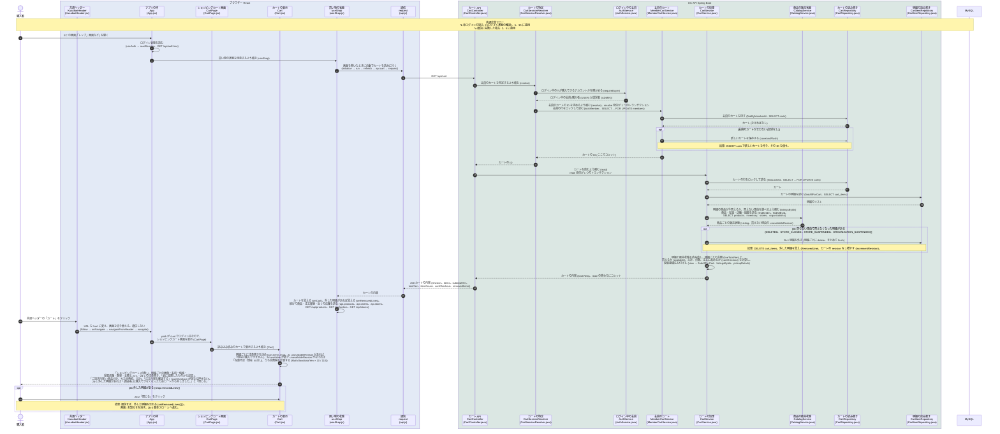

# EC-B08 カートを確認する

```mermaid
sequenceDiagram
    autonumber
    actor User as 購入者
    box rgba(47,111,219,0.10) ブラウザー React
        participant Header as 共通ヘッダー<br/>KusakariHeader<br/>(KusakariHeader.jsx)
        participant App as アプリの枠<br/>App<br/>(App.jsx)
        participant Page as ショッピングカート画面<br/>CartPage<br/>(CartPage.jsx)
        participant Cart as カートの表示<br/>Cart<br/>(Cart.jsx)
        participant Shop as 買い物の状態<br/>useShop<br/>(useShop.js)
        participant Http as 通信<br/>request<br/>(api.js)
    end
    box rgba(27,127,92,0.12) EC API Spring Boot
        participant Ctrl as カートAPI<br/>CartController<br/>(CartController.java)
        participant Resolver as カートの特定<br/>CartSessionResolver<br/>(CartSessionResolver.java)
        participant Auth as ログイン中の会員<br/>AuthService<br/>(AuthService.java)
        participant MemberCart as 会員のカート<br/>MemberCartService<br/>(MemberCartService.java)
        participant Svc as カートの処理<br/>CartService<br/>(CartService.java)
        participant Catalog as 商品の販売状態<br/>CatalogService<br/>(CatalogService.java)
        participant CartRepo as カートの読み書き<br/>CartRepository<br/>(CartRepository.java)
        participant ItemRepo as 明細の読み書き<br/>CartItemRepository<br/>(CartItemRepository.java)
    end
    participant Db as MySQL

    Note over User,Db: 共通代替フロー<br/>*b 未ログインの場合: 2 (ログイン状態の確認)、5、30 に適用<br/>*a 通信に失敗した場合: 2、5 に適用

    User->>App: EC の画面 (「トップ」画面など) を開く
    App->>App: ログイン状態を読む<br/>(useAuth → readSession、GET /api/auth/me)
    App->>Shop: 買い物の状態を用意するよう頼む (useShop)
    Shop->>Http: 画面を開いたときに自動でカートを読みに行く<br/>(initialize → run → refresh → api.cart → request)
    Http->>Ctrl: GET /api/cart
    Ctrl->>Resolver: 会員のカートを特定するよう頼む (resolve)
    Resolver->>Auth: ログイン中の人が購入できるアカウントかを確かめる (requireBuyer)
    Auth-->>Resolver: ログイン中の会員 (購入者 (USER) か運営者 (ADMIN))
    Resolver->>MemberCart: 会員のカートの ID を求めるよう頼む (resolve)。resolve 全体が 1 つのトランザクション<br/>会員の行をロックして読む (lockMember、SELECT ... FOR UPDATE members)
    MemberCart->>CartRepo: 会員のカートを探す (findByMemberId、SELECT carts)
    CartRepo-->>MemberCart: カート (なければなし)
    opt 会員のカートがまだない (記述なし)
        MemberCart->>CartRepo: 新しいカートを保存する (saveAndFlush)
        Note over MemberCart,CartRepo: 結果: INSERT carts で新しいカートを作り、その ID を使う。
    end
    MemberCart-->>Resolver: カートの ID (ここでコミット)
    Resolver-->>Ctrl: カートの ID
    Ctrl->>Svc: カートを読むよう頼む (read)<br/>read 全体が 1 つのトランザクション
    Svc->>CartRepo: カートの行をロックして読む (findLocked、SELECT ... FOR UPDATE carts)
    CartRepo-->>Svc: カート
    Svc->>ItemRepo: カートの明細を読む (findAllForCart、SELECT cart_items)
    ItemRepo-->>Svc: 明細のリスト
    Svc->>Catalog: 明細の商品が今買えるか、買えない理由を調べるよう頼む (listingsByIds)<br/>商品・在庫・店舗・組織を読む (findByIdIn、findAllById、<br/>SELECT products、inventory、stores、organizations)
    Catalog-->>Svc: 商品ごとの販売状態 (Listing、買えない理由の unavailableReason)
    opt 2b 戻らない理由で買えなくなった明細がある<br/>(DELETED、STORE_CLOSED、STORE_SUSPENDED、ORGANIZATION_SUSPENDED)
        Svc->>ItemRepo: 2b-1 明細を外す (明細ごとに delete、まとめて flush)
        Note over Svc,ItemRepo: 結果: DELETE cart_items。外した明細を覚え (RemovedLine)、カートの revision を 1 増やす (incrementRevision)。
    end
    Svc->>Svc: 明細と販売状態を読み直し、明細ごとの金額 (lineTotalYen) と<br/>買えるか (available)、合計、点数、注文に進めるか (canCheckout) を計算し、<br/>受取連絡先を付ける (view → findAllForCart、listingsByIds、pickupDetails)
    Svc-->>Ctrl: カートの内容 (CartView)。read の終わりにコミット
    Ctrl-->>Http: 200 カートの内容 (revision、items、subtotalYen、<br/>totalYen、itemCount、canCheckout、removedItems)
    Http-->>Shop: カートの内容
    Shop->>Shop: カートを覚える (setCart)。外した明細があれば覚える (setRemovedLines)。<br/>続けて商品・注文履歴・近くの店舗を読む (api.products、api.orders、api.stores、<br/>GET /api/products、GET /api/orders、GET /api/stores)

    User->>Header: 共通ヘッダーの「カート」をクリック
    Header->>App: URL を /cart に変え、画面を切り替える。通信しない<br/>(follow → onNavigate → navigateFromHeader → navigate)
    App->>Page: path が /cart でログイン中なので、<br/>ショッピングカート画面を表示 (CartPage)
    Page->>Cart: 読み込み済みのカートで表示するよう頼む (Cart)
    Cart->>Cart: 明細ごとに注意書きを決め (cart.items.map。2c unavailableReason があれば<br/>「現在は購入できません」、2d available が偽で unavailableReason がなければ<br/>「在庫不足（現在 N 点）」)、うち消費税を計算する (Math.floor(totalYen × 10 / 110))
    Cart-->>User: 「ショッピングカート (点数)」、明細ごとの画像・名前・価格・<br/>受取店舗・数量・金額と 2c-1・2d-1 の注意書き、「庭に設置したものから追加」、<br/>「ご請求内容」(商品小計、うち消費税、合計)、「注文内容を確認する」(canCheckout が偽なら押せない)。<br/>2b-1 外した明細があれば「(商品名)は購入できなくなったためカートから外しました。」と「閉じる」
    opt 2b 外した明細がある (shop.removedLines)
        User->>Cart: 2b-2「閉じる」をクリック
        Note over User,Cart: 結果: 通信せず、外した明細を忘れる (setRemovedLines([]))。<br/>画面: お知らせを消す。2b-3 基本フロー 3 へ進む。
    end
```

