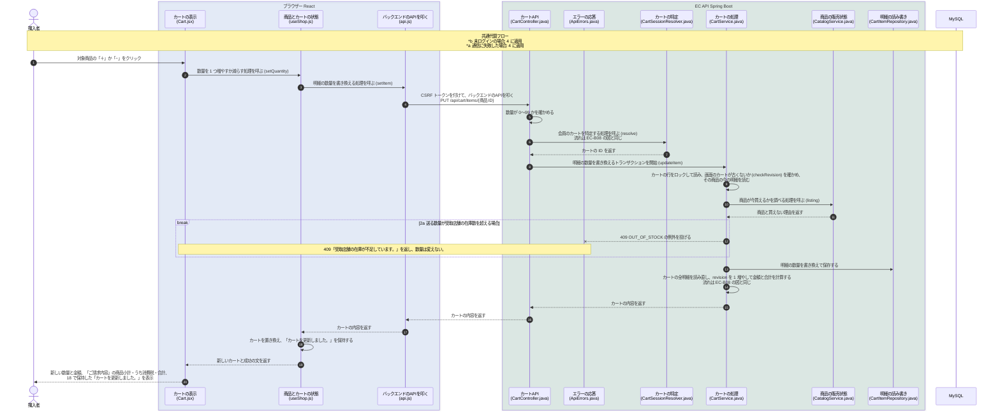

# EC-B09 カートの数量を変更する

```mermaid
sequenceDiagram
    autonumber
    actor User as 購入者
    box rgba(47,111,219,0.10) ブラウザー React
        participant Cart as カートの表示<br/>(Cart.jsx)
        participant Shop as 商品とカートの状態<br/>(useShop.js)
        participant Http as バックエンドのAPIを叩く<br/>(api.js)
    end
    box rgba(27,127,92,0.12) EC API Spring Boot
        participant Ctrl as カートAPI<br/>(CartController.java)
        participant Errs as エラーの応答<br/>(ApiErrors.java)
        participant Resolver as カートの特定<br/>(CartSessionResolver.java)
        participant Svc as カートの処理<br/>(CartService.java)
        participant Catalog as 商品の販売状態<br/>(CatalogService.java)
        participant ItemRepo as 明細の読み書き<br/>(CartItemRepository.java)
    end
    participant Db as MySQL

    Note over User,Db: 共通代替フロー<br/>*b 未ログインの場合: 4 に適用<br/>*a 通信に失敗した場合: 4 に適用

    User->>Cart: 対象商品の「＋」か「−」をクリック
    Cart->>Shop: 数量を 1 つ増やすか減らす処理を呼ぶ (setQuantity)
    Shop->>Http: 明細の数量を書き換える処理を呼ぶ (setItem)
    Http->>Ctrl: CSRF トークンを付けて、バックエンドのAPIを叩く<br/>PUT /api/cart/items/{商品 ID}
    Ctrl->>Ctrl: 数量が 0〜99 かを確かめる
    Ctrl->>Resolver: 会員のカートを特定する処理を呼ぶ (resolve)<br/>流れは EC-B08 の図と同じ
    Resolver-->>Ctrl: カートの ID を返す
    Ctrl->>Svc: 明細の数量を書き換えるトランザクションを開始 (updateItem)
    Svc->>Svc: カートの行をロックして読み、画面のカートが古くないか (checkRevision) を確かめ、<br/>その商品の今の明細を読む
    Svc->>Catalog: 商品が今買えるかを調べる処理を呼ぶ (listing)
    Catalog-->>Svc: 商品と買えない理由を返す
    break 2a 送る数量が受取店舗の在庫数を超える場合
        Svc--xErrs: 409 OUT_OF_STOCK の例外を投げる
        Note over Errs,Cart: 409「受取店舗の在庫が不足しています。」を返し、数量は変えない。
    end
    Svc->>ItemRepo: 明細の数量を書き換えて保存する
    Svc->>Svc: カートの全明細を読み直し、revision を 1 増やして金額と合計を計算する<br/>流れは EC-B08 の図と同じ
    Svc-->>Ctrl: カートの内容を返す
    Ctrl-->>Http: カートの内容を返す
    Http-->>Shop: カートの内容を返す
    Shop->>Shop: カートを置き換え、「カートを更新しました。」を保持する
    Shop-->>Cart: 新しいカートと成功の文を返す
    Cart-->>User: 新しい数量と金額、「ご請求内容」の商品小計・うち消費税・合計、<br/>18 で保持した「カートを更新しました。」を表示
```

