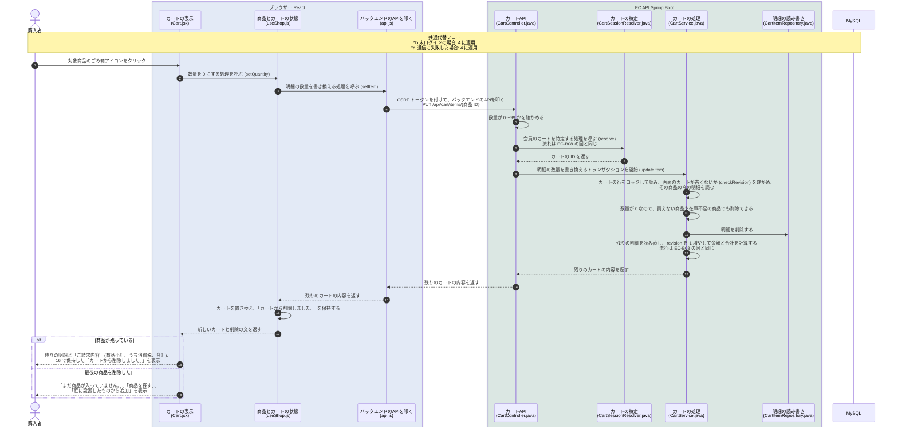

# EC-B10 カートから商品を削除する

```mermaid
sequenceDiagram
    autonumber
    actor User as 購入者
    box rgba(47,111,219,0.10) ブラウザー React
        participant Cart as カートの表示<br/>(Cart.jsx)
        participant Shop as 商品とカートの状態<br/>(useShop.js)
        participant Http as バックエンドのAPIを叩く<br/>(api.js)
    end
    box rgba(27,127,92,0.12) EC API Spring Boot
        participant Ctrl as カートAPI<br/>(CartController.java)
        participant Resolver as カートの特定<br/>(CartSessionResolver.java)
        participant Svc as カートの処理<br/>(CartService.java)
        participant ItemRepo as 明細の読み書き<br/>(CartItemRepository.java)
    end
    participant Db as MySQL

    Note over User,Db: 共通代替フロー<br/>*b 未ログインの場合: 4 に適用<br/>*a 通信に失敗した場合: 4 に適用

    User->>Cart: 対象商品のごみ箱アイコンをクリック
    Cart->>Shop: 数量を 0 にする処理を呼ぶ (setQuantity)
    Shop->>Http: 明細の数量を書き換える処理を呼ぶ (setItem)
    Http->>Ctrl: CSRF トークンを付けて、バックエンドのAPIを叩く<br/>PUT /api/cart/items/{商品 ID}
    Ctrl->>Ctrl: 数量が 0〜99 かを確かめる
    Ctrl->>Resolver: 会員のカートを特定する処理を呼ぶ (resolve)<br/>流れは EC-B08 の図と同じ
    Resolver-->>Ctrl: カートの ID を返す
    Ctrl->>Svc: 明細の数量を書き換えるトランザクションを開始 (updateItem)
    Svc->>Svc: カートの行をロックして読み、画面のカートが古くないか (checkRevision) を確かめ、<br/>その商品の今の明細を読む
    Svc->>Svc: 数量が 0 なので、買えない商品や在庫不足の商品でも削除できる
    Svc->>ItemRepo: 明細を削除する
    Svc->>Svc: 残りの明細を読み直し、revision を 1 増やして金額と合計を計算する<br/>流れは EC-B08 の図と同じ
    Svc-->>Ctrl: 残りのカートの内容を返す
    Ctrl-->>Http: 残りのカートの内容を返す
    Http-->>Shop: 残りのカートの内容を返す
    Shop->>Shop: カートを置き換え、「カートから削除しました。」を保持する
    Shop-->>Cart: 新しいカートと削除の文を返す
    alt 商品が残っている
        Cart-->>User: 残りの明細と「ご請求内容」(商品小計、うち消費税、合計)、<br/>16 で保持した「カートから削除しました。」を表示
    else 最後の商品を削除した
        Cart-->>User: 「まだ商品が入っていません。」、「商品を探す」、<br/>「庭に設置したものから追加」を表示
    end
```

