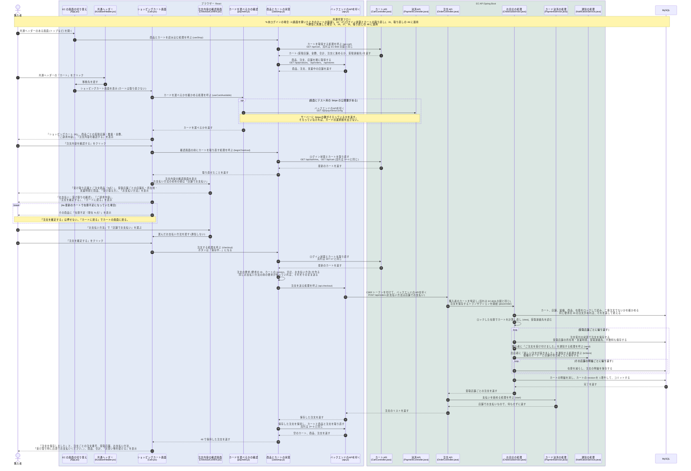
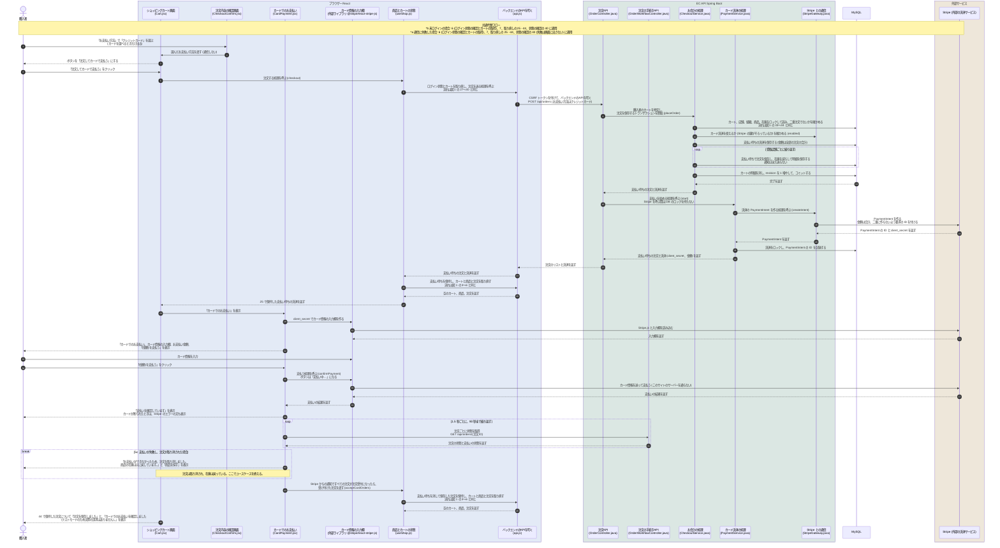
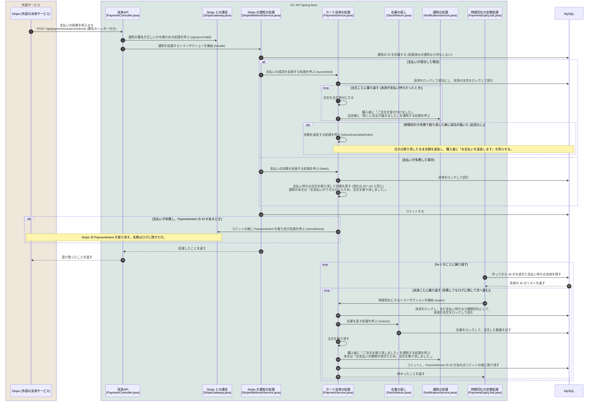

# EC-B12 商品を購入する

### 図 1 店舗でお支払い

```mermaid
sequenceDiagram
    autonumber
    actor User as 購入者
    box rgba(47,111,219,0.10) ブラウザー React
        participant App as EC の画面の切り替え<br/>(App.jsx)
        participant Header as 共通ヘッダー<br/>(KusakariHeader.jsx)
        participant Cart as ショッピングカート画面<br/>(Cart.jsx)
        participant Confirm as 注文内容の確認画面<br/>(CheckoutConfirm.jsx)
        participant Pay as カードを選べるかの確認<br/>(payment.js)
        participant Shop as 商品とカートの状態<br/>(useShop.js)
        participant Http as バックエンドのAPIを叩く<br/>(api.js)
    end
    box rgba(27,127,92,0.12) EC API Spring Boot
        participant CartCtrl as カートAPI<br/>(CartController.java)
        participant PayCtrl as 決済API<br/>(PaymentController.java)
        participant OrderCtrl as 注文API<br/>(OrderController.java)
        participant Checkout as お会計の処理<br/>(CheckoutService.java)
        participant PaySvc as カード決済の処理<br/>(PaymentService.java)
        participant Ntf as 通知の処理<br/>(NotificationService.java)
    end
    participant Db as MySQL

    Note over User,Db: 共通代替フロー<br/>*b 未ログインの場合: 3 (画面を開いたときのカートの取得)、16・27 (ログイン状態とカートの取り直し)、31、取り直しの 46 に適用<br/>*a 通信に失敗した場合: 3、16、27、31、取り直しの 46 に適用

    User->>App: 共通ヘッダーのある画面 (トップなど) を開く
    App->>Shop: 商品とカートを読み込む処理を呼ぶ (useShop)
    Shop->>CartCtrl: カートを取得する処理を呼ぶ (api.cart)<br/>GET /api/cart、流れは EC-B08 の図と同じ
    CartCtrl-->>Shop: カート (受取店舗、金額、合計、注文に進めるか、受取連絡先) を返す
    Shop->>Http: 商品、注文、店舗を順に取得する<br/>GET /api/products、/api/orders、/api/stores
    Http-->>Shop: 商品、注文、営業中の店舗を返す

    User->>Header: 共通ヘッダーの「カート」をクリック
    Header->>App: 移動先を渡す
    App->>Cart: ショッピングカート画面を表示 (カートは取り直さない)
    Cart->>Pay: カードを選べるかを確かめる処理を呼ぶ (useCardAvailable)
    opt 画面にテスト用の Stripe の公開鍵がある
        Pay->>PayCtrl: バックエンドのAPIを叩く<br/>GET /api/payments/config
        Note over Pay,PayCtrl: サーバーに Stripe の鍵がそろっているかを返す。<br/>そろっていなければ、カードの選択肢を出さない。
    end
    Pay-->>Cart: カードを選べるかを返す
    Cart-->>User: 「ショッピングカート (N)」、商品ごとの受取店舗・数量・金額、<br/>「ご請求内容」、「注文内容を確認する」を表示

    User->>Cart: 「注文内容を確認する」をクリック
    Cart->>Shop: 確認画面の前にカートを取り直す処理を呼ぶ (beginCheckout)
    Shop->>CartCtrl: ログイン状態とカートを取り直す<br/>GET /api/auth/me、GET /api/cart (流れは 3〜4 と同じ)
    CartCtrl-->>Shop: 最新のカートを返す
    Shop-->>Cart: 取り直せたことを返す
    Cart->>Confirm: 注文内容の確認画面を表示<br/>お支払い方法の初めの値は「店舗でお支払い」
    Confirm-->>User: 「受け取り店舗とご注文商品（N点）」、受取店舗ごとの店舗名・所在地・<br/>営業時間と商品、「受け取る方」、「お支払い方法」を表示
    Cart-->>User: 「お支払い・受け取りの確認」、「ご請求内容」、<br/>「注文を確定する」、「カートに戻る」を表示
    break 4a 最新のカートで在庫不足になっていた場合
        Cart-->>User: その商品に「在庫不足（現在 N 点）」を表示
        Note over User,Cart: 「注文を確定する」は押せない。「カートに戻る」でカートの画面に戻る。
    end

    User->>Confirm: 「お支払い方法」で「店舗でお支払い」を選ぶ
    Confirm->>Cart: 選んだお支払い方法を渡す (通信しない)
    User->>Cart: 「注文を確定する」をクリック
    Cart->>Shop: 注文する処理を呼ぶ (checkout)<br/>ボタンは「保存中…」になる
    Shop->>CartCtrl: ログイン状態とカートを取り直す<br/>流れは 16〜17 と同じ
    CartCtrl-->>Shop: 最新のカートを返す
    Shop->>Shop: 注文の要求 (要求の ID、カートの revision、合計、お支払い方法) を作る<br/>同じお支払い方法の前の要求が残っていれば、それをそのまま送る
    Shop->>Http: 注文を送る処理を呼ぶ (api.checkout)
    Http->>OrderCtrl: CSRF トークンを付けて、バックエンドのAPIを叩く<br/>POST /api/orders (お支払い方法は店舗でお支払い)
    OrderCtrl->>Checkout: 購入者のカートを特定し (流れは EC-B08 の図と同じ)、<br/>注文を保存するトランザクションを開始 (placeOrder)
    Checkout->>Db: カート、店舗、組織、商品、在庫をロックして読み、二重注文でないかを確かめる<br/>同じ要求の ID の注文があれば、それを返して終える
    Checkout->>Checkout: ロックした在庫でカートを計算し直し (view)、受取連絡先を読む
    loop 受取店舗ごとに繰り返す
        Checkout->>Db: 注文受付の状態で注文を保存する<br/>受取店舗の所在地・営業時間、受取連絡先、手数料も保存する
        Checkout->>Ntf: 購入者に「ご注文を受け付けました」を通知する処理を呼ぶ (send)
        Checkout->>Ntf: 出店者に「新しい注文が届きました」を通知する処理を呼ぶ (toStore)<br/>組織のオーナーと店舗の担当者ごとに保存する
        loop その店舗の明細ごとに繰り返す
            Checkout->>Db: 在庫を減らし、注文の明細を保存する
        end
    end
    Checkout->>Db: カートの明細を消し、カートの revision を 1 増やして、コミットする
    Db-->>Checkout: 完了を返す
    Checkout-->>OrderCtrl: 受取店舗ごとの注文を返す
    OrderCtrl->>PaySvc: 支払いを始める処理を呼ぶ (start)
    PaySvc-->>OrderCtrl: 店舗でお支払いなので、何もせずに返す
    OrderCtrl-->>Http: 注文のリストを返す
    Http-->>Shop: 保存した注文を返す
    Shop->>Http: 保存した注文を保持し、カートと商品と注文を取り直す<br/>流れは 3〜6 と同じ
    Http-->>Shop: 空のカート、商品、注文を返す
    Shop-->>Cart: 46 で保持した注文を返す
    Cart-->>User: 「注文を保存しました」と、注文ごとの注文番号、受取店舗、お支払い方法、<br/>「受け取り時に店頭でお支払いください。」、商品、合計、「お買い物を続ける」を表示
```

### 図 2 クレジットカード

```mermaid
sequenceDiagram
    autonumber
    actor User as 購入者
    box rgba(47,111,219,0.10) ブラウザー React
        participant Cart as ショッピングカート画面<br/>(Cart.jsx)
        participant Confirm as 注文内容の確認画面<br/>(CheckoutConfirm.jsx)
        participant Card as カードでのお支払い<br/>(CardPayment.jsx)
        participant StripeJs as カード情報の入力欄<br/>(外部ライブラリ @stripe/react-stripe-js)
        participant Shop as 商品とカートの状態<br/>(useShop.js)
        participant Http as バックエンドのAPIを叩く<br/>(api.js)
    end
    box rgba(27,127,92,0.12) EC API Spring Boot
        participant OrderCtrl as 注文API<br/>(OrderController.java)
        participant WfCtrl as 注文の手続きAPI<br/>(OrderWorkflowController.java)
        participant Checkout as お会計の処理<br/>(CheckoutService.java)
        participant PaySvc as カード決済の処理<br/>(PaymentService.java)
        participant Gateway as Stripe との通信<br/>(StripeGateway.java)
    end
    participant Db as MySQL
    box rgba(180,120,20,0.12) 外部サービス
        participant Stripe as Stripe (外部の決済サービス)
    end

    Note over User,Stripe: 共通代替フロー<br/>*b 未ログインの場合: 6 (ログイン状態の確認とカートの取得)、7、取り直しの 25・44、状態の確認の 40 に適用<br/>*a 通信に失敗した場合: 6 (ログイン状態の確認とカートの取得)、7、取り直しの 25・44、状態の確認の 40 (失敗は画面に出さない) に適用

    User->>Confirm: 「お支払い方法」で「クレジットカード」を選ぶ<br/>(カードを選べるときだけ出る)
    Confirm->>Cart: 選んだお支払い方法を渡す (通信しない)
    Cart-->>User: ボタンを「注文してカードで支払う」にする
    User->>Cart: 「注文してカードで支払う」をクリック
    Cart->>Shop: 注文する処理を呼ぶ (checkout)
    Shop->>Http: ログイン状態とカートを取り直し、注文を送る処理を呼ぶ<br/>流れは図 1 の 27〜30 と同じ
    Http->>OrderCtrl: CSRF トークンを付けて、バックエンドのAPIを叩く<br/>POST /api/orders (お支払い方法はクレジットカード)
    OrderCtrl->>Checkout: 購入者のカートを特定し、<br/>注文を保存するトランザクションを開始 (placeOrder)
    Checkout->>Db: カート、店舗、組織、商品、在庫をロックして読み、二重注文でないかを確かめる<br/>流れは図 1 の 33〜34 と同じ
    Checkout->>Gateway: カード決済を使えるか (Stripe の鍵がそろっているか) を確かめる (enabled)
    Checkout->>Db: 支払い待ちの決済を保存する (金額は全部の注文の合計)
    loop 受取店舗ごとに繰り返す
        Checkout->>Db: 支払い待ちで注文を保存し、在庫を減らして明細を保存する<br/>通知はまだ送らない
    end
    Checkout->>Db: カートの明細を消し、revision を 1 増やして、コミットする
    Db-->>Checkout: 完了を返す
    Checkout-->>OrderCtrl: 支払い待ちの注文と決済を返す
    OrderCtrl->>PaySvc: 支払いを始める処理を呼ぶ (start)<br/>Stripe を呼ぶ間は DB のロックを持たない
    PaySvc->>Gateway: 決済の PaymentIntent を作る処理を呼ぶ (createIntent)
    Gateway->>Stripe: PaymentIntent を作る<br/>金額は合計、二重に作らないよう要求の ID を付ける
    Stripe-->>Gateway: PaymentIntent の ID と client_secret を返す
    Gateway-->>PaySvc: PaymentIntent を返す
    PaySvc->>Db: 決済をロックし、PaymentIntent の ID を記録する
    PaySvc-->>OrderCtrl: 支払い待ちの注文と決済 (client_secret、金額) を返す
    OrderCtrl-->>Http: 注文のリストと決済を返す
    Http-->>Shop: 支払い待ちの注文と決済を返す
    Shop->>Http: 支払い待ちを保持し、カートと商品と注文を取り直す<br/>流れは図 1 の 3〜6 と同じ
    Http-->>Shop: 空のカート、商品、注文を返す
    Shop-->>Cart: 25 で保持した支払い待ちの決済を返す
    Cart->>Card: 「カードでのお支払い」を表示
    Card->>StripeJs: client_secret でカード情報の入力欄を作る
    StripeJs->>Stripe: Stripe.js と入力欄を読み込む
    Stripe-->>StripeJs: 入力欄を返す
    Card-->>User: 「カードでのお支払い」、カード情報の入力欄、お支払い金額、<br/>「(金額)を支払う」を表示
    User->>StripeJs: カード情報を入力
    User->>Card: 「(金額)を支払う」をクリック
    Card->>StripeJs: 支払う処理を呼ぶ (confirmPayment)<br/>ボタンは「支払い中…」になる
    StripeJs->>Stripe: カード情報を送って支払う (このサイトのサーバーを通らない)
    Stripe-->>StripeJs: 支払いの結果を返す
    StripeJs-->>Card: 支払いの結果を返す
    Card-->>User: 「支払いを確認しています」を表示<br/>カードが断られたときは、Stripe のエラーの文も表示
    loop 1.5 秒ごとに、90 秒まで繰り返す
        Card->>WfCtrl: 注文ごとに状態を取得<br/>GET /api/orders/{注文 ID}
        WfCtrl-->>Card: 注文の状態と支払いの状態を返す
    end
    break 5c 支払いが失敗し、注文が取り消された場合
        Card-->>User: 「お支払いができなかったため、注文を取り消しました。<br/>商品の在庫は元に戻しています。」と「商品を探す」を表示
        Note over Cart,Card: 注文は取り消され、在庫は戻っている。ここでユースケースを終える。
    end
    Card->>Shop: Stripe からの通知ですべての注文が注文受付になったら、<br/>受け付けた注文を渡す (acceptCardOrders)
    Shop->>Http: 支払い待ちを消して保存した注文を保持し、カートと商品と注文を取り直す<br/>流れは図 1 の 3〜6 と同じ
    Http-->>Shop: 空のカート、商品、注文を返す
    Cart-->>User: 44 で保持した注文について「注文を保存しました」と、「カードでのお支払いを確認しました<br/>（テストモードのため実際の請求はありません）。」を表示
```

### 図 3 Stripe からの通知と時間切れ

```mermaid
sequenceDiagram
    autonumber
    box rgba(180,120,20,0.12) 外部サービス
        participant Stripe as Stripe (外部の決済サービス)
    end
    box rgba(27,127,92,0.12) EC API Spring Boot
        participant PayCtrl as 決済API<br/>(PaymentController.java)
        participant Gateway as Stripe との通信<br/>(StripeGateway.java)
        participant Webhook as Stripe の通知の処理<br/>(StripeWebhookService.java)
        participant PaySvc as カード決済の処理<br/>(PaymentService.java)
        participant Stock as 在庫の戻し<br/>(StockReturn.java)
        participant Ntf as 通知の処理<br/>(NotificationService.java)
        participant Job as 時間切れの定期処理<br/>(PaymentExpiryJob.java)
    end
    participant Db as MySQL

    Stripe->>PayCtrl: 支払いの結果を知らせる<br/>POST /api/payments/stripe/webhook (署名のヘッダー付き)
    PayCtrl->>Gateway: 通知の署名が正しいかを確かめる処理を呼ぶ (signatureValid)
    PayCtrl->>Webhook: 通知を処理するトランザクションを開始 (handle)
    Webhook->>Db: 通知の ID を記録する (処理済みの通知なら何もしない)
    alt 支払いが成功した場合
        Webhook->>PaySvc: 支払いの成功を反映する処理を呼ぶ (succeeded)
        PaySvc->>Db: 決済をロックして成功にし、決済の注文をロックして読む
        loop 注文ごとに繰り返す (決済が支払い待ちだったとき)
            PaySvc->>PaySvc: 注文を注文受付にする
            PaySvc->>Ntf: 購入者に「ご注文を受け付けました」、<br/>出店者に「新しい注文が届きました」を通知する処理を呼ぶ
        end
        opt 時間切れや失敗で取り消した後に成功が届いた (記述なし)
            PaySvc->>PaySvc: 全額を返金する処理を呼ぶ (refundCancelledOrder)
            Note over PaySvc,Db: 注文は取り消したまま全額を返金し、購入者に「お支払いを返金します」を知らせる。
        end
    else 支払いが失敗した場合
        Webhook->>PaySvc: 支払いの失敗を反映する処理を呼ぶ (failed)
        PaySvc->>Db: 決済をロックして読む
        PaySvc->>PaySvc: 支払い待ちの注文を取り消して在庫を戻す (流れは 20〜24 と同じ)<br/>通知の本文は「お支払いができなかったため、注文を取り消しました。」
    end
    Webhook->>Db: コミットする
    opt 支払いが失敗し、PaymentIntent の ID があるとき
        PaySvc->>Gateway: コミットの後に PaymentIntent を取り消す処理を呼ぶ (cancelIntent)
        Note over Stripe,Gateway: Stripe の PaymentIntent を取り消す。失敗はログに残すだけ。
    end
    Webhook-->>PayCtrl: 処理したことを返す
    PayCtrl-->>Stripe: 受け取ったことを返す

    loop 5e 1 分ごとに繰り返す
        Job->>Db: 作ってから 30 分を過ぎた支払い待ちの決済を探す
        Db-->>Job: 決済の ID のリストを返す
        loop 決済ごとに繰り返す (失敗してもログに残して次へ進む)
            Job->>PaySvc: 時間切れにするトランザクションを開始 (expire)
            PaySvc->>Db: 決済をロックし、まだ支払い待ちなら期限切れにして、<br/>決済の注文をロックして読む
            PaySvc->>Stock: 在庫を戻す処理を呼ぶ (restock)
            Stock->>Db: 在庫をロックして、注文した数量を足す
            PaySvc->>PaySvc: 注文を取り消す
            PaySvc->>Ntf: 購入者に「ご注文を取り消しました」を通知する処理を呼ぶ<br/>本文は「お支払いの期限が過ぎたため、注文を取り消しました。」
            PaySvc->>Db: コミットし、PaymentIntent の ID があればコミットの後に取り消す
            PaySvc-->>Job: 終わったことを返す
        end
    end
```

