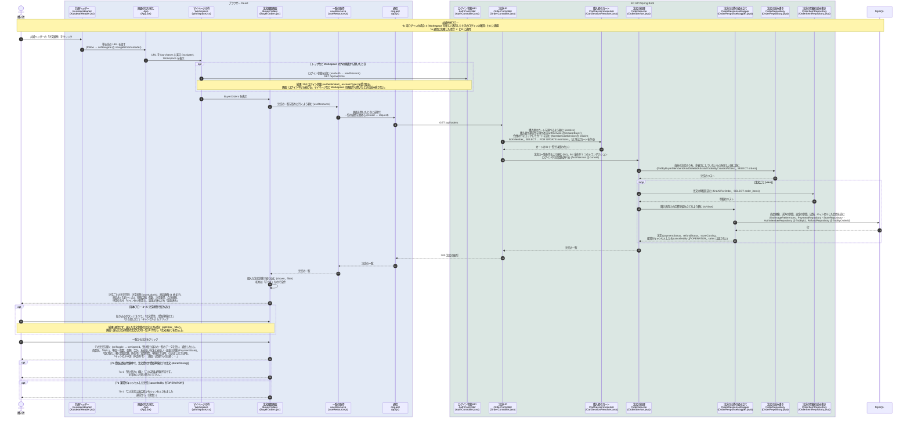

# EC-B13 注文履歴を確認する

```mermaid
sequenceDiagram
    autonumber
    actor User as 購入者
    box rgba(47,111,219,0.10) ブラウザー React
        participant Header as 共通ヘッダー<br/>KusakariHeader<br/>(KusakariHeader.jsx)
        participant App as 画面の切り替え<br/>App<br/>(App.jsx)
        participant Work as マイページの枠<br/>Workspace<br/>(Workspace.jsx)
        participant Orders as 注文履歴画面<br/>BuyerOrders<br/>(BuyerOrders.jsx)
        participant Hook as 一覧の取得<br/>useResource<br/>(useResource.js)
        participant Http as 通信<br/>request<br/>(api.js)
    end
    box rgba(27,127,92,0.12) EC API Spring Boot
        participant AuthCtrl as ログイン状態API<br/>AuthController<br/>(AuthController.java)
        participant Ctrl as 注文API<br/>OrderController<br/>(OrderController.java)
        participant Session as 購入者のカート<br/>CartSessionResolver<br/>(CartSessionResolver.java)
        participant Svc as 注文の処理<br/>OrderService<br/>(OrderService.java)
        participant Mapper as 注文の応答の組み立て<br/>OrderResponseMapper<br/>(OrderResponseMapper.java)
        participant Repo as 注文の読み書き<br/>OrderRepository<br/>(OrderRepository.java)
        participant Items as 注文の明細の読み書き<br/>OrderItemRepository<br/>(OrderItemRepository.java)
    end
    participant Db as MySQL

    Note over User,Db: 共通代替フロー<br/>*b 未ログインの場合: 4 (Workspace を新しく表示したときのログインの確認) と 8 に適用<br/>*a 通信に失敗した場合: 4 と 8 に適用

    User->>Header: 共通ヘッダーの「注文履歴」をクリック
    Header->>App: 移る先の URL を渡す<br/>(follow → onNavigate の navigateFromHeader)
    App->>Work: URL を /purchases に変え (navigate)、<br/>Workspace を表示
    opt トップなど Workspace の外の画面から開いたとき
        Work->>AuthCtrl: ログイン状態を読む (useAuth → readSession)<br/>GET /api/auth/me
        Note over Work,AuthCtrl: 結果: 200 ログイン状態 (authenticated、accountType) を受け取る。<br/>画面: ログイン中なら続ける。マイページなど Workspace の画面から開いたときは読み直さない。
    end
    Work->>Orders: BuyerOrders を表示
    Orders->>Hook: 注文の一覧を取りに行くよう頼む (useResource)
    Hook->>Http: 画面を開いたときに自動で<br/>一覧の通信を始める (reload → request)
    Http->>Ctrl: GET /api/orders
    Ctrl->>Session: 購入者のカートを調べるよう頼む (resolve)<br/>購入者か運営かを確かめ (AuthService の requireBuyer)、<br/>会員の行をロックしてカートを読む (MemberCartService の resolve、<br/>lockMember、SELECT ... FOR UPDATE members。なければカートを作る)
    Session-->>Ctrl: カートの ID (一覧では使わない)
    Ctrl->>Svc: 注文の一覧を作るよう頼む (list)。list 全体が 1 つのトランザクション<br/>ログイン中の会員を調べる (AuthService の current)
    Svc->>Repo: 自分の注文のうち、非表示にしていないものを新しい順に読む<br/>(findByBuyerMemberIdAndDeletedAtIsNullOrderByCreatedAtDesc、SELECT orders)
    Repo-->>Svc: 注文のリスト
    loop 注文ごと (view)
        Svc->>Items: 注文の明細を読む (findAllForOrder、SELECT order_items)
        Items-->>Svc: 明細のリスト
        Svc->>Mapper: 購入者向けの応答を組み立てるよう頼む (toView)
        Mapper->>Db: 商品画像、決済の状態、返金の状態、店舗、キャンセルした会員を読む<br/>(findImageReferences、PaymentRepository・StoreRepository・<br/>AuthMemberRepository の findById、RefundRepository の findByOrderId)
        Db-->>Mapper: 行
        Mapper-->>Svc: 注文 (paymentStatus、refundStatus、storeClosing、<br/>運営がキャンセルしたら cancelledBy が OPERATOR。sales は返さない)
    end
    Svc-->>Ctrl: 注文の一覧
    Ctrl-->>Http: 200 注文の配列
    Http-->>Hook: 注文の一覧
    Hook-->>Orders: 注文の一覧
    Orders->>Orders: 選んだ注文状態で絞り込む (shown、filter)<br/>初めは「すべて」なので全件
    Orders-->>User: 注文ごとの注文日時、注文状態 (orderLabels)、商品画像 (4 枚まで)、<br/>商品名 (「ほか N 点」)、受取店舗、個数、注文番号、合計金額。<br/>申請中なら「キャンセル申請中」、返金が済んだら「返金済み」
    opt 基本フロー 4〜5 注文状態で絞り込む
        User->>Orders: 絞り込みボタン (「すべて」「注文受付」「受取準備完了」<br/>「引き渡し完了」「キャンセル」) をクリック
        Note over User,Orders: 結果: 通信せず、選んだ注文状態の注文だけを残す (setFilter、filter)。<br/>画面: 選んだ注文状態の注文だけの一覧 (0 件なら「注文はありません。」)。
    end
    User->>Orders: 一覧から注文をクリック
    Orders-->>User: その注文を開く (onToggle → setOpenId。受け取り済みの一覧のデータを使い、通信しない)。<br/>商品名、「SKU」、単価 × 個数、金額、合計、お支払い方法と支払い・返金の状態 (PaymentState)、<br/>「受け取り」欄 (受取店舗、所在地 / 営業時間、準備完了日時、引き渡し完了日時)、<br/>「キャンセル申請（承認/却下）：理由 / 店舗からの回答：…」
    opt 7a 受取店舗が閉鎖中で、注文受付か受取準備完了の注文 (storeClosing)
        Orders-->>User: 7a-1「受け取り」欄に「この店舗は閉鎖予定です。<br/>お早めにお受け取りください。」
    end
    opt 7b 運営がキャンセルした注文 (cancelledBy が OPERATOR)
        Orders-->>User: 7b-1「この注文は出店者からキャンセルされました<br/>（運営から：(理由)）」
    end
```

