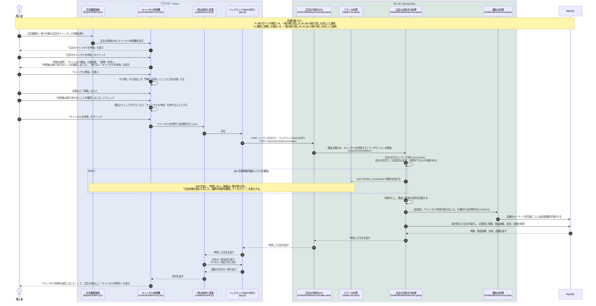

# EC-B14 注文キャンセルを申請する

```mermaid
sequenceDiagram
    autonumber
    actor User as 購入者
    box rgba(47,111,219,0.10) ブラウザー React
        participant Orders as 注文履歴画面<br/>(BuyerOrders.jsx)
        participant Form as キャンセル申請欄<br/>(CancelOrderForm.jsx)
        participant Hook as 一覧の取得と変更<br/>(useResource.js)
        participant Http as バックエンドのAPIを叩く<br/>(api.js)
    end
    box rgba(27,127,92,0.12) EC API Spring Boot
        participant Ctrl as 注文の手続きAPI<br/>(OrderWorkflowController.java)
        participant Errs as エラーの応答<br/>(ApiErrors.java)
        participant Svc as 注文の手続きの処理<br/>(OrderWorkflowService.java)
        participant Ntf as 通知の処理<br/>(NotificationService.java)
    end
    participant Db as MySQL

    Note over User,Db: 共通代替フロー<br/>*b 未ログインの場合: 14、一覧の取り直しの 26 (8a の取り直しも同じ) に適用<br/>*a 通信に失敗した場合: 14、一覧の取り直しの 26 (8a の取り直しも同じ) に適用

    User->>Orders: 注文履歴の一覧で対象の注文をクリックして詳細を開く
    Orders->>Form: 注文の詳細の中にキャンセル申請欄を表示
    Form-->>User: 「注文のキャンセルを申請」を表示
    User->>Form: 「注文のキャンセルを申請」をクリック
    Form-->>User: 申請の説明、「キャンセル理由」の選択肢、「詳細（任意）」、<br/>「申請後は取り消せないことを確認しました」、押せない「キャンセルを申請」を表示
    User->>Form: 「キャンセル理由」を選ぶ
    Form->>Form: 「その他」なら見出しを「詳細（必須）」にして入力を必須にする
    User->>Form: 必要なら「詳細」を入力
    User->>Form: 「申請後は取り消せないことを確認しました」にチェック
    Form->>Form: 理由とチェックがそろったら「キャンセルを申請」を押せるようにする
    User->>Form: 「キャンセルを申請」をクリック
    Form->>Hook: キャンセルを申請する処理を呼ぶ (run)
    Hook->>Http: 同左
    Http->>Ctrl: CSRF トークンを付けて、バックエンドのAPIを叩く<br/>POST /api/orders/{id}/cancellation
    Ctrl->>Svc: 理由を確かめ、キャンセルを申請するトランザクションを開始<br/>(requestCancellation)
    Svc->>Svc: 注文の行をロックして読み (lockOrder)、<br/>自分の注文で、注文受付のまま、申請中でないかを確かめる
    break 8a 注文状態が変わっていた場合
        Svc--xErrs: 409 ORDER_CHANGED の例外を投げる
        Note over Errs,Orders: 409 を返し、申請しない。画面は一覧を取り直し、<br/>「注文状態が変わりました。最新の状態を確認してください。」を表示する。
    end
    Svc->>Svc: 申請中にし、理由と申請の日時を記録する
    Svc->>Ntf: 出店者に「キャンセル申請が届きました」を通知する処理を呼ぶ (toStore)
    Ntf->>Db: 店舗のオーナーと担当者ごとに出店者通知を保存する
    Svc->>Db: 書き換えた注文を保存し、応答用に明細、商品画像、決済、店舗を取得
    Db-->>Svc: 明細、商品画像、決済、店舗を返す
    Svc-->>Ctrl: 申請した注文を返す
    Ctrl-->>Http: 申請した注文を返す
    Http-->>Hook: 申請した注文を返す
    Hook->>Http: 注文の一覧を取り直す<br/>EC-B13 の図と同じ流れ
    Http-->>Hook: 最新の注文の一覧を返す
    Hook-->>Form: 成功を返す
    Form-->>User: 「キャンセル申請を送信しました。」と、注文の見出しに「キャンセル申請中」を表示
```

