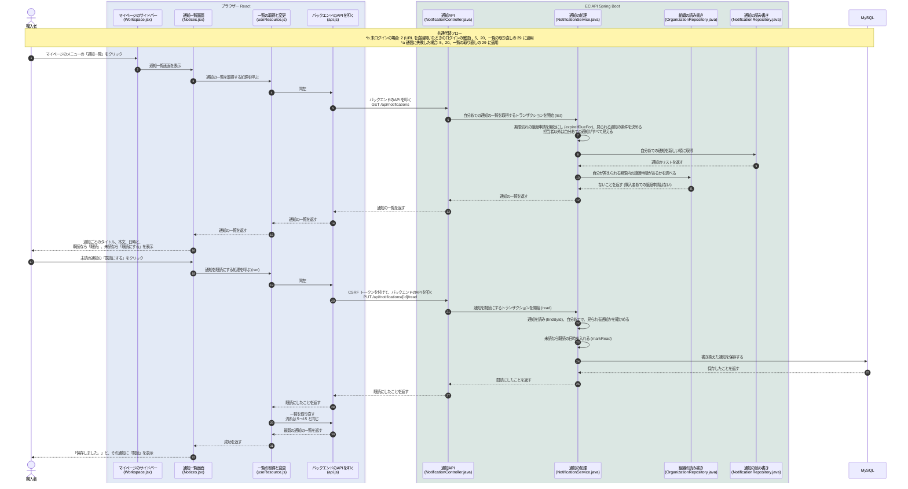

# EC-B15 利用者通知を確認する

```mermaid
sequenceDiagram
    autonumber
    actor User as 購入者
    box rgba(47,111,219,0.10) ブラウザー React
        participant Work as マイページのサイドバー<br/>(Workspace.jsx)
        participant Page as 通知一覧画面<br/>(Notices.jsx)
        participant Hook as 一覧の取得と変更<br/>(useResource.js)
        participant Http as バックエンドのAPIを叩く<br/>(api.js)
    end
    box rgba(27,127,92,0.12) EC API Spring Boot
        participant Ctrl as 通知API<br/>(NotificationController.java)
        participant Svc as 通知の処理<br/>(NotificationService.java)
        participant Org as 組織の読み書き<br/>(OrganizationRepository.java)
        participant Repo as 通知の読み書き<br/>(NotificationRepository.java)
    end
    participant Db as MySQL

    Note over User,Db: 共通代替フロー<br/>*b 未ログインの場合: 2 (URL を直接開いたときのログインの確認)、5、20、一覧の取り直しの 29 に適用<br/>*a 通信に失敗した場合: 5、20、一覧の取り直しの 29 に適用

    User->>Work: マイページのメニューの「通知一覧」をクリック
    Work->>Page: 通知一覧画面を表示
    Page->>Hook: 通知の一覧を取得する処理を呼ぶ
    Hook->>Http: 同左
    Http->>Ctrl: バックエンドのAPIを叩く<br/>GET /api/notifications
    Ctrl->>Svc: 自分あての通知の一覧を取得するトランザクションを開始 (list)
    Svc->>Svc: 期限切れの譲渡申請を無効にし (expireIfDueFor)、見られる通知の条件を決める<br/>担当者以外は自分あての通知がすべて見える
    Svc->>Repo: 自分あての通知を新しい順に取得
    Repo-->>Svc: 通知のリストを返す
    Svc->>Org: 自分が答えられる期限内の譲渡申請があるかを調べる
    Org-->>Svc: ないことを返す (購入者あての譲渡申請はない)
    Svc-->>Ctrl: 通知の一覧を返す
    Ctrl-->>Http: 通知の一覧を返す
    Http-->>Hook: 通知の一覧を返す
    Hook-->>Page: 通知の一覧を返す
    Page-->>User: 通知ごとのタイトル、本文、日時と、<br/>既読なら「既読」、未読なら「既読にする」を表示

    User->>Page: 未読の通知の「既読にする」をクリック
    Page->>Hook: 通知を既読にする処理を呼ぶ (run)
    Hook->>Http: 同左
    Http->>Ctrl: CSRF トークンを付けて、バックエンドのAPIを叩く<br/>PUT /api/notifications/{id}/read
    Ctrl->>Svc: 通知を既読にするトランザクションを開始 (read)
    Svc->>Svc: 通知を読み (findById)、自分あてで、見られる通知かを確かめる
    Svc->>Svc: 未読なら既読の日時を入れる (markRead)
    Svc->>Db: 書き換えた通知を保存する
    Db-->>Svc: 保存したことを返す
    Svc-->>Ctrl: 既読にしたことを返す
    Ctrl-->>Http: 既読にしたことを返す
    Http-->>Hook: 既読にしたことを返す
    Hook->>Http: 一覧を取り直す<br/>流れは 5〜15 と同じ
    Http-->>Hook: 最新の通知の一覧を返す
    Hook-->>Page: 成功を返す
    Page-->>User: 「保存しました。」と、その通知に「既読」を表示
```

