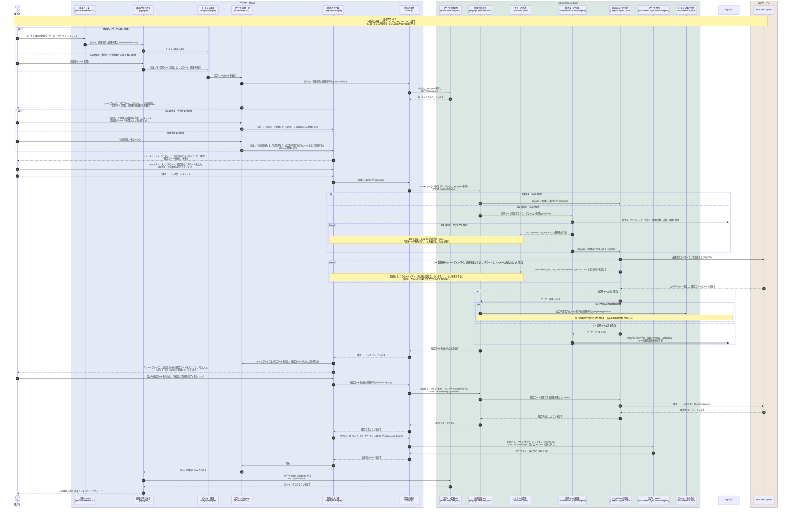

# EC-B16 一般アカウントを登録する

```mermaid
sequenceDiagram
    autonumber
    actor User as 購入者
    box rgba(47,111,219,0.10) ブラウザー React
        participant Header as 共通ヘッダー<br/>(KusakariHeader.jsx)
        participant App as 画面の切り替え<br/>(App.jsx)
        participant Login as ログイン画面<br/>(LoginPage.jsx)
        participant Panel as ログインのカード<br/>(AuthPanel.jsx)
        participant Form as 登録の入力欄<br/>(SignupForm.jsx)
        participant AuthJs as 認証の通信<br/>(auth.js)
    end
    box rgba(27,127,92,0.12) EC API Spring Boot
        participant AuthCtrl as ログイン状態API<br/>(AuthController.java)
        participant SignupCtrl as 新規登録API<br/>(SignupController.java)
        participant Errs as エラーの応答<br/>(ApiErrors.java)
        participant Inv as 招待キーの処理<br/>(StoreInvitationService.java)
        participant CogS as Cognito への登録<br/>(CognitoSignup.java)
        participant LoginCtrl as ログインAPI<br/>(PasswordLoginController.java)
        participant Auth as ログイン中の会員<br/>(AuthService.java)
    end
    participant Db as MySQL
    box rgba(180,120,20,0.12) 外部サービス
        participant Cog as Amazon Cognito
    end

    Note over User,Cog: 共通代替フロー<br/>*a 通信に失敗した場合: 8、19、38、46、51 に適用<br/>*b 未ログインの場合: ログインの前なので適用しない

    alt 共通ヘッダーから開く場合
        User->>Header: 「メイン」画面の共通ヘッダーの「ログイン」をクリック
        Header->>App: ログイン画面を開く処理を呼ぶ (openHeaderPanel)
        App->>Login: ログイン画面を表示
    else 3a 店舗から受け取った登録用の URL を開く場合
        User->>App: 登録用の URL を開く
        App->>Login: 見出しを「招待キーで登録」にしてログイン画面を表示
    end
    Login->>Panel: ログインのカードを表示
    Panel->>AuthJs: ログイン状態を読む処理を呼ぶ (readSession)
    AuthJs->>AuthCtrl: バックエンドのAPIを叩く<br/>GET /api/auth/me
    AuthCtrl-->>AuthJs: 未ログインであることを返す
    Panel-->>User: メールアドレス、パスワード、「ログイン」、「新規登録」、<br/>「招待キーで登録（店舗の担当者）」を表示

    alt 3a 招待キーで登録する場合
        User->>Panel: 「招待キーで登録（店舗の担当者）」をクリック<br/>(登録用の URL から開いたときは押さない)
        Panel->>Form: 見出し「招待キーで登録」と「招待キー」の欄のある入力欄を表示
    else 新規登録する場合
        User->>Panel: 「新規登録」をクリック
        Panel->>Form: 見出し「新規登録」と「企業様向け：出店を申請するアカウントとして登録する」<br/>のある入力欄を表示
    end
    Form-->>User: 「メールアドレス」「パスワード（8文字以上）」「パスワード（確認）」、<br/>「確認コードを送信」を表示

    User->>Form: メールアドレス、パスワード、確認用のパスワードを入力<br/>(招待キーや企業様向けのチェックも)
    User->>Form: 「確認コードを送信」をクリック
    Form->>AuthJs: 登録する処理を呼ぶ (signUp)
    AuthJs->>SignupCtrl: CSRF トークンを付けて、バックエンドのAPIを叩く<br/>POST /api/auth/signup
    alt 招待キーがない場合
        SignupCtrl->>CogS: Cognito に登録する処理を呼ぶ (signUp)
    else 3a 招待キーがある場合
        SignupCtrl->>Inv: 招待キーで登録するトランザクションを開始 (register)
        Inv->>Db: 招待キーの行をロックして読み、使用回数、店舗、組織を取得
        break 8b 招待キーが使えない場合
            Inv--xErrs: 400 INVITATION_INVALID の例外を投げる
            Note over Errs,Form: 400 を返し、Cognito には登録しない。<br/>「招待キーが無効です。…」を表示し、入力は残す。
        end
        Inv->>CogS: Cognito に登録する処理を呼ぶ (signUp)
    end
    CogS->>Cog: 未確認のユーザーとして登録する (SignUp)
    break 8a 登録済みのメールアドレスや、条件を満たさないパスワードで、Cognito が受け付けない場合
        CogS--xErrs: 409 EMAIL_IN_USE、400 PASSWORD_REJECTED などの例外を投げる
        Note over Errs,Form: 登録せず、「このメールアドレスは既に登録されています。…」などを表示する。<br/>招待キーがあるときはトランザクションを取り消す。
    end
    Cog-->>CogS: ユーザーの ID を返し、確認コードのメールを送る
    alt 招待キーがない場合
        CogS-->>SignupCtrl: ユーザーの ID を返す
        opt 6a 企業様向けの登録の場合
            SignupCtrl->>Auth: 出店申請用アカウントを作る処理を呼ぶ (registerApplicant)
            Note over SignupCtrl,Db: 同じ利用者の会員がいなければ、出店申請用の会員を保存する。
        end
    else 3a 招待キーがある場合
        CogS-->>Inv: ユーザーの ID を返す
        Inv->>Db: 店舗の担当者の会員、組織への所属、店舗の担当、<br/>キーの使用記録を保存する
    end
    SignupCtrl-->>AuthJs: 確認コードを送ったことを返す
    AuthJs-->>Form: 確認コードを送ったことを返す
    Form->>Panel: メールアドレスとパスワードを渡し、確認コードの入力に切り替える
    Form-->>User: 「{メールアドレス} に送信した6桁の確認コードを入力してください。」、<br/>「確認コード」「確認して登録を完了」を表示

    User->>Form: 届いた確認コードを入力し、「確認して登録を完了」をクリック
    Form->>AuthJs: 確認コードを送る処理を呼ぶ (confirmSignUp)
    AuthJs->>SignupCtrl: CSRF トークンを付けて、バックエンドのAPIを叩く<br/>POST /api/auth/signup/confirm
    SignupCtrl->>CogS: 確認コードを照合する処理を呼ぶ (confirm)
    CogS->>Cog: 確認コードを照合する (ConfirmSignUp)
    Cog-->>CogS: 確認済みにしたことを返す
    CogS-->>SignupCtrl: 確認済みにしたことを返す
    SignupCtrl-->>AuthJs: 確認できたことを返す
    AuthJs-->>Form: 確認できたことを返す
    Form->>AuthJs: 保持していたパスワードでログインする処理を呼ぶ (passwordLogin)
    AuthJs->>LoginCtrl: CSRF トークンを付けて、バックエンドのAPIを叩く<br/>POST /api/auth/login (流れは EC-B01 の図と同じ)
    LoginCtrl-->>AuthJs: ログインして、戻る先の URL を返す
    AuthJs-->>Form: 戻る先の URL を返す
    Form->>Panel: 同左
    Panel->>App: 戻る先の画面を読み込み直す
    App->>AuthCtrl: ログイン状態を読む処理を呼ぶ<br/>GET /api/auth/me
    AuthCtrl-->>App: ログイン中であることを返す
    App-->>User: 元の画面を表示 (共通ヘッダーに「アカウント」)
```

