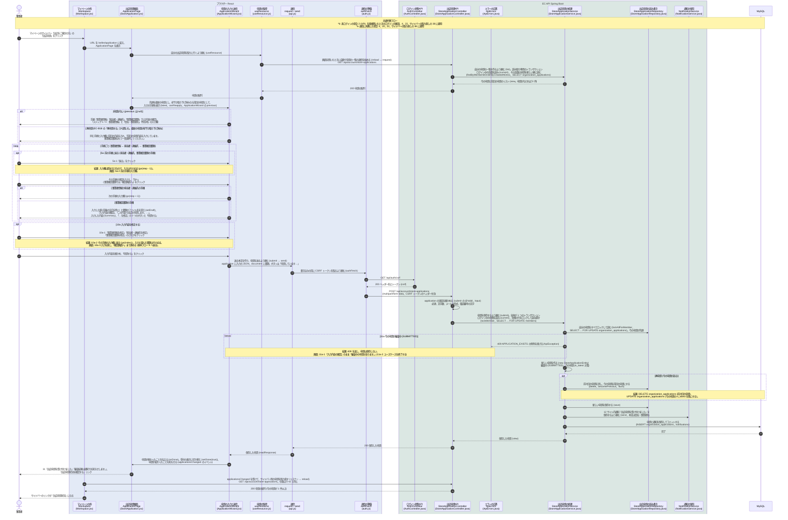

# EC-B17 出店の申請をする

```mermaid
sequenceDiagram
    autonumber
    actor User as 事業者
    box rgba(47,111,219,0.10) ブラウザー React
        participant Work as マイページの枠<br/>Workspace<br/>(Workspace.jsx)
        participant Page as 出店申請画面<br/>ApplicationPage<br/>(StoreApplication.jsx)
        participant Wiz as 申請の入力と送信<br/>ApplicationWizard<br/>(ApplicationWizard.jsx)
        participant Hook as 申請の取得<br/>useResource<br/>(useResource.js)
        participant Http as 通信<br/>request・send<br/>(api.js)
        participant AuthJs as 通信の準備<br/>authFetch<br/>(auth.js)
    end
    box rgba(27,127,92,0.12) EC API Spring Boot
        participant AuthCtrl as ログイン状態API<br/>AuthController<br/>(AuthController.java)
        participant Ctrl as 出店申請API<br/>StoreApplicationController<br/>(StoreApplicationController.java)
        participant Errs as エラーの応答<br/>ApiErrors<br/>(ApiErrors.java)
        participant Svc as 出店申請の処理<br/>StoreApplicationService<br/>(StoreApplicationService.java)
        participant Repo as 出店申請の読み書き<br/>StoreApplicationRepository<br/>(StoreApplicationRepository.java)
        participant Ntf as 通知の保存<br/>NotificationService<br/>(NotificationService.java)
    end
    participant Db as MySQL

    Note over User,Db: 共通代替フロー<br/>*b 未ログインの場合: 2 (URL を直接開いたときのログインの確認)、4、22、サイドバーの取り直しの 38 に適用<br/>*a 通信に失敗した場合: 4、20、22、サイドバーの取り直しの 38 に適用

    User->>Work: マイページのサイドバー「出店をご検討の方」の<br/>「出店申請」をクリック
    Work->>Page: URL を /seller/application に変え、<br/>ApplicationPage を表示
    Page->>Hook: 自分の出店申請を取りに行くよう頼む (useResource)
    Hook->>Ctrl: 画面を開いたときに自動で申請の一覧の通信を始める (reload → request)<br/>GET /api/account/store-applications
    Ctrl->>Svc: 自分の申請の一覧を作るよう頼む (list)。読み取り専用のトランザクション<br/>ログイン中の会員を読み (current)、その会員の申請を新しい順に読む<br/>(findByMemberIdOrderByCreatedAtDesc、SELECT organization_applications)
    Svc-->>Ctrl: 今の申請と前回の申請のリスト (view。申請がなければ 0 件)
    Ctrl-->>Hook: 200 申請の配列
    Hook-->>Page: 申請の配列
    Page->>Wiz: 先頭を最新の申請とし、却下か取り下げ済みなら前回の申請として、<br/>入力の手順を表示 (latest、canReapply、ApplicationWizard の previous)
    alt 申請がない (previous は null)
        Wiz-->>User: 手順「事業者情報」「担当者・連絡先」「事業確認書類」「入力内容の確認」、<br/>「ステップ 1 / 4：事業者情報」と「会社・事業者名」「所在地」の入力欄
    else 再申請 (EC-B18 の「再申請する」から開いた。最新の申請が却下か取り下げ済み)
        Wiz-->>User: 同じ手順と入力欄に前回の内容を入れ、「前回の申請内容を入力しています。<br/>事業確認書類はもう一度選択してください。」
    end

    loop 手順ごと (事業者情報 → 担当者・連絡先 → 事業確認書類)
        opt 5a 前の手順に戻る (担当者・連絡先、事業確認書類の手順)
            User->>Wiz: 5a-1「戻る」をクリック
            Note over User,Wiz: 結果: 入力欄は隠すだけなので、入力はそのまま (go(step - 1))。<br/>画面: 5a-2 前の手順の入力欄。
        end
        User->>Wiz: その手順の項目を入力し、「次へ」<br/>(事業確認書類では「確認画面へ」) をクリック
        alt 事業者情報か担当者・連絡先の手順
            Wiz-->>User: 次の手順の入力欄 (go(step + 1))
        else 事業確認書類の手順
            Wiz-->>User: 入力した値 (前後の空白を除く) と書類のファイル名を覚え (setDraft)、<br/>「入力内容の確認」、「この内容で出店を申請します。…」、<br/>入力した内容 (Summary)、「…を修正」の 3 つのボタンと「申請する」
        end
    end
    opt 10a 入力内容を修正する
        User->>Wiz: 10a-1「事業者情報を修正」「担当者・連絡先を修正」<br/>「事業確認書類を修正」のどれかをクリック
        Note over User,Wiz: 結果: 10a-2 その手順の入力欄に戻る (go(index))。入力と選んだ書類はそのまま。<br/>画面: 10a-3 入力を直し、「確認画面へ」まで進める (基本フロー 9 へ戻る)。
    end

    User->>Wiz: 入力内容を確かめ、「申請する」をクリック
    Wiz->>Http: 送る本文を作り、申請を送るよう頼む (submit → send)<br/>application に入力の JSON、document に書類。ボタンは「申請しています…」
    Http->>AuthJs: 書き込みの前に CSRF トークンを取るよう頼む (authFetch)
    AuthJs->>AuthCtrl: GET /api/auth/csrf
    AuthCtrl-->>AuthJs: 200 ヘッダー名とトークン (csrf)
    AuthJs->>Ctrl: POST /api/account/store-applications<br/>(multipart/form-data、CSRF トークンのヘッダー付き)
    Ctrl->>Ctrl: application の項目を確かめる (submit の @Valid、Input)<br/>必須、文字数、メールの形式、電話番号の文字
    Ctrl->>Svc: 申請を保存するよう頼む (submit)。全体が 1 つのトランザクション<br/>ログイン中の会員を読み (current)、会員の行をロックして読み直す<br/>(lockMember、SELECT ... FOR UPDATE members)
    Svc->>Repo: 自分の申請をすべてロックして読む (lockAllForMember、<br/>SELECT ... FOR UPDATE organization_applications)。今の申請が先頭
    break 11a 今の申請が審査中 (SUBMITTED)
        Svc--xErrs: 409 APPLICATION_EXISTS の例外を投げる (ApiException)
        Note over Errs,Wiz: 結果: 409 を返し、申請は保存しない。<br/>画面: 11a-1「入力内容の確認」のまま「審査中の申請があります。」(11a-2 ユースケースを終了する)
    end
    Svc->>Svc: 新しい申請を作る (new StoreApplicationEntity)<br/>審査中 (SUBMITTED)、今の申請 (is_latest が真)
    opt 再申請 (今の申請がある)
        Svc->>Repo: 前々回の申請を消し、今の申請を前回の申請にする<br/>(delete、becomePrevious、flush)
        Note over Svc,Db: 結果: DELETE organization_applications (前々回の申請)、<br/>UPDATE organization_applications (今の申請の is_latest を偽にする)。
    end
    Svc->>Repo: 新しい申請を保存する (save)
    Svc->>Ntf: 12 サイト内通知「出店申請を受け付けました」を<br/>保存するよう頼む (send、本文は会社・事業者名)
    Svc->>Db: 申請と通知を保存してコミットする<br/>(INSERT organization_applications、notifications)
    Db-->>Svc: 完了
    Svc-->>Ctrl: 保存した申請 (view)
    Ctrl-->>Http: 200 保存した申請
    Http-->>Wiz: 保存した申請 (readResponse)
    Wiz->>Page: 申請が終わったことを伝える (onDone)。受付の表示に切り替え (setDone(true))、<br/>申請が変わったことを知らせる (applicationsChanged のイベント)
    Page-->>User: 11「出店申請を受け付けました」「審査結果は通知でお知らせします。」、<br/>「出店申請状況を確認する」リンク
    Work->>Ctrl: applicationsChanged を受けて、サイドバー用の申請を取り直す (リスナー → reload)<br/>GET /api/account/store-applications。中身は 5〜6 と同じ
    Ctrl-->>Work: 200 申請の配列 (今の申請が 1 件以上)
    Work-->>User: サイドバーのリンクが「出店申請状況」になる
```

