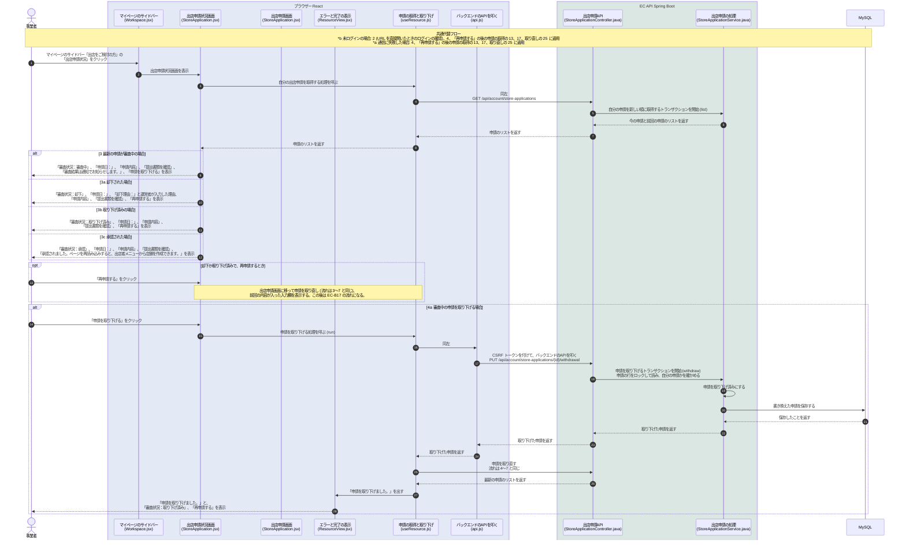

# EC-B18 出店申請状況を確認する

```mermaid
sequenceDiagram
    autonumber
    actor User as 事業者
    box rgba(47,111,219,0.10) ブラウザー React
        participant Work as マイページのサイドバー<br/>(Workspace.jsx)
        participant Page as 出店申請状況画面<br/>(StoreApplication.jsx)
        participant Form as 出店申請画面<br/>(StoreApplication.jsx)
        participant Status as エラーと完了の表示<br/>(ResourceView.jsx)
        participant Hook as 申請の取得と取り下げ<br/>(useResource.js)
        participant Http as バックエンドのAPIを叩く<br/>(api.js)
    end
    box rgba(27,127,92,0.12) EC API Spring Boot
        participant Ctrl as 出店申請API<br/>(StoreApplicationController.java)
        participant Svc as 出店申請の処理<br/>(StoreApplicationService.java)
    end
    participant Db as MySQL

    Note over User,Db: 共通代替フロー<br/>*b 未ログインの場合: 2 (URL を直接開いたときのログインの確認)、4、「再申請する」の後の申請の取得の 13、17、取り直しの 25 に適用<br/>*a 通信に失敗した場合: 4、「再申請する」の後の申請の取得の 13、17、取り直しの 25 に適用

    User->>Work: マイページのサイドバー「出店をご検討の方」の<br/>「出店申請状況」をクリック
    Work->>Page: 出店申請状況画面を表示
    Page->>Hook: 自分の出店申請を取得する処理を呼ぶ
    Hook->>Ctrl: 同左<br/>GET /api/account/store-applications
    Ctrl->>Svc: 自分の申請を新しい順に取得するトランザクションを開始 (list)
    Svc-->>Ctrl: 今の申請と前回の申請のリストを返す
    Ctrl-->>Hook: 申請のリストを返す
    Hook-->>Page: 申請のリストを返す
    alt 3 最新の申請が審査中の場合
        Page-->>User: 「審査状況：審査中」、「申請日：」、「申請内容」、「提出書類を確認」、<br/>「審査結果は通知でお知らせします。」、「申請を取り下げる」を表示
    else 3a 却下された場合
        Page-->>User: 「審査状況：却下」、「申請日：」、「却下理由：」と運営者が入力した理由、<br/>「申請内容」、「提出書類を確認」、「再申請する」を表示
    else 3b 取り下げ済みの場合
        Page-->>User: 「審査状況：取り下げ済み」、「申請日：」、「申請内容」、<br/>「提出書類を確認」、「再申請する」を表示
    else 3c 承認された場合
        Page-->>User: 「審査状況：承認」、「申請日：」、「申請内容」、「提出書類を確認」、<br/>「承認されました。ページを再読み込みすると、出店者メニューから店舗を作成できます。」を表示
    end

    opt 却下か取り下げ済みで、再申請するとき
        User->>Page: 「再申請する」をクリック
        Note over Page,Hook: 出店申請画面に移って申請を取り直し (流れは 3〜7 と同じ)、<br/>前回の内容が入った入力欄を表示する。この後は EC-B17 の流れになる。
    end

    alt 4a 審査中の申請を取り下げる場合
        User->>Page: 「申請を取り下げる」をクリック
        Page->>Hook: 申請を取り下げる処理を呼ぶ (run)
        Hook->>Http: 同左
        Http->>Ctrl: CSRF トークンを付けて、バックエンドのAPIを叩く<br/>PUT /api/account/store-applications/{id}/withdrawal
        Ctrl->>Svc: 申請を取り下げるトランザクションを開始 (withdraw)<br/>申請の行をロックして読み、自分の申請かを確かめる
        Svc->>Svc: 申請を取り下げ済みにする
        Svc->>Db: 書き換えた申請を保存する
        Db-->>Svc: 保存したことを返す
        Svc-->>Ctrl: 取り下げた申請を返す
        Ctrl-->>Http: 取り下げた申請を返す
        Http-->>Hook: 取り下げた申請を返す
        Hook->>Ctrl: 申請を取り直す<br/>流れは 4〜7 と同じ
        Ctrl-->>Hook: 最新の申請のリストを返す
        Hook->>Status: 「申請を取り下げました。」を出す
        Status-->>User: 「申請を取り下げました。」と、<br/>「審査状況：取り下げ済み」、「再申請する」を表示
    end
```

