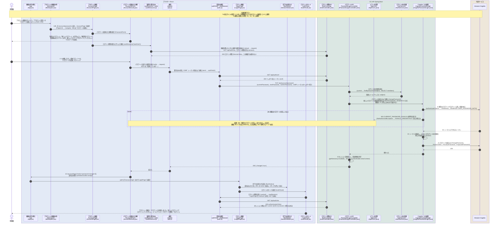

# EC-B19 パスワードを変更する

```mermaid
sequenceDiagram
    autonumber
    actor User as 利用者
    box rgba(47,111,219,0.10) ブラウザー React
        participant App as 画面の切り替え<br/>App<br/>(App.jsx)
        participant Work as アカウントの画面の枠<br/>Workspace<br/>(Workspace.jsx)
        participant Acct as アカウント画面<br/>AccountPage<br/>(AccountPage.jsx)
        participant Form as パスワード変更の入力欄<br/>PasswordForm<br/>(AccountSecurity.jsx)
        participant Hook as 取得と書き込み<br/>useResource・write<br/>(useResource.js)
        participant Http as 通信<br/>request<br/>(api.js)
        participant AuthJs as 認証の通信<br/>authFetch・readSession<br/>(auth.js)
        participant Login as ログイン画面<br/>LoginPage<br/>(LoginPage.jsx)
        participant Flash as 完了のお知らせ<br/>flashNotice<br/>(SessionNotice.jsx)
        participant Panel as ログインのカード<br/>AuthPanel<br/>(AuthPanel.jsx)
    end
    box rgba(27,127,92,0.12) EC API Spring Boot
        participant AuthCtrl as ログイン状態API<br/>AuthController<br/>(AuthController.java)
        participant PwCtrl as パスワードAPI<br/>PasswordLoginController<br/>(PasswordLoginController.java)
        participant Errs as エラーの応答<br/>ApiErrors<br/>(ApiErrors.java)
        participant Auth as ログイン中の会員<br/>AuthService<br/>(AuthService.java)
        participant CogP as Cognito との通信<br/>CognitoPasswordLogin<br/>(CognitoPasswordLogin.java)
    end
    box rgba(180,120,20,0.12) 外部サービス
        participant Cog as Amazon Cognito
    end

    Note over User,Cog: 共通代替フロー<br/>*b 未ログインの場合: 2 (URL を直接開いたときのログインの確認) と 12 に適用<br/>*a 通信に失敗した場合: 11、12、32 に適用

    User->>Work: アカウント画面のサイドバー「アカウント設定」の<br/>「パスワード変更」をクリック (EC-C01)
    Work->>Acct: URL を /account/password に変え、AccountPage を表示<br/>(PageLink → navigate、tab は「パスワード変更」)
    Acct->>Form: パスワード変更の入力欄を表示 (PasswordForm)
    Form-->>User: 「現在のパスワード」「新しいパスワード（8文字以上）」「確認用パスワード」、<br/>「変更後はログアウトします。新しいパスワードでログインしてください。」、<br/>「パスワードを変更」
    Acct->>Hook: ログイン状態を取りに行くよう頼む (useResource('/auth/me'))
    Hook->>AuthCtrl: 画面を開いたときに自動で通信を始める (reload → request)<br/>GET /api/auth/me。ログイン状態を作る (session)
    AuthCtrl-->>Hook: 200 ログイン状態 (SessionView。この画面では使わない)

    User->>Form: 3 つの欄に入力し (基本フロー 3〜5)、<br/>「パスワードを変更」をクリック
    Form->>Http: パスワードを変える通信を送る (write → request)<br/>ボタンは「変更しています…」
    Http->>AuthJs: 書き込みの前に CSRF トークンを取るよう頼む (send → authFetch)
    AuthJs->>AuthCtrl: GET /api/auth/csrf
    AuthCtrl-->>AuthJs: 200 ヘッダー名とトークン (csrf)
    AuthJs->>PwCtrl: PUT /api/account/password<br/>(currentPassword、newPassword、confirmPassword、CSRF トークンのヘッダー付き)
    PwCtrl->>Auth: ログイン中の会員を読む<br/>(current → findByIssuerAndSubject、SELECT members)
    Auth-->>PwCtrl: 会員 (メールアドレスと subject)
    PwCtrl->>CogP: パスワードを変えるよう頼む (changePassword)<br/>新しいパスワードと確認用が違えば 400 PASSWORD_MISMATCH だが、<br/>画面の 7a が先に止めるので届かない
    CogP->>Cog: 8 現在のパスワードでログインし直して確かめる<br/>(authenticateTokens → initiateAuth、InitiateAuth USER_PASSWORD_AUTH)
    break 8a 現在のパスワードが正しくない
        CogP--xErrs: 400 CURRENT_PASSWORD_INVALID の例外を投げる<br/>(NotAuthorizedException → INVALID_CREDENTIALS を言い換える)
        Note over Errs,Form: 結果: 400「現在のパスワードが正しくありません。」を返す。<br/>画面: 8a-1 その文 (setError)。入力は残る。8a-2 基本フロー 3 へ戻る
    end
    Cog-->>CogP: ID トークンとアクセストークン
    CogP->>CogP: ID トークンを検証し、subject がログイン中の会員と<br/>同じかを確かめる (toUser)
    CogP->>Cog: 9 パスワードを変える (ChangePassword、<br/>AccessToken・PreviousPassword・ProposedPassword)
    Cog-->>CogP: 200
    CogP-->>PwCtrl: 終わった
    PwCtrl->>PwCtrl: 9 セッションを無効にし、認証情報を消す<br/>(getSession().invalidate、SecurityContextHolder.clearContext)
    PwCtrl-->>Http: 200 { changed: true }
    Http-->>Form: 変えた
    Form->>App: 10 /account/login?notice=password-changed を<br/>読み込み直す (window.location.assign)
    App->>Login: path が /account/login なので LoginPage を表示
    Login->>Flash: 完了のお知らせを読む (flashNotice)<br/>読み込んだときに URL の notice を読み、URL から外してある
    Login->>Panel: ログインのカードを表示 (AuthPanel)
    Panel->>AuthJs: ログイン状態を読む (useAuth → readSession)<br/>LoginPage の useAuth も同じ GET を送る
    AuthJs->>AuthCtrl: GET /api/auth/me
    AuthCtrl-->>AuthJs: 200 authenticated=false<br/>(セッションが無いので current の 401 を session が受け止める)
    Panel-->>User: 「ログイン」画面と「パスワードを変更しました。新しいパスワードで<br/>ログインしてください。」、メールアドレス・パスワードの欄と「ログイン」
```

