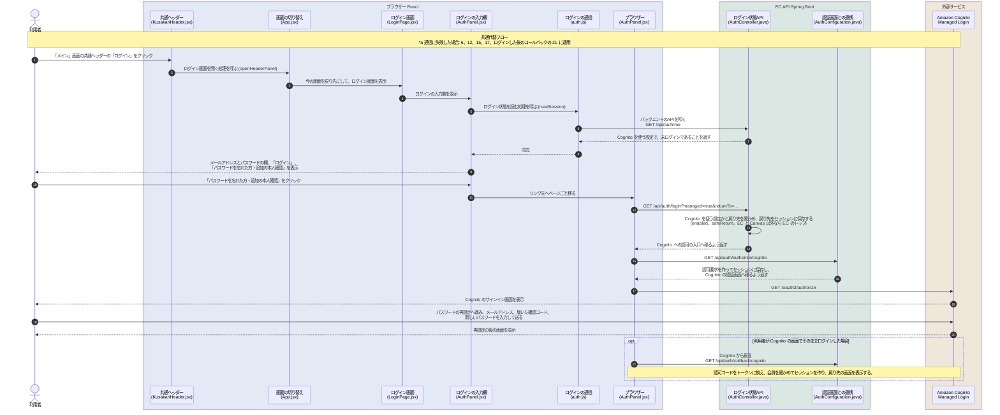

# EC-B20 パスワードを再設定する

```mermaid
sequenceDiagram
    autonumber
    actor User as 利用者
    box rgba(47,111,219,0.10) ブラウザー React
        participant Header as 共通ヘッダー<br/>(KusakariHeader.jsx)
        participant App as 画面の切り替え<br/>(App.jsx)
        participant Login as ログイン画面<br/>(LoginPage.jsx)
        participant Panel as ログインの入力欄<br/>(AuthPanel.jsx)
        participant AuthJs as ログインの通信<br/>(auth.js)
        participant Browser as ブラウザー<br/>(AuthPanel.jsx)
    end
    box rgba(27,127,92,0.12) EC API Spring Boot
        participant AuthCtrl as ログイン状態API<br/>(AuthController.java)
        participant Sec as 認証画面との連携<br/>(AuthConfiguration.java)
    end
    box rgba(180,120,20,0.12) 外部サービス
        participant Cog as Amazon Cognito<br/>Managed Login
    end

    Note over User,Cog: 共通代替フロー<br/>*a 通信に失敗した場合: 6、12、15、17、ログインした後のコールバックの 21 に適用

    User->>Header: 「メイン」画面の共通ヘッダーの「ログイン」をクリック
    Header->>App: ログイン画面を開く処理を呼ぶ (openHeaderPanel)
    App->>Login: 今の画面を戻り先にして、ログイン画面を表示
    Login->>Panel: ログインの入力欄を表示
    Panel->>AuthJs: ログイン状態を読む処理を呼ぶ (readSession)
    AuthJs->>AuthCtrl: バックエンドのAPIを叩く<br/>GET /api/auth/me
    AuthCtrl-->>AuthJs: Cognito を使う設定で、未ログインであることを返す
    AuthJs-->>Panel: 同左
    Panel-->>User: メールアドレスとパスワードの欄、「ログイン」、<br/>「パスワードを忘れた方・追加の本人確認」を表示

    User->>Panel: 「パスワードを忘れた方・追加の本人確認」をクリック
    Panel->>Browser: リンク先へページごと移る
    Browser->>AuthCtrl: GET /api/auth/login?managed=true&returnTo=…
    AuthCtrl->>AuthCtrl: Cognito を使う設定かと戻り先を確かめ、戻り先をセッションに保存する<br/>(enabled、safeReturn。EC と Canvas 以外なら EC のトップ)
    AuthCtrl-->>Browser: Cognito への認可の入口へ移るよう返す
    Browser->>Sec: GET /api/auth/authorize/cognito
    Sec-->>Browser: 認可要求を作ってセッションに保存し、<br/>Cognito の認証画面へ移るよう返す
    Browser->>Cog: GET /oauth2/authorize
    Cog-->>User: Cognito のサインイン画面を表示
    User->>Cog: パスワードの再設定へ進み、メールアドレス、届いた確認コード、<br/>新しいパスワードを入力して送る
    Cog-->>User: 再設定の後の画面を表示

    opt 利用者が Cognito の画面でそのままログインした場合
        Browser->>Sec: Cognito から戻る<br/>GET /api/auth/callback/cognito
        Note over Browser,Cog: 認可コードをトークンに換え、会員を確かめてセッションを作り、戻り先の画面を表示する。
    end
```

