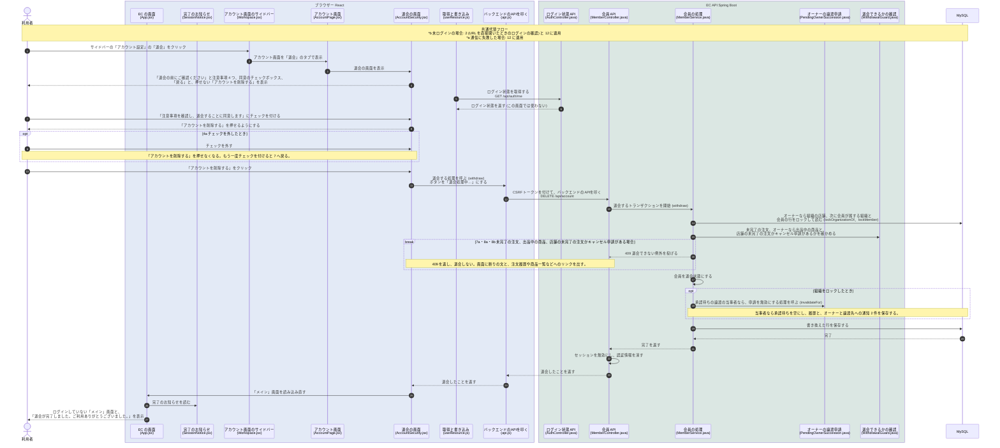

# EC-B21 アカウントを退会する

```mermaid
sequenceDiagram
    autonumber
    actor User as 利用者
    box rgba(47,111,219,0.10) ブラウザー React
        participant App as EC の画面<br/>(App.jsx)
        participant Flash as 完了のお知らせ<br/>(SessionNotice.jsx)
        participant Work as アカウント画面のサイドバー<br/>(Workspace.jsx)
        participant Acct as アカウント画面<br/>(AccountPage.jsx)
        participant Form as 退会の画面<br/>(AccountSecurity.jsx)
        participant Hook as 取得と書き込み<br/>(useResource.js)
        participant Http as バックエンドのAPIを叩く<br/>(api.js)
    end
    box rgba(27,127,92,0.12) EC API Spring Boot
        participant AuthCtrl as ログイン状態API<br/>(AuthController.java)
        participant Ctrl as 会員API<br/>(MemberController.java)
        participant Svc as 会員の処理<br/>(MemberService.java)
        participant Pend as オーナーの譲渡申請<br/>(PendingOwnerSuccession.java)
        participant Guard as 退会できるかの確認<br/>(WithdrawalGuard.java)
    end
    participant Db as MySQL

    Note over User,Db: 共通代替フロー<br/>*b 未ログインの場合: 2 (URL を直接開いたときのログインの確認) と 12 に適用<br/>*a 通信に失敗した場合: 12 に適用

    User->>Work: サイドバーの「アカウント設定」の「退会」をクリック
    Work->>Acct: アカウント画面を「退会」のタブで表示
    Acct->>Form: 退会の画面を表示
    Form-->>User: 「退会の前にご確認ください」と注意事項 4 つ、同意のチェックボックス、<br/>「戻る」と、押せない「アカウントを削除する」を表示
    Hook->>AuthCtrl: ログイン状態を取得する<br/>GET /api/auth/me
    AuthCtrl-->>Hook: ログイン状態を返す (この画面では使わない)

    User->>Form: 「注意事項を確認し、退会することに同意します」にチェックを付ける
    Form-->>User: 「アカウントを削除する」を押せるようにする
    opt 4a チェックを外したとき
        User->>Form: チェックを外す
        Note over User,Form: 「アカウントを削除する」を押せなくなる。もう一度チェックを付けると 7 へ戻る。
    end
    User->>Form: 「アカウントを削除する」をクリック
    Form->>Http: 退会する処理を呼ぶ (withdraw)<br/>ボタンを「退会処理中…」にする
    Http->>Ctrl: CSRF トークンを付けて、バックエンドのAPIを叩く<br/>DELETE /api/account
    Ctrl->>Svc: 退会するトランザクションを開始 (withdraw)
    Svc->>Db: オーナーなら組織の店舗、次に会員が属する組織と<br/>会員の行をロックして読む (lockOrganizationOf、lockMember)
    Svc->>Guard: 未完了の注文、オーナーなら出品中の商品と、<br/>店舗の未完了の注文かキャンセル申請があるかを確かめる
    break 7a・8a・8b 未完了の注文、出品中の商品、店舗の未完了の注文かキャンセル申請がある場合
        Svc--xCtrl: 409 退会できない例外を投げる
        Note over Ctrl,Form: 409 を返し、退会しない。画面に断りの文と、注文履歴や商品一覧などへのリンクを出す。
    end
    Svc->>Svc: 会員を退会状態にする
    opt 組織をロックしたとき
        Svc->>Pend: 承認待ちの譲渡の当事者なら、申請を無効にする処理を呼ぶ (invalidateFor)
        Note over Svc,Db: 当事者なら承認待ちを空にし、履歴と、オーナーと譲渡先への通知 2 件を保存する。
    end
    Svc->>Db: 書き換えた行を保存する
    Db-->>Svc: 完了
    Svc-->>Ctrl: 完了を返す
    Ctrl->>Ctrl: セッションを無効にし、認証情報を消す
    Ctrl-->>Http: 退会したことを返す
    Http-->>Form: 退会したことを返す
    Form->>App: 「メイン」画面を読み込み直す
    App->>Flash: 完了のお知らせを読む
    App-->>User: ログインしていない「メイン」画面と、<br/>「退会が完了しました。ご利用ありがとうございました。」を表示
```

