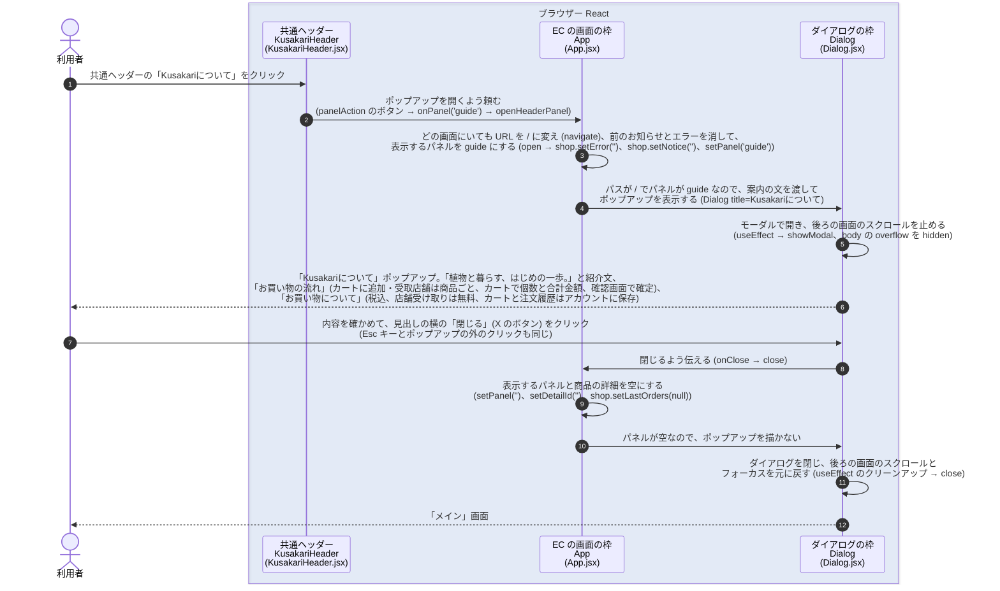

# EC-B23 利用ガイド・利用方法を確認する

```mermaid
sequenceDiagram
    autonumber
    actor User as 利用者
    box rgba(47,111,219,0.10) ブラウザー React
        participant Header as 共通ヘッダー<br/>KusakariHeader<br/>(KusakariHeader.jsx)
        participant App as EC の画面の枠<br/>App<br/>(App.jsx)
        participant Dlg as ダイアログの枠<br/>Dialog<br/>(Dialog.jsx)
    end

    User->>Header: 共通ヘッダーの「Kusakariについて」をクリック
    Header->>App: ポップアップを開くよう頼む<br/>(panelAction のボタン → onPanel('guide') → openHeaderPanel)
    App->>App: どの画面にいても URL を / に変え (navigate)、前のお知らせとエラーを消して、<br/>表示するパネルを guide にする (open → shop.setError('')、shop.setNotice('')、setPanel('guide'))
    App->>Dlg: パスが / でパネルが guide なので、案内の文を渡して<br/>ポップアップを表示する (Dialog title=Kusakariについて)
    Dlg->>Dlg: モーダルで開き、後ろの画面のスクロールを止める<br/>(useEffect → showModal、body の overflow を hidden)
    Dlg-->>User: 「Kusakariについて」ポップアップ。「植物と暮らす、はじめの一歩。」と紹介文、<br/>「お買い物の流れ」(カートに追加・受取店舗は商品ごと、カートで個数と合計金額、確認画面で確定)、<br/>「お買い物について」(税込、店舗受け取りは無料、カートと注文履歴はアカウントに保存)

    User->>Dlg: 内容を確かめて、見出しの横の「閉じる」(X のボタン) をクリック<br/>(Esc キーとポップアップの外のクリックも同じ)
    Dlg->>App: 閉じるよう伝える (onClose → close)
    App->>App: 表示するパネルと商品の詳細を空にする<br/>(setPanel('')、setDetailId('')、shop.setLastOrders(null))
    App->>Dlg: パネルが空なので、ポップアップを描かない
    Dlg->>Dlg: ダイアログを閉じ、後ろの画面のスクロールと<br/>フォーカスを元に戻す (useEffect のクリーンアップ → close)
    Dlg-->>User: 「メイン」画面
```

