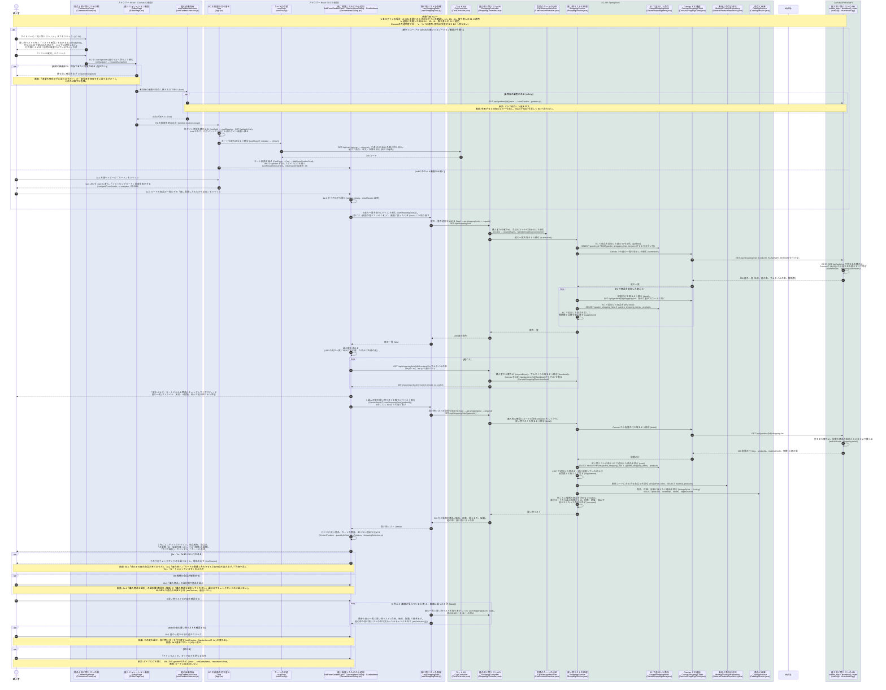

# EC-B24 買い物リストを確認する(EC)

```mermaid
sequenceDiagram
    autonumber
    actor User as 購入者
    box rgba(47,111,219,0.10) ブラウザー React（Canvas の画面）
        participant Panel as 商品と買い物リストの欄<br/>CommercePanel<br/>(CommercePanel.jsx)
        participant Editor as 庭シミュレーション画面<br/>EditorPage<br/>(EditorPage.jsx)
        participant Save as 庭の自動保存<br/>useGardenAutosave<br/>(useGardenAutosave.js)
    end
    box rgba(47,111,219,0.10) ブラウザー React（EC の画面）
        participant App as EC の画面の切り替え<br/>App<br/>(App.jsx)
        participant Shop as カートの状態<br/>useShop<br/>(useShop.js)
        participant Dlg as 庭に設置したものから追加<br/>AddFromGardenCard・GardenItemsDialog・GardenItems<br/>(GardenItemsDialog.jsx)
        participant Data as 買い物リストの取得<br/>useShoppingData<br/>(useShoppingData.js)
    end
    box rgba(27,127,92,0.12) EC API Spring Boot
        participant CartCtrl as カートAPI<br/>CartController<br/>(CartController.java)
        participant Ctrl as 庭の買い物リストAPI<br/>ShoppingController<br/>(ShoppingController.java)
        participant Res as 会員のカートの決定<br/>CartSessionResolver<br/>(CartSessionResolver.java)
        participant Svc as 買い物リストの処理<br/>ShoppingService<br/>(ShoppingService.java)
        participant Saved as EC で追加した商品<br/>SavedShoppingItems<br/>(SavedShoppingItems.java)
        participant Client as Canvas との通信<br/>CanvasShoppingClient<br/>(CanvasShoppingClient.java)
        participant Mat as 素材と商品の対応<br/>MaterialProductRepository<br/>(MaterialProductRepository.java)
        participant Cat as 商品と在庫<br/>CatalogService<br/>(CatalogService.java)
    end
    participant Db as MySQL
    box rgba(27,127,92,0.12) Canvas API FastAPI
        participant CApi as 庭と買い物リストのAPI<br/>create_app・thumbnail_router<br/>(main.py、thumbnails.py)
    end

    Note over User,CApi: 共通代替フロー<br/>*b 未ログインの場合: 10 (URL を開いたときのログインの確認)、12、20、41、取り直しの 61 に適用<br/>*a 通信に失敗した場合: 12、20、41、取り直しの 61 に適用<br/>Canvas の共通代替フロー *a・*b: 7 に適用 (保存に失敗すると EC へ移らない)

    alt 基本フロー 1〜3 Canvas の庭シミュレーション画面から開く
        User->>Panel: サイドバーの「買い物リスト（n）」タブをクリック (UC-09)
        Panel-->>User: 買い物リストの行と「リストを確認」を表示する (setTab('list'))。<br/>行は UC-09 で読み込み済みで、ここでは通信しない。<br/>行が無いときは「植物が設置されていません」だけ
        User->>Panel: 「リストを確認」をクリック
        Panel->>Editor: EC の /cart?garden={庭の ID} へ移るよう頼む<br/>(onNavigate → requestNavigation)
        opt 輪郭の描画中か、保存できない写真がある (記述なし)
            Editor-->>User: 移る前に確認を出す (requestNavigation)
            Note over User,Editor: 画面: 「変更を保存せずに戻りますか？」か「庭写真を保存せずに戻りますか？」。<br/>この先は図では省略。
        end
        Editor->>Save: 未保存の編集を保存し終えるまで待つ (flush)
        opt 未保存の編集がある (isDirty)
            Save->>CApi: PUT /api/gardens/{id} (save → saveGarden、gardens.js)
            Note over Save,CApi: 結果: 200 で保存した庭を返す。<br/>画面: 失敗すると保存のエラーを出し、flush が false を返して EC へ移らない。
        end
        Save-->>Editor: 保存が済んだ (true)
        Editor->>App: EC の画面を読み込む (window.location.assign)
        App->>App: ログイン状態を確かめる (useAuth → readSession、GET /api/auth/me)。<br/>/cart なので、ログインしていなければログイン画面へ移る
        App->>Shop: カートを読み込むよう頼む (useShop の initialize → refresh)
        Shop->>CartCtrl: GET /api/cart (api.cart → request)。中身は EC-B08 の図と同じ流れ。<br/>続けて商品・注文・店舗も読む (図では省略)
        CartCtrl-->>Shop: 200 カート
        App->>Dlg: カート画面を描き (CartPage → Cart → AddFromGardenCard)、<br/>URL の garden を読んでダイアログを開く<br/>(useRequestedGarden。initialGarden は庭の ID)
    else 1a EC のカート画面から開く
        User->>App: 1a-1 共通ヘッダーの「カート」をクリック
        App-->>User: 1a-2 URL を /cart に変え、「ショッピングカート」画面を表示する<br/>(navigateFromHeader → navigate。EC-B08)
        User->>Dlg: 1a-3 カートの商品の一覧の下の「庭に設置したものから追加」をクリック
        Dlg->>Dlg: 1a-4 ダイアログを開く (setOpen(true)。initialGarden は空)
    end

    Dlg->>Data: 4 庭の一覧を取りに行くよう頼む (useShoppingData(''))。<br/>3 秒ごと (画面が見えているとき) と、画面に戻ったとき (focus) にも取り直す
    Data->>Ctrl: 庭の一覧の通信を始める (load → api.shoppingLists → request)<br/>GET /api/shopping-lists
    Ctrl->>Res: 購入者かを確かめ、会員のカートを決めるよう頼む<br/>(resolve → requireBuyer、MemberCartService.resolve)
    Ctrl->>Svc: 庭の一覧を作るよう頼む (summaries)
    Svc->>Saved: EC で商品を追加した庭の ID を読む (gardens)<br/>SELECT garden_id FROM garden_shopping_lists (revision が 0 より大きい行)
    Svc->>Client: Canvas から庭の一覧を取るよう頼む (summaries)
    Client->>CApi: GET /api/shopping-lists (Cookie の KUSAKARI_SESSION を付ける)
    CApi->>CApi: EC の GET /api/auth/me で持ち主を確かめ、<br/>Canvas の MySQL から持ち主の庭をすべて読む<br/>(authenticate、shopping.summaries)
    CApi-->>Client: 200 庭の一覧 (名前、庭の版、サムネイルの版、種類数)
    Client-->>Svc: 庭の一覧
    loop EC で商品を追加した庭ごと
        Svc->>Client: 配置の行を取るよう頼む (detail)。<br/>GET /api/gardens/{id}/shopping-list。流れは基本フロー 5 と同じ
        Svc->>Saved: EC で追加した商品を読む (read)<br/>SELECT garden_shopping_lists と garden_shopping_items、products
        Svc->>Svc: EC で追加した商品を足して、<br/>種類数と点数を数え直す (supplement)
    end
    Svc-->>Ctrl: 庭の一覧
    Ctrl-->>Data: 200 庭の配列
    Data-->>Dlg: 庭の一覧 (lists)
    Dlg->>Dlg: 選ぶ庭を決める<br/>(URL の庭が一覧にあればその庭、なければ先頭の庭)
    loop 庭ごと
        Dlg->>Ctrl: GET /api/shopping-lists/{id}/thumbnail?v=サムネイルの版<br/>(img の src。api.js を通らない)
        Ctrl->>Svc: 購入者かを確かめ (requireBuyer)、サムネイルを取るよう頼む (thumbnail)。<br/>Canvas の GET /api/gardens/{id}/thumbnail から PNG を取る<br/>(CanvasShoppingClient.thumbnail)
        Ctrl-->>Dlg: 200 image/png (Cache-Control private, no-cache)
    end
    Dlg-->>User: 「庭をえらび、カートに入れる商品にチェックしてください。」と<br/>庭の一覧 (サムネイル、名前、n種類)。選んだ庭は押された状態

    Dlg->>Data: 5 選んだ庭の買い物リストを取りに行くよう頼む<br/>(GardenItems の useShoppingData(gardenId))。<br/>3 秒ごとと focus でも取り直す
    Data->>Ctrl: 買い物リストの通信を始める (load → api.shoppingList → request)<br/>GET /api/shopping-lists/{gardenId}
    Ctrl->>Svc: 購入者の確認とカートの決定 (resolve) をしてから、<br/>買い物リストを作るよう頼む (detail)
    Svc->>Client: Canvas から配置の行を取るよう頼む (detail)
    Client->>CApi: GET /api/gardens/{id}/shopping-list
    CApi->>CApi: 持ち主を確かめ、配置を商品か素材ごとにまとめて数える<br/>(authenticate、shopping.detail)
    CApi-->>Client: 200 配置の行 (key、productId、materialCode、個数) と庭の版
    Client-->>Svc: 配置の行
    Svc->>Saved: 買い物リストの版と EC で追加した商品を読む (read)<br/>SELECT revision FROM garden_shopping_lists と garden_shopping_items、products
    Svc->>Svc: 6 EC で追加した商品を、庭に配置していなければ<br/>必要数 1 の行として足す (supplement)
    Svc->>Mat: 素材コードに対応する商品 ID を読む (findAllForCodes、SELECT material_products)
    Svc->>Cat: 商品、在庫、店舗と買えない理由を読む (listingsByIds → Listing)<br/>SELECT products、inventory、stores、organizations
    Svc->>Svc: 行ごとに候補の商品を決める (resolve)。<br/>素材コードから選ぶ候補からは、削除・閉店・停止で<br/>買えなくなった商品を外す (removed)
    Svc-->>Ctrl: 買い物リスト
    Ctrl-->>Data: 200 行と候補の商品 (価格、在庫、買えるか、店舗)、<br/>庭の版、買い物リストの版
    Data-->>Dlg: 買い物リスト (detail)
    Dlg->>Dlg: 行ごとに買う商品、カートの数量、選べない理由を決める<br/>(chosenProduct、quantityInCart、lineReason。shoppingSelection.js)
    Dlg-->>User: 7 行ごとにチェックボックス、商品画像、商品名、<br/>「必要数 n点・店舗在庫 n点」、小計 (価格×必要数)、<br/>「すべて選択」「キャンセル」「カートに追加」
    opt 6a・7a・7b 選べない行がある
        Dlg-->>User: その行のチェックボックスを選べなくし、理由を出す (lineReason)
        Note over User,Dlg: 画面: 6a-1「対応する販売商品がありません」、7a-1「販売終了」「カートの数量と合わせると上限99点を超えます」「在庫不足」、<br/>7b-1「カートに入っています」のどれか
    end
    opt 6b 候補の商品が複数ある
        User->>Dlg: 6b-2「購入商品」の選択欄で商品を選ぶ
        Note over User,Dlg: 画面: 6b-1「購入商品を選択」の選択欄 (商品名 / 価格) と「購入商品を選択してください」(選ぶまでチェックボックスは選べない)。<br/>6b-3 選んだ商品の在庫と小計 (setChoices。通信しない)
    end

    User->>Dlg: 8 買い物リストの内容を確認する
    loop 3 秒ごと (画面が見えているとき) と、画面に戻ったとき (focus)
        Data->>Ctrl: 庭の一覧と買い物リストを取り直す (2 つの useShoppingData の load)。<br/>流れは 20〜 と 41〜 と同じ
        Data-->>Dlg: 最新の庭の一覧と買い物リスト (在庫、価格、配置) で描き直す。<br/>庭の版か買い物リストの版が変わったらチェックを外す (setSelection({}))
    end
    opt 4b 別の庭の買い物リストを確認する
        User->>Dlg: 4b-1 庭の一覧から別の庭をクリック
        Note over User,Dlg: 結果: その庭を選び、買い物リストを作り直す (setChosen。GardenItems の key が変わる)。<br/>画面: 4b-2 基本フロー 5 (40) へ戻る
    end
    opt 閉じる
        User->>Dlg: 「キャンセル」か、ダイアログを閉じる操作
        Note over User,Dlg: 結果: ダイアログを閉じ、URL から garden を外す (close → setOpen(false)、requested.clear)。<br/>画面: カートには追加しない
    end
```

-1.png>)
