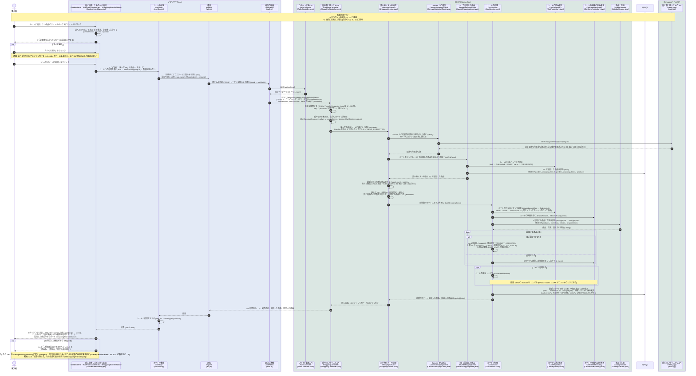

# EC-B25 買い物リストから商品をカートに追加する

```mermaid
sequenceDiagram
    autonumber
    actor User as 購入者
    box rgba(47,111,219,0.10) ブラウザー React
        participant Dlg as 庭に設置したものから追加<br/>GardenItems・AddFromGardenCard・ShoppingTransferNotice<br/>(GardenItemsDialog.jsx)
        participant Shop as カートの状態<br/>useShop<br/>(useShop.js)
        participant Http as 通信<br/>request<br/>(api.js)
        participant AuthJs as 通信の準備<br/>authFetch<br/>(auth.js)
    end
    box rgba(27,127,92,0.12) EC API Spring Boot
        participant AuthCtrl as ログイン状態API<br/>AuthController<br/>(AuthController.java)
        participant Ctrl as 庭の買い物リストAPI<br/>ShoppingController<br/>(ShoppingController.java)
        participant Svc as 買い物リストの処理<br/>ShoppingService<br/>(ShoppingService.java)
        participant Client as Canvas との通信<br/>CanvasShoppingClient<br/>(CanvasShoppingClient.java)
        participant Saved as EC で追加した商品<br/>SavedShoppingItems<br/>(SavedShoppingItems.java)
        participant Carts as カートの処理<br/>CartService<br/>(CartService.java)
        participant CartRepo as カートの読み書き<br/>CartRepository<br/>(CartRepository.java)
        participant Items as カートの明細の読み書き<br/>CartItemRepository<br/>(CartItemRepository.java)
        participant Cat as 商品と在庫<br/>CatalogService<br/>(CatalogService.java)
    end
    participant Db as MySQL
    box rgba(27,127,92,0.12) Canvas API FastAPI
        participant CApi as 庭と買い物リストのAPI<br/>create_app<br/>(main.py)
    end

    Note over User,CApi: 共通代替フロー<br/>*b 未ログインの場合: 9、11 に適用<br/>*a 通信に失敗した場合 (記述の 5a): 9、11 に適用

    User->>Dlg: 1 カートに追加したい商品のチェックボックスにチェックを付ける
    Dlg->>Dlg: 選んだ行の key と商品 ID を覚え、必要数を合計する<br/>(setSelection、picked、quantity)
    Dlg-->>User: 2「(必要数の合計)点をカートに追加」(押せる)
    opt 「すべて選択」
        User->>Dlg: 「すべて選択」をクリック
        Note over User,Dlg: 画面: 選べる行だけにチェックを付ける (selectAll。カートにある行と、選べない理由がある行は選ばない)
    end

    User->>Dlg: 3「n点をカートに追加」をクリック
    Dlg->>Shop: 3 つの版と、選んだ key と商品 ID を渡して、<br/>カートへの追加を頼む (add → transferShoppingList)。数量は送らない
    Shop->>Http: 処理中にしてエラーとお知らせを消し (run)、<br/>追加の通信を送る (api.transferShoppingList → request)
    Http->>AuthJs: 書き込みの前に CSRF トークンを取るよう頼む (send → authFetch)
    AuthJs->>AuthCtrl: GET /api/auth/csrf
    AuthCtrl-->>AuthJs: 200 ヘッダー名とトークン (csrf)
    AuthJs->>Ctrl: POST /api/cart/shopping-lists/{gardenId}/items<br/>(CSRF トークンのヘッダー付き。本文は gardenRevision、<br/>listRevision、cartRevision、items の key と productId)
    Ctrl->>Ctrl: 本文を検査する (@Valid TransferRequest。items は 1〜200 件、<br/>key と productId は空でない、版は 0 以上)
    Ctrl->>Ctrl: 購入者かを確かめ、会員のカートを決める<br/>(CartSessionResolver.resolve → requireBuyer、MemberCartService.resolve)
    Ctrl->>Svc: 選んだ商品をカートに移すよう頼む (transfer)。<br/>transfer 全体が 1 つのトランザクション (READ_COMMITTED)
    Svc->>Client: Canvas から最新の配置の行を取るよう頼む (detail)。<br/>カートのロックを取る前に終える
    Client->>CApi: GET /api/gardens/{id}/shopping-list
    CApi-->>Client: 200 配置の行と庭の版 (持ち主の確かめと読み方は EC-B24 の図と同じ流れ)
    Client-->>Svc: 配置の行と庭の版
    Svc->>Saved: カートをロックし、EC で追加した商品を読むよう頼む (lockAndRead)
    Saved->>CartRepo: カートの行をロックして読む<br/>(lock → findLocked、SELECT carts … FOR UPDATE)
    Saved->>Db: EC で追加した商品を読む (read)<br/>SELECT garden_shopping_lists と garden_shopping_items、products
    Saved-->>Svc: 買い物リストの版と EC で追加した商品
    Svc->>Svc: 最新の行と候補の商品を作る (supplement、resolve。<br/>素材と商品の対応と商品・在庫の読み方は EC-B24 の図と同じ流れ)
    Svc->>Svc: 選んだ key と商品 ID を最新の行と照らし、<br/>同じ商品の必要数を合計して、追加する商品を作る (additions)
    Svc->>Carts: 必要数でカートに足すよう頼む (addShoppingItems)
    Carts->>CartRepo: カートの行をロックして読む (requireLockedCart → findLocked)<br/>SELECT carts … FOR UPDATE (同じトランザクションでロック済み)
    Carts->>Items: カートの明細を読む (findAllForCart、SELECT cart_items)
    Carts->>Cat: 4 追加する商品と在庫を読む (listingsById → listingsByIds)<br/>SELECT products、inventory、stores、organizations
    Cat-->>Carts: 商品、在庫、買えない理由 (Listing)
    loop 追加する商品ごと
        alt 4a 追加できない
            Carts->>Carts: 4a-1 見送る (skipped)。販売終了 (PRODUCT_ARCHIVED)、<br/>上限 99 点 (QUANTITY_LIMIT)、在庫不足 (OUT_OF_STOCK)、<br/>上限 50 種類 (CART_LIMIT) の順に見る
        else 追加できる
            Carts->>Items: 5 カートの数量に必要数を足して保存する (save)
        end
    end
    opt 1 つ以上追加した
        Carts->>Carts: カートの版を 1 上げる (incrementRevision)
        Note over Carts,Items: 結果: carts の revision を 1 上げる (UPDATE carts は JPA がコミットのときに送る)
    end
    Carts->>Db: 最新のカートを作るため、明細と商品を読み直す<br/>(view → findAllForCart、listingsByIds)。明細とカートの版の変更<br/>(cart_items の INSERT・UPDATE、carts の UPDATE) は JPA が送る
    Carts-->>Svc: 最新のカート、追加した商品、見送った商品 (TransferResult)
    Svc-->>Ctrl: 同じ結果。コミットしてカートのロックを外す
    Ctrl-->>Http: 200 最新のカート、庭の名前、追加した商品、見送った商品
    Http-->>Shop: 結果
    Shop->>Shop: カートと結果を覚える (setCart、setShoppingTransfer)
    Shop-->>Dlg: 結果 (run が true)
    Dlg-->>User: 6 ダイアログを閉じ、URL から garden を外す (onAdded → close)。<br/>カートの上に「(庭の名前)からn種類を追加しました。」と、<br/>追加した商品のあるカート (ShoppingTransferNotice)
    opt 4a 見送った商品がある (skipped)
        Dlg-->>User: 4a-2「n種類は追加できませんでした。」と<br/>「(商品名)：(理由)」、「庭から選び直す」
        Note over User,Dlg: 結果: 4a-3「庭から選び直す」なら URL を /cart?garden={gardenId} に変え (navigate)、同じ庭を選んだダイアログを最新の在庫で開き直す (useRequestedGarden。EC-B24 の基本フロー 5)。<br/>画面: 4a-4「結果を閉じる」なら結果の表示を消す (setShoppingTransfer(null))
    end
```

