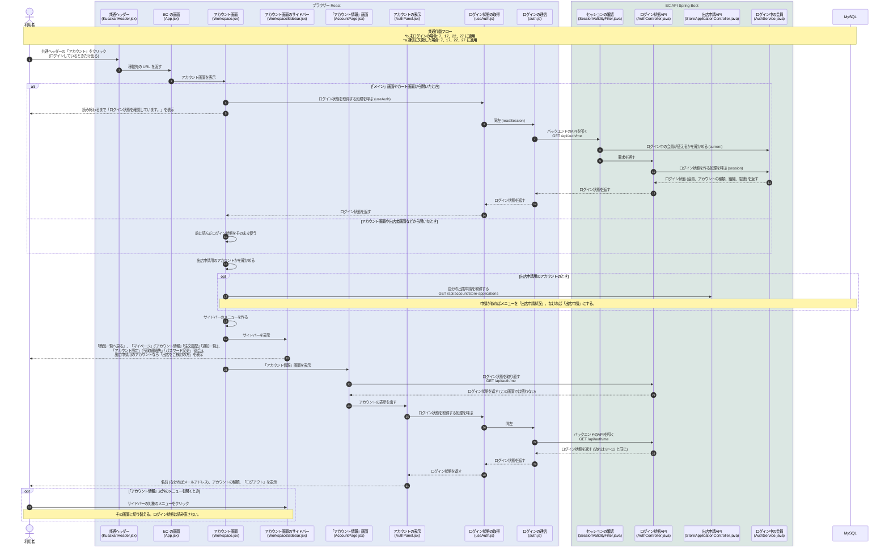

# EC-C01 アカウントのメニューを開く

```mermaid
sequenceDiagram
    autonumber
    actor User as 利用者
    box rgba(47,111,219,0.10) ブラウザー React
        participant Header as 共通ヘッダー<br/>(KusakariHeader.jsx)
        participant App as EC の画面<br/>(App.jsx)
        participant Work as アカウント画面<br/>(Workspace.jsx)
        participant Side as アカウント画面のサイドバー<br/>(WorkspaceSidebar.jsx)
        participant Acc as 「アカウント情報」画面<br/>(AccountPage.jsx)
        participant Panel as アカウントの表示<br/>(AuthPanel.jsx)
        participant UseAuth as ログイン状態の取得<br/>(useAuth.js)
        participant AuthJs as ログインの通信<br/>(auth.js)
    end
    box rgba(27,127,92,0.12) EC API Spring Boot
        participant Filter as セッションの確認<br/>(SessionValidityFilter.java)
        participant AuthCtrl as ログイン状態API<br/>(AuthController.java)
        participant AppCtrl as 出店申請API<br/>(StoreApplicationController.java)
        participant AuthSvc as ログイン中の会員<br/>(AuthService.java)
    end
    participant Db as MySQL

    Note over User,Db: 共通代替フロー<br/>*b 未ログインの場合: 7、17、22、27 に適用<br/>*a 通信に失敗した場合: 7、17、22、27 に適用

    User->>Header: 共通ヘッダーの「アカウント」をクリック<br/>(ログインしているときだけ出る)
    Header->>App: 移動先の URL を渡す
    App->>Work: アカウント画面を表示
    alt 「メイン」画面やカート画面から開いたとき
        Work->>UseAuth: ログイン状態を取得する処理を呼ぶ (useAuth)
        Work-->>User: 読み終わるまで「ログイン状態を確認しています。」を表示
        UseAuth->>AuthJs: 同左 (readSession)
        AuthJs->>Filter: バックエンドのAPIを叩く<br/>GET /api/auth/me
        Filter->>AuthSvc: ログイン中の会員が使えるかを確かめる (current)
        Filter->>AuthCtrl: 要求を通す
        AuthCtrl->>AuthSvc: ログイン状態を作る処理を呼ぶ (session)
        AuthSvc-->>AuthCtrl: ログイン状態 (会員、アカウントの種類、組織、店舗) を返す
        AuthCtrl-->>AuthJs: ログイン状態を返す
        AuthJs-->>UseAuth: ログイン状態を返す
        UseAuth-->>Work: ログイン状態を返す
    else アカウント画面や出店者画面などから開いたとき
        Work->>Work: 前に読んだログイン状態をそのまま使う
    end

    Work->>Work: 出店申請用のアカウントかを確かめる
    opt 出店申請用のアカウントのとき
        Work->>AppCtrl: 自分の出店申請を取得する<br/>GET /api/account/store-applications
        Note over Work,Db: 申請があればメニューを「出店申請状況」、なければ「出店申請」にする。
    end
    Work->>Work: サイドバーのメニューを作る
    Work->>Side: サイドバーを表示
    Side-->>User: 「商品一覧へ戻る」、「マイページ」(「アカウント情報」「注文履歴」「通知一覧」)、<br/>「アカウント設定」(「受取連絡先」「パスワード変更」「退会」)、<br/>出店申請用のアカウントなら「出店をご検討の方」を表示
    Work->>Acc: 「アカウント情報」画面を表示
    Acc->>AuthCtrl: ログイン状態を取り直す<br/>GET /api/auth/me
    AuthCtrl-->>Acc: ログイン状態を返す (この画面では使わない)
    Acc->>Panel: アカウントの表示を出す
    Panel->>UseAuth: ログイン状態を取得する処理を呼ぶ
    UseAuth->>AuthJs: 同左
    AuthJs->>AuthCtrl: バックエンドのAPIを叩く<br/>GET /api/auth/me
    AuthCtrl-->>AuthJs: ログイン状態を返す (流れは 8〜12 と同じ)
    AuthJs-->>UseAuth: ログイン状態を返す
    UseAuth-->>Panel: ログイン状態を返す
    Panel-->>User: 名前 (なければメールアドレス)、アカウントの種類、「ログアウト」を表示

    opt 「アカウント情報」以外のメニューを開くとき
        User->>Side: サイドバーの対象のメニューをクリック
        Note over User,Side: その画面に切り替える。ログイン状態は読み直さない。
    end
```

