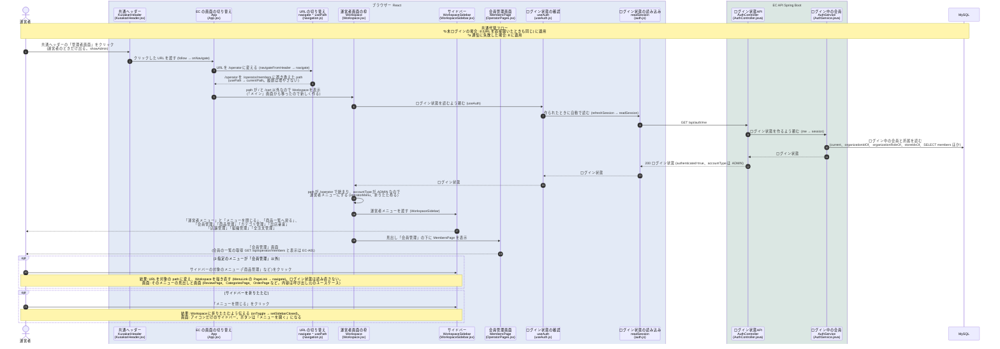

# EC-C02 管理者画面のメニューを開く

```mermaid
sequenceDiagram
    autonumber
    actor User as 運営者
    box rgba(47,111,219,0.10) ブラウザー React
        participant Head as 共通ヘッダー<br/>KusakariHeader<br/>(KusakariHeader.jsx)
        participant App as EC の画面の切り替え<br/>App<br/>(App.jsx)
        participant Nav as URL の切り替え<br/>navigate・usePath<br/>(navigation.js)
        participant Work as 運営者画面の枠<br/>Workspace<br/>(Workspace.jsx)
        participant Side as サイドバー<br/>WorkspaceSidebar<br/>(WorkspaceSidebar.jsx)
        participant Members as 会員管理画面<br/>MembersPage<br/>(OperatorPages.jsx)
        participant UseAuth as ログイン状態の確認<br/>useAuth<br/>(useAuth.js)
        participant AuthJs as ログイン状態の読み込み<br/>readSession<br/>(auth.js)
    end
    box rgba(27,127,92,0.12) EC API Spring Boot
        participant AuthCtrl as ログイン状態API<br/>AuthController<br/>(AuthController.java)
        participant AuthSvc as ログイン中の会員<br/>AuthService<br/>(AuthService.java)
    end
    participant Db as MySQL

    Note over User,Db: 共通代替フロー<br/>*b 未ログインの場合: 8 (URL を直接開いたときも同じ) に適用<br/>*a 通信に失敗した場合: 8 に適用

    User->>Head: 共通ヘッダーの「管理者画面」をクリック<br/>(運営者のときだけ出る。showAdmin)
    Head->>App: クリックした URL を渡す (follow → onNavigate)
    App->>Nav: URL を /operator に変える (navigateFromHeader → navigate)
    Nav-->>App: /operator を /operator/members に置き換えた path<br/>(usePath → currentPath。履歴は増やさない)
    App->>Work: path が / と /cart 以外なので Workspace を表示<br/>(「メイン」画面から移ったので新しく作る)
    Work->>UseAuth: ログイン状態を読むよう頼む (useAuth)
    UseAuth->>AuthJs: 作られたときに自動で読む (refreshSession → readSession)
    AuthJs->>AuthCtrl: GET /api/auth/me
    AuthCtrl->>AuthSvc: ログイン状態を作るよう頼む (me → session)
    AuthSvc->>Db: ログイン中の会員と所属を読む<br/>(current、organizationIdOf、organizationRoleOf、storeIdsOf、SELECT members ほか)
    AuthSvc-->>AuthCtrl: ログイン状態
    AuthCtrl-->>AuthJs: 200 ログイン状態 (authenticated=true、accountType は ADMIN)
    AuthJs-->>UseAuth: ログイン状態
    UseAuth-->>Work: ログイン状態
    Work->>Work: path が /operator で始まり、accountType が ADMIN なので<br/>運営者メニューにする (operatorMenu、折りたためる)
    Work->>Side: 運営者メニューを渡す (WorkspaceSidebar)
    Side-->>User: 「運営者メニュー」と「メニューを閉じる」、「商品一覧へ戻る」、<br/>「会員管理」「商品管理」「カテゴリ管理」「出店審査」<br/>「店舗管理」「組織管理」「全注文管理」
    Work->>Members: 見出し「会員管理」の下に MembersPage を表示
    Members-->>User: 「会員管理」画面<br/>(会員の一覧の取得 GET /api/operator/members と表示は EC-A01)

    opt 3 指定のメニューが「会員管理」以外
        User->>Side: サイドバーの対象のメニュー (「商品管理」など) をクリック
        Note over User,Side: 結果: URL を対象の path に変え、Workspace を描き直す (MenuLink の PageLink → navigate)。ログイン状態は読み直さない。<br/>画面: そのメニューの見出しと画面 (ReviewPage、CategoriesPage、OrderPage など。内容は呼び出し元のユースケース)
    end
    opt サイドバーを折りたたむ
        User->>Side: 「メニューを閉じる」をクリック
        Note over User,Side: 結果: Workspace に折りたたむよう伝える (onToggle → setSidebarClosed)。<br/>画面: アイコンだけのサイドバー。ボタンは「メニューを開く」になる
    end
```

