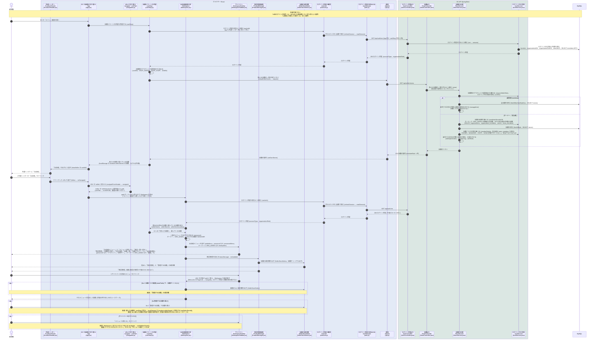

# EC-C03 出店者画面のメニューを開く

```mermaid
sequenceDiagram
    autonumber
    actor User as 出店者
    box rgba(47,111,219,0.10) ブラウザー React
        participant Head as 共通ヘッダー<br/>KusakariHeader<br/>(KusakariHeader.jsx)
        participant App as EC の画面の切り替え<br/>App<br/>(App.jsx)
        participant Nav as URL の切り替え<br/>navigate・usePath<br/>(navigation.js)
        participant Shop as 店舗とカートの状態<br/>useShop<br/>(useShop.js)
        participant Work as 出店者画面の枠<br/>Workspace<br/>(Workspace.jsx)
        participant Side as サイドバー<br/>WorkspaceSidebar<br/>(WorkspaceSidebar.jsx)
        participant PM as 商品管理画面<br/>ProductManager<br/>(ProductManager.jsx)
        participant Sel as 店舗の選択欄<br/>SellerStoreSelect<br/>(SellerStoreSelect.jsx)
        participant UseAuth as ログイン状態の確認<br/>useAuth<br/>(useAuth.js)
        participant AuthJs as ログイン状態の読み込み<br/>readSession<br/>(auth.js)
        participant Http as 通信<br/>request<br/>(api.js)
    end
    box rgba(27,127,92,0.12) EC API Spring Boot
        participant AuthCtrl as ログイン状態API<br/>AuthController<br/>(AuthController.java)
        participant StCtrl as 店舗API<br/>StoreController<br/>(StoreController.java)
        participant StSvc as 店舗の処理<br/>StoreService<br/>(StoreService.java)
        participant AuthSvc as ログイン中の会員<br/>AuthService<br/>(AuthService.java)
    end
    participant Db as MySQL

    Note over User,Db: 共通代替フロー<br/>*b 未ログインの場合: 14、36 (URL を直接開いたときも同じ) に適用<br/>*a 通信に失敗した場合: 14、36 に適用

    User->>App: EC の「メイン」画面を開く
    App->>Shop: 店舗とカートの状態を用意する (useShop)
    Shop->>UseAuth: ログイン状態を読むよう頼む (useAuth)<br/>App も共通ヘッダー用に同じく呼ぶ
    UseAuth->>AuthJs: 作られたときに自動で読む (refreshSession → readSession)
    AuthJs->>AuthCtrl: GET /api/auth/me (App 用と useShop 用の 2 回)
    AuthCtrl->>AuthSvc: ログイン状態を作るよう頼む (me → session)
    AuthSvc->>Db: ログイン中の会員と所属を読む<br/>(current、organizationIdOf、organizationRoleOf、storeIdsOf、SELECT members ほか)
    AuthSvc-->>AuthCtrl: ログイン状態
    AuthCtrl-->>AuthJs: 200 ログイン状態 (accountType、organizationRole)
    AuthJs-->>UseAuth: ログイン状態
    UseAuth-->>Shop: ログイン状態
    Shop->>Shop: 店舗側のアカウントか運営者かを決める<br/>(canSell。SHOP_OWNER、SHOP_STAFF、ADMIN)
    Shop->>Http: 扱える店舗の一覧を取りに行く<br/>(reloadSellerStores → request)
    Http->>StCtrl: GET /api/seller/stores
    StCtrl->>StSvc: 扱える店舗の一覧を作るよう頼む (mine)<br/>読み取り専用のトランザクション
    StSvc->>AuthSvc: 店舗側のアカウントか運営者かを確かめ (requireSellerRole)、<br/>ログイン中の会員を読む (current)
    alt 運営者 (isAdmin)
        StSvc->>Db: 全店舗を読む (findAllByOrderByIdAsc、SELECT stores)
        StSvc->>StSvc: 未完了の注文の件数と運営の警告を付ける (managedList)<br/>店舗ごとの立場は付けない
    else オーナー、担当者
        StSvc->>AuthSvc: 店舗の候補を調べる (candidateStoreIdsOf)<br/>オーナーと ORG_ADMIN は組織の全店舗、ほかの担当者は所属の店舗<br/>(SELECT organizations、organization_members、stores、store_members)
        StSvc->>Db: 店舗を読む (findAllById、SELECT stores)
        StSvc->>AuthSvc: 店舗ごとの立場を調べる (memberRoleAt。担当者は store_members を読む)<br/>OWNER、MANAGER、STAFF、NONE (所属でロールなし)、担当でなければ null
        StSvc->>StSvc: 未完了の注文の件数と運営の警告、立場を付ける<br/>(withOpenOrders、withWarning、withRole)
    end
    StSvc-->>StCtrl: 店舗のリスト
    StCtrl-->>Http: 200 店舗の配列 (memberRole つき)
    Http-->>Shop: 店舗の配列 (setOwnStores)
    Shop-->>App: 扱える店舗と選んでいる店舗<br/>(localStorage の kusakari.sellerStoreId の店舗、なければ先頭)
    App->>Head: 「出店者」を出すよう渡す (showSeller は canSell)
    Head-->>User: 共通ヘッダーに「出店者」

    User->>Head: 1 共通ヘッダーの「出店者」をクリック
    Head->>App: クリックした URL を渡す (follow → onNavigate)
    App->>Nav: URL を /seller に変える (navigateFromHeader → navigate)
    Nav-->>App: /seller を /seller/products に置き換えた path<br/>(usePath → currentPath。履歴は増やさない)
    App->>Work: path が / と /cart 以外なので Workspace を表示<br/>(「メイン」画面から移ったので新しく作る)
    Work->>UseAuth: ログイン状態を読むよう頼む (useAuth)
    UseAuth->>AuthJs: 作られたときに自動で読む (refreshSession → readSession)
    AuthJs->>AuthCtrl: GET /api/auth/me
    AuthCtrl-->>AuthJs: 200 ログイン状態 (中身は 6〜9 と同じ)
    AuthJs-->>UseAuth: ログイン状態
    UseAuth-->>Work: ログイン状態 (accountType、organizationRole)
    Work->>Shop: 読み込み済みの店舗と選んでいる店舗を使う<br/>(sellerStores、sellerStoreId、sellerStoresLoading)
    Shop-->>Work: 13〜25 で読んだ店舗と、選んでいる店舗
    Work->>Work: 人事のメニューを出すかを決める (personnel)<br/>オーナー、ORG_ADMIN、いずれかの店舗の MANAGER
    Work->>Side: 出店者メニューを渡す (sellerMenu、personnel なら personnelMenu、<br/>オーナーと ORG_ADMIN なら historyItem)
    Side-->>User: 「出店者メニュー」と「メニューを閉じる」、「商品一覧へ戻る」、<br/>「商品管理」「店舗受け取り」「注文実績」「店舗一覧」「店舗プロフィール」「出店者通知」<br/>(personnel なら「アカウント」「招待キー」、オーナーと ORG_ADMIN なら「履歴」も)
    Work->>PM: 商品管理を表示 (ProductManager、embedded)
    PM->>Sel: 店舗の選択欄を出す (SellerStoreSelect。店舗が 1 つでも出す)
    Sel-->>User: 見出し「商品管理」と「管理する店舗」の選択欄
    PM-->>User: 「商品管理」画面 (商品の取得と中身は EC-S03 など)

    User->>Side: 3 サイドバーの対象のメニューをクリック
    Side->>Work: URL を対象の path に変え、Workspace を描き直す<br/>(MenuLink の PageLink → navigate)。ログイン状態と店舗は読み直さない
    opt 3a-1 店舗ごとの画面 (storePaths) で、店舗が 2 つ以上
        Work->>Sel: 画面の上に選択欄を出す (SellerStoreSelect)
        Note over User,Sel: 画面: 「管理する店舗」の選択欄
    end
    Work-->>User: そのメニューの見出しと画面 (内容は呼び出し元のユースケース)
    opt 3a 管理する店舗を選ぶ
        User->>Sel: 3a-2「管理する店舗」で店舗を選ぶ
        Note over User,Sel: 結果: 選んだ店舗を useShop が覚え、localStorage の kusakari.sellerStoreId に保存する (setSellerStoreId)。<br/>画面: 3a-3 選んだ店舗の内容で画面を描き直す (内容の取得は呼び出し元のユースケース)
    end
    opt サイドバーを折りたたむ
        User->>Side: 「メニューを閉じる」をクリック
        Note over User,Side: 結果: Workspace に折りたたむよう伝える (onToggle → setSidebarClosed)。<br/>画面: アイコンだけのサイドバー。ボタンは「メニューを開く」になる
    end
```

