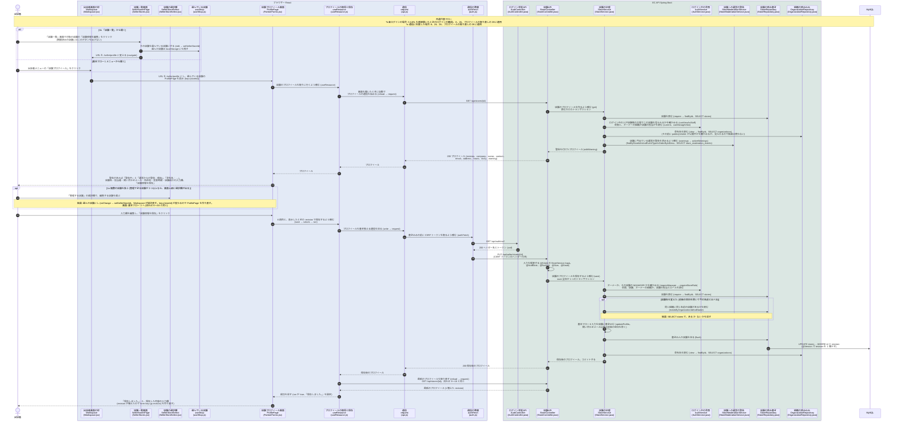

# EC-S02 店舗プロフィールを編集する

```mermaid
sequenceDiagram
    autonumber
    actor User as 出店者
    box rgba(47,111,219,0.10) ブラウザー React
        participant Work as 出店者画面の枠<br/>Workspace<br/>(Workspace.jsx)
        participant Stores as 店舗一覧画面<br/>SellerStoresPage<br/>(SellerStores.jsx)
        participant Select as 店舗の選択欄<br/>SellerStoreSelect<br/>(SellerStoreSelect.jsx)
        participant Shop as 選んでいる店舗<br/>useShop<br/>(useShop.js)
        participant Page as 店舗プロフィール画面<br/>ProfilePage<br/>(PartnerForms.jsx)
        participant Hook as プロフィールの取得と保存<br/>useResource<br/>(useResource.js)
        participant Http as 通信<br/>request<br/>(api.js)
        participant AuthJs as 通信の準備<br/>authFetch<br/>(auth.js)
    end
    box rgba(27,127,92,0.12) EC API Spring Boot
        participant AuthCtrl as ログイン状態API<br/>AuthController<br/>(AuthController.java)
        participant Ctrl as 店舗API<br/>StoreController<br/>(StoreController.java)
        participant Svc as 店舗の処理<br/>StoreService<br/>(StoreService.java)
        participant Auth as ログイン中の会員<br/>AuthService<br/>(AuthService.java)
        participant Mod as 店舗への運営の警告<br/>StoreModerationService<br/>(StoreModerationService.java)
        participant Repo as 店舗の読み書き<br/>StoreRepository<br/>(StoreRepository.java)
        participant OrgRepo as 組織の読み込み<br/>OrganizationRepository<br/>(OrganizationRepository.java)
    end
    participant Db as MySQL

    Note over User,Db: 共通代替フロー<br/>*b 未ログインの場合: 5 (URL を直接開いたときのログインの確認)、8、26、プロフィールの取り直しの 39 に適用<br/>*a 通信に失敗した場合: 8、24、26、プロフィールの取り直しの 39 に適用

    alt 1b 「店舗一覧」から開く
        User->>Stores: 「店舗一覧」画面で対象の店舗の「店舗情報を編集」をクリック<br/>(閉鎖済みの店舗にはこのボタンを出さない)
        Stores->>Shop: その店舗を選んでいる店舗にする (edit → setSellerStoreId)<br/>選んだ店舗は localStorage にも残す
        Stores->>Work: URL を /seller/profile に変える (navigate)
    else 基本フロー 1 メニューから開く
        User->>Work: 出店者メニューの「店舗プロフィール」をクリック
    end
    Work->>Page: URL を /seller/profile にし、選んでいる店舗の<br/>ProfilePage を表示 (key={storeId})

    Page->>Hook: 店舗のプロフィールを取りに行くよう頼む (useResource)
    Hook->>Http: 画面を開いたときに自動で<br/>プロフィールの通信を始める (reload → request)
    Http->>Ctrl: GET /api/stores/{id}
    Ctrl->>Svc: 店舗のプロフィールを作るよう頼む (get)<br/>読むだけのトランザクション
    Svc->>Repo: 店舗を読む (require → findById、SELECT stores)
    Svc->>Auth: ログイン中の人が店舗側の立場でこの店舗を見られるかを確かめる (canViewAsStaff)<br/>会員と、オーナーの組織か店舗の担当かを読む (current、canManageView)
    Svc->>OrgRepo: 会社名を読む (view → findById、SELECT organizations)<br/>(その前に publiclyVisible が公開中かを確かめるが、見られるので結果は使わない)
    Svc->>Mod: 店舗に今出ている運営の警告を求めるよう頼む (warnings → activeWarnings)<br/>(findByStoreIdInAndEventTypeInOrderByIdDesc、SELECT store_moderation_events)
    Svc-->>Ctrl: 警告を付けたプロフィール (withWarning)
    Ctrl-->>Http: 200 プロフィール (revision、company、name、contact、<br/>email、address、hours、story、warning)
    Http-->>Hook: プロフィール
    Hook-->>Page: プロフィール
    Page-->>User: 警告があれば「警告中」と「運営からの警告：理由」、「会社名：…」、<br/>店舗名・担当者・問い合わせメール・所在地・営業時間・店舗紹介の入力欄、<br/>「店舗情報を保存」

    opt 1a 複数の店舗を扱う (管理できる店舗が 2 つ以上なら、画面上部に選択欄が出る)
        User->>Select: 「管理する店舗」の選択欄で、編集する店舗を選ぶ
        Note over User,Page: 結果: 選んだ店舗にし (onChange → setSellerStoreId)、Workspace が描き直す。key={storeId} が変わるので ProfilePage を作り直す。<br/>画面: 基本フロー 2 へ (流れは 6〜18 と同じ)
    end

    User->>Page: 入力欄を編集し、「店舗情報を保存」をクリック
    Page->>Hook: 6 項目と、表示したときの revision で保存するよう頼む<br/>(save → values → run)
    Hook->>Http: プロフィールを書き換える通信を送る (write → request)
    Http->>AuthJs: 書き込みの前に CSRF トークンを取るよう頼む (authFetch)
    AuthJs->>AuthCtrl: GET /api/auth/csrf
    AuthCtrl-->>AuthJs: 200 ヘッダー名とトークン (csrf)
    AuthJs->>Ctrl: PUT /api/seller/stores/{id}<br/>(CSRF トークンのヘッダー付き)
    Ctrl->>Ctrl: 入力を検査する (@Valid の StoreService.Input。<br/>@NotBlank、@NotNull、@Size、@Email)
    Ctrl->>Svc: 店舗のプロフィールを保存するよう頼む (save)<br/>save 全体が 1 つのトランザクション
    Svc->>Auth: オーナーか、その店舗の MANAGER かを確かめる (requireManager → requireStoreRole)<br/>会員、店舗、オーナーの組織か、店舗の担当とロールを読む
    Svc->>Repo: 店舗を読む (require → findById、SELECT stores)
    opt 店舗名を変えた (前後の空白を除いて今の名前と比べる)
        Svc->>Repo: 同じ組織に同じ名前の店舗があるかを読む<br/>(existsByOrganizationIdAndName)
        Note over Svc,Repo: 結果: SELECT stores で、ある か ない かを返す
    end
    Svc->>Svc: 基本フロー 6 入力を店舗に書き込む (updateProfile。<br/>問い合わせメール以外は前後の空白を除く)
    Svc->>Repo: 書き込んだ店舗を送る (flush)
    Repo->>Db: UPDATE stores ... WHERE id と revision<br/>(@Version で revision を 1 増やす)
    Svc->>OrgRepo: 会社名を読む (view → findById、SELECT organizations)
    Svc-->>Ctrl: 保存後のプロフィール。コミットする
    Ctrl-->>Http: 200 保存後のプロフィール
    Http-->>Hook: 保存後のプロフィール
    Hook->>Ctrl: 最新のプロフィールを取り直す (reload → request)<br/>GET /api/stores/{id}。流れは 8〜16 と同じ
    Ctrl-->>Hook: 最新のプロフィール (1 増えた revision)
    Hook-->>Page: 成功を返す (run が true、「保存しました。」を設定)
    Page-->>User: 「保存しました。」と、保存した内容の入力欄<br/>(revision が増えたので form key={p.revision} を作り直す)
```

