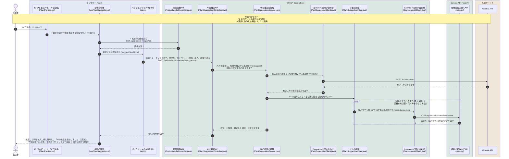

# EC-S03 商品を登録する

### 図 1 商品を登録する

```mermaid
sequenceDiagram
    autonumber
    actor User as 出店者
    box rgba(47,111,219,0.10) ブラウザー React
        participant Work as 出店者画面のサイドバー<br/>(Workspace.jsx)
        participant Mgr as 商品管理画面<br/>(ProductManager.jsx)
        participant Cat as 出店者の商品一覧<br/>(useSellerCatalog.js)
        participant NewPage as 商品登録画面<br/>(ProductCreatePage.jsx)
        participant Form as 商品登録のフォーム<br/>(ProductForm.jsx)
        participant Picker as カテゴリーの選択<br/>(CategoryPicker.jsx)
        participant Images as 商品画像<br/>(ProductImages.jsx)
        participant Garden as 庭オブジェクトの手順<br/>(ProductGardenStep.jsx)
        participant Preview as 3D プレビューと「AIで生成」<br/>(PlantPreview.jsx)
        participant Plant as 植物の特徴<br/>(usePlantSuggestion.js)
        participant Review as 確認の手順<br/>(ProductReview.jsx)
        participant Shop as 商品の保存<br/>(useShop.js)
        participant Hook as 警告とカテゴリーの取得<br/>(useResource.js)
        participant Http as バックエンドのAPIを叩く<br/>(api.js)
    end
    box rgba(47,111,219,0.10) ブラウザー Canvas の iframe React
        participant CWeb as Canvas の 3D プレビュー画面<br/>(PlantPreviewPage.jsx)
    end
    box rgba(27,127,92,0.12) EC API Spring Boot
        participant SPC as 出店者の商品API<br/>(SellerProductController.java)
        participant CatCtrl as カテゴリーAPI<br/>(CategoryController.java)
        participant MediaCtrl as 商品画像API<br/>(ProductMediaController.java)
        participant EdCtrl as 商品の登録・編集API<br/>(ProductEditorController.java)
        participant CatalogCtrl as 購入者向けの商品API<br/>(CatalogController.java)
        participant MediaSvc as 商品画像の処理<br/>(ProductMediaService.java)
        participant EdSvc as 商品の登録・編集の処理<br/>(ProductEditorService.java)
        participant Auth as ログイン中の会員<br/>(AuthService.java)
        participant CModel as Canvas への問い合わせ<br/>(CanvasModelClient.java)
    end
    box rgba(27,127,92,0.12) Canvas API FastAPI
        participant CApi as 植物の組み立てAPI<br/>(main.py)
    end
    participant Db as MySQL

    Note over User,Db: 共通代替フロー<br/>*b 未ログインの場合: 2 (URL を直接開いたときのログインの確認)、3、5、13、25、55、出品の後の 73 に適用<br/>*a 通信に失敗した場合: 3、5、13、25、31、39、40、55、出品の後の 68・73 に適用

    User->>Work: 出店者メニューの「商品管理」をクリック
    Work->>Mgr: 商品管理画面を表示
    par 商品の一覧
        Cat->>SPC: 選んでいる店舗の商品を取得する<br/>GET /api/seller/products?storeId={id}
        SPC-->>Cat: 商品のリストを返す (流れは EC-S04 の図と同じ)
    and 運営からの警告・停止
        Hook->>SPC: 店舗の商品への警告・停止を取得する<br/>GET /api/seller/products/moderation?storeId={id}
        SPC-->>Hook: 警告・停止のリストを返す (流れは EC-S04 の図と同じ)
    end
    Mgr-->>User: 「商品管理」、「管理する店舗」、「新しい商品」、<br/>「運営からの警告・停止」欄、商品一覧を表示

    User->>Mgr: 「新しい商品」をクリック
    Mgr->>Work: お知らせとエラーを消し、商品登録画面へ移る
    Work->>NewPage: 商品登録画面を表示
    NewPage->>Form: 在庫を登録する店舗の選択と、空の商品のフォームを表示
    Form->>Picker: 「商品情報」の手順の入力欄とカテゴリーの選択を表示
    Picker->>CatCtrl: カテゴリーの一覧を取得する<br/>GET /api/categories
    CatCtrl-->>Picker: カテゴリー名のリストを返す (流れは EC-S04 の図と同じ)
    Form-->>User: 「商品登録」、「1 / 4」、「商品情報」(商品名、カテゴリー、商品説明、<br/>税込価格（円）、選択店舗の在庫、在庫を登録する店舗、「サイズ」「詳しい情報」)、「次へ」を表示

    User->>Form: 「商品名」「商品説明」「税込価格（円）」「選択店舗の在庫」と、<br/>「サイズ」の「樹齢目安（年）」「鉢径（cm）」、「詳しい情報」の「生産者名」を入力
    User->>Picker: 「選ぶ」をクリックし、「カテゴリーを選ぶ」の一覧からカテゴリーを選ぶ
    User->>Form: 「次へ」をクリック
    Form->>Form: 「商品情報」の入力を確かめる
    Form-->>User: 「2 / 4」の「画像」の手順を表示

    User->>Images: 「商品の写真を選択」から商品画像のファイルを選ぶ<br/>(1 枚以上あれば「画像を追加」)
    Images->>Images: 枚数、形式、大きさを確かめる
    Images->>Form: 保存の間はフォームを操作できなくする
    loop 選んだファイルごと
        Images->>Http: 画像を送る処理を呼ぶ (uploadProductImage)
        Http->>MediaCtrl: CSRF トークンを付けて、バックエンドのAPIを叩く<br/>POST /api/product-images
        MediaCtrl->>MediaSvc: 画像を保存するトランザクションを開始 (upload)<br/>ファイルの中身から形式を確かめる
        MediaSvc->>Db: 画像を保存する
        MediaCtrl-->>Images: 画像の URL を返す
        Images->>Form: 画像を下書きに入れる
    end
    Images->>Form: フォームを操作できるようにする
    Images->>MediaCtrl: サムネイルの画像を取得する<br/>GET /api/product-images/{id}
    MediaCtrl-->>Images: 画像を返す
    Images-->>User: 商品画像のサムネイルと、1 枚目に「メイン画像」を表示

    User->>Form: 「次へ」をクリック
    Form->>Form: 画像があるかを確かめる
    Form->>Garden: 「3 / 4」の「庭オブジェクト」の手順を表示
    alt 「鉢・庭材」のカテゴリーのとき
        Garden-->>User: 「「鉢・庭材」の商品は植物の3Dモデルを作りません。…」と<br/>「商品の高さ」を表示
    else 植物のカテゴリーのとき
        Garden->>Preview: 入力が止まるのを待ち、入力を確かめて 3D プレビューの URL を渡す<br/>(高さが空なら既定の高さで仮に表示)
        Preview->>CWeb: Canvas の 3D プレビュー画面を開く<br/>GET /model-preview
        CWeb->>CApi: 植物の 3D の構成を取得する<br/>POST /api/model-assemblies/resolve
        CApi-->>CWeb: 構成を返す
        Preview-->>User: 3D の植物、「AIで生成」、「植物の高さ」などの特徴の入力欄を表示
    end

    alt 15a 「AIで生成」をクリックしたとき
        User->>Preview: 「AIで生成」をクリック<br/>図 2 の流れで特徴を推定し、入力欄に反映する
    else 手で入力するとき
        User->>Garden: 「植物の高さ」などの特徴を入力
        Garden->>Plant: 特徴を変える (3D プレビューは 38〜42 と同じ流れで更新)
    end

    User->>Form: 「次へ」をクリック
    Form->>Form: 庭オブジェクトの入力を確かめる
    Form->>Review: 「4 / 4」の「確認」の手順を表示
    Review->>CWeb: 植物の商品なら 3D プレビューを開く (流れは 39〜41 と同じ)
    Review-->>User: 商品画像、3D モデル、商品名、価格、登録店舗、在庫、<br/>カテゴリー、商品説明など、「前の手順へ」「出品する」を表示

    User->>Form: 「出品する」をクリック
    Form->>Form: すべての手順の入力を確かめ直す
    Form->>Shop: 入力をまとめて、商品を登録する処理を呼ぶ (saveProduct)
    Shop->>Http: 同左 (createProduct)
    Http->>EdCtrl: CSRF トークンを付けて、バックエンドのAPIを叩く<br/>POST /api/products
    EdCtrl->>EdCtrl: 入力を検査する
    EdCtrl->>EdSvc: 商品を登録するトランザクションを開始 (create)
    EdSvc->>Auth: オーナーか店舗の担当者か、店舗とカテゴリーがあるか、<br/>在庫が 1 以上かを確かめる (requireManager)
    EdSvc->>Db: 入力から商品を作り、店舗の中で重ならない商品番号を付ける<br/>(重なれば最大 5 回作り直す)
    opt 植物の商品のとき
        EdSvc->>CModel: 植物の 3D の構成を作る処理を呼ぶ (resolve)
        Note over EdSvc,CApi: Canvas の API から構成を受け取り、商品に入れる。
    end
    EdSvc->>Db: 商品と商品画像を保存する
    EdSvc->>Db: 在庫を公開中で保存する
    opt 構成があるとき
        EdSvc->>Db: 素材コードと商品の対応を保存する
    end
    EdSvc->>Db: 登録した商品を読む
    EdSvc-->>EdCtrl: 登録した商品 (商品番号を含む) を返す
    EdCtrl-->>Http: 登録した商品を返す
    Http-->>Shop: 登録した商品を返す
    Shop->>CatalogCtrl: 購入者向けの商品を取り直す<br/>GET /api/products
    CatalogCtrl-->>Shop: 購入者に見える商品のリストを返す
    Shop-->>Form: 成功を返す
    Form->>Work: 商品管理画面へ戻る
    Work->>Mgr: 商品管理画面を表示
    Mgr->>SPC: 商品の一覧と警告・停止を取り直す<br/>流れは 3〜6 と同じ
    Mgr-->>User: 「商品を保存しました。商品番号は KS-… です。」と、<br/>登録した商品を含む商品一覧を表示
```

### 図 2 AIで生成するとき

```mermaid
sequenceDiagram
    autonumber
    actor User as 出店者
    box rgba(47,111,219,0.10) ブラウザー React
        participant Preview as 3D プレビューと「AIで生成」<br/>(PlantPreview.jsx)
        participant Plant as 植物の特徴<br/>(usePlantSuggestion.js)
        participant Http as バックエンドのAPIを叩く<br/>(api.js)
    end
    box rgba(27,127,92,0.12) EC API Spring Boot
        participant MediaCtrl as 商品画像API<br/>(ProductMediaController.java)
        participant SugCtrl as AI の推定API<br/>(PlantSuggestionController.java)
        participant SugSvc as AI の推定の処理<br/>(PlantSuggestionService.java)
        participant AiCli as OpenAI への問い合わせ<br/>(PlantSuggestionClient.java)
        participant Fitter as 寸法の調整<br/>(PlantSuggestionFitter.java)
        participant CModel as Canvas への問い合わせ<br/>(CanvasModelClient.java)
    end
    box rgba(27,127,92,0.12) Canvas API FastAPI
        participant CApi as 植物の組み立てAPI<br/>(main.py)
    end
    box rgba(180,120,20,0.12) 外部サービス
        participant OpenAI as OpenAI API
    end

    Note over User,OpenAI: 共通代替フロー<br/>*b 未ログインの場合: 6 に適用<br/>*a 通信に失敗した場合: 3、6 に適用

    User->>Preview: 「AIで生成」をクリック
    Preview->>Plant: 下書きの値で特徴を推定する処理を呼ぶ (suggest)
    Plant->>MediaCtrl: 1 枚目の画像を読む<br/>GET /api/product-images/{id}
    MediaCtrl-->>Plant: 画像を返す
    Plant->>Http: 推定する処理を呼ぶ (suggestPlantModel)
    Http->>SugCtrl: CSRF トークンを付けて、商品名、カテゴリー、説明、高さ、画像を送る<br/>POST /api/products/plant-model-suggestions
    SugCtrl->>SugSvc: 入力を検査し、特徴を推定する処理を呼ぶ (suggest)<br/>同時に推定するのは 2 件まで
    SugSvc->>AiCli: 商品情報と画像から特徴を推定する処理を呼ぶ (infer)
    AiCli->>OpenAI: POST /v1/responses
    OpenAI-->>AiCli: 推定した特徴を返す
    AiCli-->>SugSvc: 推定した特徴と注意点を返す
    SugSvc->>Fitter: 3D で組み立てられる寸法に整える処理を呼ぶ (fit)
    loop 組み立てられるまで (最大 4 回。2 回目からは葉・花・幹を小さくする)
        Fitter->>CModel: 組み立てられるかを確かめる処理を呼ぶ (checkSuggestion)
        CModel->>CApi: POST /api/model-assemblies/resolve
        CApi-->>CModel: 構成か、組み立てられないことを返す
    end
    SugSvc-->>SugCtrl: 推定した特徴、推定した項目、注意点を返す
    SugCtrl-->>Plant: 推定の結果を返す
    Plant-->>User: 推定した特徴を入力欄に反映し、「AIの推定を反映しました · 注意点」、<br/>「AI設定を元に戻す」を表示 (3D プレビューは図 1 と同じ流れで更新)
```

