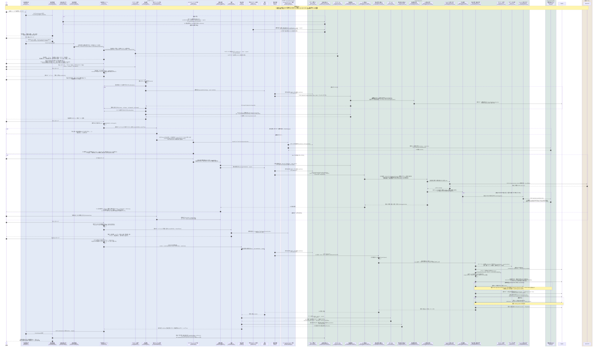

# EC-S03 商品を登録する

```mermaid
sequenceDiagram
    autonumber
    actor User as 出店者
    box rgba(47,111,219,0.10) ブラウザー React
        participant Work as 出店者画面の枠<br/>Workspace<br/>(Workspace.jsx)
        participant Mgr as 商品管理画面<br/>ProductManager<br/>(ProductManager.jsx)
        participant Cat as 出店者の商品一覧<br/>useSellerCatalog<br/>(useSellerCatalog.js)
        participant NewPage as 商品登録画面<br/>ProductCreatePage<br/>(ProductCreatePage.jsx)
        participant Form as 商品登録のフォーム<br/>ProductForm<br/>(ProductForm.jsx)
        participant Picker as カテゴリーの選択<br/>CategoryPicker<br/>(CategoryPicker.jsx)
        participant Images as 商品画像<br/>ProductImages<br/>(ProductImages.jsx)
        participant Garden as 庭オブジェクトの手順<br/>ProductGardenStep<br/>(ProductGardenStep.jsx)
        participant Preview as 3D プレビューと「AIで生成」<br/>PlantPreview<br/>(PlantPreview.jsx)
        participant Plant as 植物の特徴<br/>usePlantSuggestion<br/>(usePlantSuggestion.js)
        participant Review as 確認<br/>ProductReview<br/>(ProductReview.jsx)
        participant Shop as 商品の保存<br/>useShop<br/>(useShop.js)
        participant Hook as 警告とカテゴリーの取得<br/>useResource<br/>(useResource.js)
        participant Http as 通信<br/>request<br/>(api.js)
        participant AuthJs as 通信の準備<br/>authFetch<br/>(auth.js)
    end
    box rgba(47,111,219,0.10) ブラウザー Canvas の iframe React
        participant CWeb as Canvas の 3D プレビュー画面<br/>PlantPreviewPage<br/>(PlantPreviewPage.jsx)
    end
    box rgba(27,127,92,0.12) EC API Spring Boot
        participant AuthCtrl as ログイン状態API<br/>AuthController<br/>(AuthController.java)
        participant SPC as 出店者の商品API<br/>SellerProductController<br/>(SellerProductController.java)
        participant CatCtrl as カテゴリーAPI<br/>CategoryController<br/>(CategoryController.java)
        participant MediaCtrl as 商品画像API<br/>ProductMediaController<br/>(ProductMediaController.java)
        participant SugCtrl as AI の推定API<br/>PlantSuggestionController<br/>(PlantSuggestionController.java)
        participant EdCtrl as 商品の登録・編集API<br/>ProductEditorController<br/>(ProductEditorController.java)
        participant CartCtrl as カートAPI<br/>CartController<br/>(CartController.java)
        participant CatalogCtrl as 購入者向けの商品API<br/>CatalogController<br/>(CatalogController.java)
        participant MediaSvc as 商品画像の処理<br/>ProductMediaService<br/>(ProductMediaService.java)
        participant SugSvc as AI の推定の処理<br/>PlantSuggestionService<br/>(PlantSuggestionService.java)
        participant AiCli as OpenAI への問い合わせ<br/>PlantSuggestionClient<br/>(PlantSuggestionClient.java)
        participant Fitter as 寸法の調整<br/>PlantSuggestionFitter<br/>(PlantSuggestionFitter.java)
        participant EdSvc as 商品の登録・編集の処理<br/>ProductEditorService<br/>(ProductEditorService.java)
        participant CatgSvc as カテゴリーの処理<br/>CategoryService<br/>(CategoryService.java)
        participant Auth as ログイン中の会員<br/>AuthService<br/>(AuthService.java)
        participant CModel as Canvas への問い合わせ<br/>CanvasModelClient<br/>(CanvasModelClient.java)
    end
    box rgba(27,127,92,0.12) Canvas API FastAPI
        participant CApi as 植物の組み立てAPI<br/>resolve_model<br/>(main.py)
    end
    participant Db as MySQL
    box rgba(180,120,20,0.12) 外部サービス
        participant OpenAI as OpenAI API
    end

    Note over User,OpenAI: 共通代替フロー<br/>*b 未ログインの場合: 2 (URL を直接開いたときのログインの確認)、3、5、13、26、50、75、出品の後の 91・98 に適用<br/>*a 通信に失敗した場合: 3、5、13、25、26、32、40、41、42、47、49、50、74、75、出品の後の 91・93・98 に適用

    User->>Work: 出店者メニューの「商品管理」をクリック
    Work->>Mgr: URL を /seller/products に変え、<br/>ProductManager を表示 (embedded)
    par 商品の一覧
        Cat->>SPC: 選んでいる店舗の商品を取りに行く<br/>(useSellerCatalog → useEffect → api.sellerProducts → request)<br/>GET /api/seller/products?storeId={id}
        SPC-->>Cat: 200 商品の配列 (EC-S04 の図と同じ流れ。setProducts)
    and 運営からの警告・停止
        Hook->>SPC: 店舗の商品への警告・停止を取りに行く (useResource → reload → request)<br/>GET /api/seller/products/moderation?storeId={id}
        SPC-->>Hook: 200 警告・停止の配列 (EC-S04 の図と同じ流れ)
    end
    Mgr-->>User: 「商品管理」、「管理する店舗」、「新しい商品」、<br/>「運営からの警告・停止」欄、商品一覧

    User->>Mgr: 「新しい商品」をクリック
    Mgr->>Work: お知らせとエラーを消し、URL を /seller/products/new に変える<br/>(shop.setError('')、shop.setNotice('')、navigate)
    Work->>NewPage: ProductCreatePage を表示
    NewPage->>Form: 在庫を登録する店舗の選択を付けて、空の商品のフォームを表示<br/>(StorePicker、ProductForm の product は null、onSave は shop.saveProduct)
    Form->>Picker: 「商品情報」の手順で、入力欄とカテゴリーの選択を表示<br/>(createDraft(emptyProduct)、step は INFO、ProductInfoFields → CategoryPicker)
    Picker->>CatCtrl: カテゴリーの一覧を取りに行く (useResource → reload → request)<br/>GET /api/categories
    CatCtrl-->>Picker: 200 カテゴリー名の配列 (EC-S04 の図と同じ流れ)
    Form-->>User: 「商品登録」、「1 / 4」、「商品情報」(商品名、カテゴリー、商品説明、<br/>税込価格（円）、選択店舗の在庫、在庫を登録する店舗、「サイズ」「詳しい情報」)、「次へ」

    User->>Form: 「商品名」「商品説明」「税込価格（円）」「選択店舗の在庫」と、<br/>「サイズ」の「樹齢目安（年）」「鉢径（cm）」、「詳しい情報」の「生産者名」を入力する<br/>(ProductInfoFields の change、RangeField と input の onChange → set)
    User->>Picker: 「選ぶ」をクリックし、「カテゴリーを選ぶ」の一覧からカテゴリーを選ぶ<br/>(choose → onChange → set('category'))
    User->>Form: 「次へ」をクリック
    Form->>Form: 「商品情報」の入力を確かめる (next → validate(INFO)。<br/>firstInvalid で required・min・max、商品名と説明が空白だけでないか)
    Form-->>User: 基本フロー 10「2 / 4」、「画像」の手順 (move(IMAGES))

    User->>Images: 「商品の写真を選択」(1 枚以上あれば「画像を追加」) から、<br/>商品画像のファイルを選ぶ
    Images->>Images: 枚数、形式、大きさを確かめる (upload)
    Images->>Form: 保存の間はフォームを操作できなくする (onBusy(true))
    loop 選んだファイルごと
        Images->>Http: 画像を送る (api.uploadProductImage → send、FormData)
        AuthJs->>AuthCtrl: 書き込みの前に CSRF トークンを取る (authFetch)<br/>GET /api/auth/csrf
        AuthJs->>MediaCtrl: POST /api/product-images (multipart の file。CSRF トークンのヘッダー付き)
        MediaCtrl->>MediaSvc: 店舗側のアカウントか運営かを確かめ (requireSellerRole)、<br/>画像を保存するよう頼む (upload)。1 つのトランザクション。<br/>先頭のバイトで形式を判定し、ファイルの Content-Type と比べる (detect)
        MediaSvc->>Db: 基本フロー 12 画像を保存する (ProductMediaRepository.save、<br/>INSERT product_media。id は UUID)
        MediaCtrl-->>Images: 200 imageUrl (/api/product-images/{id})
        Images->>Form: 画像を下書きに入れる (change → onChange → set('imageUrl')、set('images'))
    end
    Images->>Form: フォームを操作できるようにする (onBusy(false))
    Images->>MediaCtrl: サムネイルの img が画像を読む GET /api/product-images/{id}<br/>(get → ProductMediaRepository.findById、SELECT product_media)
    MediaCtrl-->>Images: 200 画像 (X-Content-Type-Options nosniff)
    Images-->>User: 商品画像のサムネイル。1 枚目に「メイン画像」

    User->>Form: 「次へ」をクリック
    Form->>Form: 画像があるかを確かめる (next → validate(IMAGES)、draft.imageUrl)
    Form->>Garden: 基本フロー 14「3 / 4」の「庭オブジェクト」を表示 (move(GARDEN)、active が true)
    alt 「鉢・庭材」のカテゴリー (植物ではない。isPlantCategory)
        Garden-->>User: 「「鉢・庭材」の商品は植物の3Dモデルを作りません。…」と<br/>「商品の高さ」。3D は作らない
    else 植物のカテゴリー
        Garden->>Preview: 入力が 400ms 止まるのを待ち、入力を確かめて Canvas のプレビューの URL を作り、渡す<br/>(usePlantPreview、firstInvalid、modelPreviewUrl、pending。<br/>高さが空なら profile の既定の高さで仮表示)
        Preview->>CWeb: iframe の src で GET /model-preview?profile=...
        CWeb->>AuthCtrl: ログイン中かを確かめる (AuthGate、GET /api/auth/me)
        CWeb->>CApi: 植物の 3D の構成を求める (useQuery → requestJson)<br/>POST /api/model-assemblies/resolve
        CApi-->>CWeb: 200 構成 (assemble)
        Preview-->>User: 3D の植物 (iframe を読み終えると onLoad → loaded で、700ms 後に前のプレビューと入れ替える)、<br/>「AIで生成」、「植物の高さ」などの特徴の入力欄 (高さが空なら仮の高さの案内)
    end

    alt 15a 「AIで生成」をクリックした
        User->>Preview: 「AIで生成」をクリック
        Preview->>Plant: 下書きの値で特徴を推定するよう頼む (suggest(draft))。<br/>商品名が空でないか、高さが空か 10〜1500 の整数かを確かめる
        Plant->>MediaCtrl: 1 枚目の画像を読み、data URL にする (photo → fetch、dataUrl)<br/>GET /api/product-images/{id} (中は 32〜33 と同じ)
        Plant->>Http: 推定の通信を送る (api.suggestPlantModel → request)
        AuthJs->>AuthCtrl: 書き込みの前に CSRF トークンを取る (authFetch)<br/>GET /api/auth/csrf
        AuthJs->>SugCtrl: POST /api/products/plant-model-suggestions<br/>(name、latinName、category、description、heightCm、<br/>currentProfile、imageDataUrl)
        SugCtrl->>SugSvc: 入力を検査し (@Valid の PlantSuggestionRequest)、店舗側のアカウントか運営かを確かめ<br/>(requireSellerRole)、特徴を推定するよう頼む (suggest)。DB を使わない。<br/>画像を検査し、同時の推定を 2 件までにする (image、slots.tryAcquire)
        SugSvc->>AiCli: 商品情報と画像から特徴を推定するよう頼む (infer)
        AiCli->>OpenAI: POST /v1/responses (json_schema の構造化出力、store は false)
        OpenAI-->>AiCli: 推定した特徴の JSON (output_text)
        AiCli-->>SugSvc: profile と warnings
        SugSvc->>Fitter: 高さと seed を入れ直して検査し (Validator、整数と小数第 1 位の桁)、<br/>3D で組み立てられるかを確かめるよう頼む (fit)
        loop 組み立てられるまで (最大 4 回。2 回目からは葉・花・幹を小さくする)
            Fitter->>CModel: 組み立てられるかを問い合わせる (checkSuggestion)
            CModel->>CApi: POST /api/model-assemblies/resolve
            CApi-->>CModel: 200 構成か、400 INCOMPATIBLE_PLANT_DIMENSIONS<br/>(組み立てられなければ 422 AI_MODEL_DIMENSIONS の例外)
        end
        SugSvc-->>SugCtrl: 推定した特徴、推定した項目、注意点 (PlantSuggestionView)
        SugCtrl-->>Plant: 200 推定の結果
        Plant-->>User: 15a-1 前の値を残し (setUndo)、特徴を入力欄に反映 (setProfile、setHeightValue、setWarnings)。<br/>「AIの推定を反映しました · 注意点」、「AI設定を元に戻す」。<br/>3D プレビューは 39〜44 と同じ流れで更新 (15a-2 基本フロー 16 へ)
    else 基本フロー 15 手で入力する
        User->>Garden: 「植物の高さ」などの特徴を入力する (PlantModelFields)
        Garden->>Plant: 特徴を変える (setHeight、changeProfile)。<br/>3D プレビューは 39〜44 と同じ流れで更新
    end

    User->>Form: 「次へ」をクリック
    Form->>Form: 庭オブジェクトの入力を確かめる (next → validate(GARDEN)。<br/>firstInvalid で model から始まる入力欄、plant.currentProfile)
    Form->>Review: 基本フロー 17「4 / 4」の「確認」を表示 (move(REVIEW) → ProductReview)
    Review->>CWeb: 植物の商品なら、iframe の src で GET /model-preview?profile=...<br/>(流れは 40〜43 と同じ)
    Review-->>User: 「確認」に商品画像、3D モデル、商品名、価格、登録店舗、在庫、<br/>カテゴリー、商品説明など。「前の手順へ」「出品する」

    User->>Form: 「出品する」をクリック
    Form->>Form: すべての手順の入力を確かめ直す (save → validate(null))。<br/>不正ならその手順を開いて止まる (10a、14a、17a と同じ。通信しない)
    Form->>Shop: 入力をまとめて登録を頼む<br/>(onSave → productInput(values, storeId, currentProfile) → saveProduct)
    Shop->>Http: 商品を登録する通信を送る (run → api.createProduct → request)
    AuthJs->>AuthCtrl: 書き込みの前に CSRF トークンを取る (authFetch)<br/>GET /api/auth/csrf
    AuthJs->>EdCtrl: POST /api/products<br/>(sku は空、storeId、stock、heightCm、plantModelProfile ほか)
    EdCtrl->>EdCtrl: 入力を検査する (@Valid の ProductRequest)
    EdCtrl->>EdSvc: 商品を登録するよう頼む (create)<br/>create 全体が 1 つのトランザクション。Canvas への問い合わせもこの中
    EdSvc->>Auth: オーナーか、その店舗の MANAGER かを確かめる (requireManager → requireStoreRole)<br/>会員、店舗、オーナーの組織か、店舗の担当とロールを読む
    EdSvc->>Db: 店舗があるかを確かめる<br/>(CatalogService.requireStore → StoreRepository.existsById)
    EdSvc->>CatgSvc: カテゴリーが登録済みかを確かめる (require)<br/>(CategoryRepository.share、SELECT ... FOR SHARE categories)
    EdSvc->>EdSvc: 在庫が 1 以上かを確かめ、入力から商品を作る<br/>(mapper.toEntity、id は UUID、追加した人は auth.current() の会員)
    EdSvc->>Db: 商品番号を作り、店舗の中で重ならないかを確かめる<br/>(ProductSkuGenerator.next → ProductRepository.existsByStoreIdAndSku。<br/>KS-年月日-6 文字。重なれば最大 5 回作り直す)
    opt 植物の商品 (plantModelProfile がある。resolveModel)
        EdSvc->>CModel: 植物の 3D の構成を作るよう頼む (resolve)
        Note over EdSvc,CApi: 結果: POST /api/model-assemblies/resolve (受けた要求の KUSAKARI_SESSION Cookie と X-CSRF-TOKEN を付ける) で、<br/>200 構成 (parts) を受け取り、modelComposition に入れる
    end
    EdSvc->>Db: 基本フロー 19 商品と商品画像を保存する (saveProduct → entityManager.persist・flush、<br/>INSERT products、product_images)
    EdSvc->>Db: 在庫を公開中で保存する (InventoryRepository.save、<br/>INSERT inventory。publication_status は PUBLISHED)
    opt 構成がある
        EdSvc->>Db: 素材コードと商品の対応を保存する<br/>(linkMaterial → MaterialProductRepository.save、material_products)
        Note over EdSvc,Db: 結果: material_products に行を足す
    end
    EdSvc->>Db: 登録した商品を読む (CatalogService.product → listingsByIds)
    EdSvc-->>EdCtrl: 登録した商品 (sku を含む)。コミットする
    EdCtrl-->>Http: 200 登録した商品
    Http-->>Shop: 登録した商品 (created)
    Shop->>CartCtrl: カートを読む (refresh → api.cart → request)<br/>GET /api/cart
    CartCtrl-->>Shop: 403「店舗・出店申請用のアカウントでは購入できません。…」<br/>(CartSessionResolver.resolve → requireBuyer、BUYER_REQUIRED)
    Shop->>CatalogCtrl: 購入を断られたので、購入者向けの商品だけを読む (api.products)<br/>GET /api/products
    CatalogCtrl-->>Shop: 200 購入者に見える商品の配列 (setProducts)
    Shop-->>Form: 成功を返す (setNotice('商品を保存しました。商品番号は {sku} です。')、run が true)
    Form->>Work: URL を /seller/products に戻す (onDone → navigate)
    Work->>Mgr: ProductManager を表示
    Mgr->>SPC: 商品の一覧と警告・停止を取り直す (useSellerCatalog、useResource)<br/>GET /api/seller/products?storeId={id} と<br/>GET /api/seller/products/moderation?storeId={id}。流れは 3〜6 と同じ
    Mgr-->>User: 「商品を保存しました。商品番号は KS-… です。」と、<br/>登録した商品を含む商品一覧 (「追加した人：(自分の表示名)」)
```

